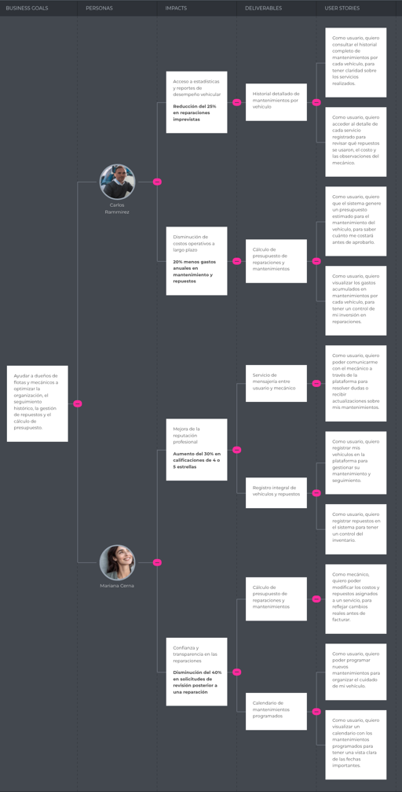

# Universidad Peruana De Ciencias Aplicadas

## Ingeniería de Software

### Informe de Trabajo Final

### Desarrollo de Aplicaciones Open Source 

**Sección:** 
4310

**Profesor:**  
Ivan Robles Fernández

**Integrantes:**

    <ul>
        <li>Victor Andres Cruz Ibarra - U202311053</li>
        <li>Rafael Andres Vivanco Salazar - U202311064</li>
        <li>Ricardo Fernando Cardenas Minaya - U202310004</li>
        <li>Jarod Jack Cespedes Pillco - U202318588</li>
        <li>Ronald Joel Peralta Chipa -U202224619</li>
    </ul>

**2025 - 1**

---

# **Registro de Versiones del Informe**

| Versión | Fecha      | Autor                          | Descripción de modificación      |
|---------|------------|--------------------------------|----------------------------------|
| TB1     | 26/01/2025 | Ronald Joel Peralta Chipa - Victor Andres Cruz Ibarra - Ricardo Fernando Cardenas Minaya - Rafael Andres Vivanco Salazar - Jarod Jack Cespedes Pillco   | Capitulo 1, Capitulo 2, Capitulo 3, Capitulo 4, Capitulo 5 |
| TB2     |            |                                |                                  |
| TB3     |            |                                |                                  |

# **Project Report Collaboration Insights**

Enlace de la organización para el reporte del proyecto: https://github.com/orgs/project-OpenSource-4310/repositories

**TB1**

Para el desarrollo del informe correspondiente a la entrega TB1, se estableció la implementación de secciones de la siguiente manera para cada integrante del equipo:

|Integrante|Tareas Asignadas|
|-|-|
|Victor Andres Cruz Ibarra|Style Guidelines, Information Architecture, Landing Page UI Design, Web Applications UI/UI Design, Web Applications Prototyping|
|Rafael Andres Vivanco Salazar| Startup Profile, Solution Profile, Domain-Driven Software Architecture, Software Object-Oriented Design y Database Design|
|Ricardo Fernando Cardenas Minaya |Competidores, Análisis competitivo, To-Be Scneario Mapping, User Stories, Impact Mapping y Product Backlog|
|Jarod Jack Cespedes Pillco | Source Code Management, Source Style Guide, Software Deployment Configuration|
|Ronald Joel Peralta Chipa|Análisis de entrevistas, NeedFinding, User personas, User Task Matrix, User Journey Mapping, Empathy Mapping, As-is Scenario Mapping.|

# **Contenido**

### Tabla de contenidos

- [Universidad Peruana De Ciencias Aplicadas](#universidad-peruana-de-ciencias-aplicadas)
  - [Ingeniería de Software](#ingeniería-de-software)
    - [Informe de Trabajo Final](#informe-de-trabajo-final)
    - [Desarrollo de Aplicaciones Open Source](#desarrollo-de-aplicaciones-open-source)
- [**Registro de Versiones del Informe**](#registro-de-versiones-del-informe)
- [**Project Report Collaboration Insights**](#project-report-collaboration-insights)
- [**Contenido**](#contenido)
    - [Tabla de contenidos](#tabla-de-contenidos)
- [**Student Outcome**](#student-outcome)
- [ **Capítulo I: Introducción** ](#-capítulo-i-introducción-)
  - [**1.1. Startup Profile**](#11-startup-profile)
    - [**1.1.1. Descripción de la Startup**](#111-descripción-de-la-startup)
    - [**1.1.2. Perfiles de integrantes del equipo**](#112-perfiles-de-integrantes-del-equipo)
  - [**1.2. Solution Profile**](#12-solution-profile)
    - [**1.2.1. Antecedentes y problemática**](#121-antecedentes-y-problemática)
    - [**1.2.2. Lean UX Process**](#122-lean-ux-process)
      - [**1.2.2.1. Lean UX Problem Statements**](#1221-lean-ux-problem-statements)
      - [**1.2.2.2. Lean UX Assumptions**](#1222-lean-ux-assumptions)
      - [**1.2.2.3. Lean UX Hypothesis Statements**](#1223-lean-ux-hypothesis-statements)
      - [**1.2.2.4. Lean UX Canvas**](#1224-lean-ux-canvas)
  - [**1.3. Segmentos objetivo**](#13-segmentos-objetivo)
- [ **Capítulo II: Requirements Elicitation \& Analysis** ](#-capítulo-ii-requirements-elicitation--analysis-)
  - [**2.1. Competidores**](#21-competidores)
    - [**2.1.1. Análisis competitivo**](#211-análisis-competitivo)
    - [**2.1.2. Estrategias y tácticas frente a competidores**](#212-estrategias-y-tácticas-frente-a-competidores)
  - [**2.2. Entrevistas**](#22-entrevistas)
    - [**2.2.1. Diseño de entrevistas**](#221-diseño-de-entrevistas)
    - [**2.2.2. Registro de entrevistas**](#222-registro-de-entrevistas)
    - [**2.2.3. Análisis de entrevistas**](#223-análisis-de-entrevistas)
  - [**2.3. Needfinding**](#23-needfinding)
    - [**2.3.1. User Personas**](#231-user-personas)
    - [**2.3.2. User Task Matrix**](#232-user-task-matrix)
    - [**2.3.3. User Journey Mapping**](#233-user-journey-mapping)
    - [**2.3.4. Empathy Mapping**](#234-empathy-mapping)
    - [**2.3.5. As-is Scenario Mapping**](#235-as-is-scenario-mapping)
  - [**2.4. Ubiquitous Language**](#24-ubiquitous-language)
- [ **Capítulo III: Requirements Specification** ](#-capítulo-iii-requirements-specification-)
  - [**3.1. To-Be Scenario Mapping**](#31-to-be-scenario-mapping)
  - [**3.2. User Stories**](#32-user-stories)
      - [**Epics**](#epics)
      - [**User Stories**](#user-stories)
  - [**3.3. Impact Mapping**](#33-impact-mapping)
  - [**3.4. Product Backlog**](#34-product-backlog)
- [ **Capítulo IV: Product Design** ](#-capítulo-iv-product-design-)
  - [**4.1. Style Guidelines**](#41-style-guidelines)
    - [4.1.1. General Style Guidelines](#411-general-style-guidelines)
    - [4.1.2. Web Style Guidelines](#412-web-style-guidelines)
  - [**4.2. Information Architecture**](#42-information-architecture)
    - [**4.2.1. Organization Systems**](#421-organization-systems)
    - [**4.2.2. Labeling Systems**](#422-labeling-systems)
    - [**4.2.3. SEO Tags and Meta Tags**](#423-seo-tags-and-meta-tags)
    - [**4.2.4. Searching Systems**](#424-searching-systems)
    - [**4.2.5. Navigation Systems**](#425-navigation-systems)
  - [**4.3. Landing Page UI Design**](#43-landing-page-ui-design)
    - [**4.3.1. Landing Page Wireframe**](#431-landing-page-wireframe)
    - [**4.3.2. Landing Page Mock-up**](#432-landing-page-mock-up)
  - [**4.4. Web Applications UX/UI Design**](#44-web-applications-uxui-design)
    - [**4.4.1. Web Applications Wireframes**](#441-web-applications-wireframes)
    - [**4.4.2. Web Applications Wireflow Diagrams**](#442-web-applications-wireflow-diagrams)
    - [**4.4.3. Web Applications Mock-ups**](#443-web-applications-mock-ups)
    - [**4.4.4. Web Applications User Flow Diagrams**](#444-web-applications-user-flow-diagrams)
  - [**4.5. Web Applications Prototyping**](#45-web-applications-prototyping)
  - [**4.6. Domain-Driven Software Architecture**](#46-domain-driven-software-architecture)
    - [**4.6.1. Software Architecture Context Diagram**](#461-software-architecture-context-diagram)
    - [**4.6.2. Software Architecture Container Diagrams**](#462-software-architecture-container-diagrams)
    - [**4.6.3. Software Architecture Components Diagrams**](#463-software-architecture-components-diagrams)
  - [**4.7. Software Object-Oriented Design**](#47-software-object-oriented-design)
    - [**4.7.1. Class Diagrams**](#471-class-diagrams)
    - [**4.7.2. Diccionario de Clases**](#472-diccionario-de-clases)
  - [**4.8. Database Design**](#48-database-design)
    - [**4.8.1. Database Diagram**](#481-database-diagram)
- [ **Capítulo V: Product Implementation, Validation \& Deployment** ](#-capítulo-v-product-implementation-validation--deployment-)
  - [**5.1. Software Configuration Management**](#51-software-configuration-management)
    - [**5.1.1. Software Development Environment Configuration**](#511-software-development-environment-configuration)
    - [**5.1.2. Source Code Management**](#512-source-code-management)
    - [**5.1.3. Source Code Style Guide \& Conventions**](#513-source-code-style-guide--conventions)
    - [**5.1.4. Software Deployment Configuration**](#514-software-deployment-configuration)
      - [**5.2.1.2. Aspect Leaders and Collaborators**](#5212-aspect-leaders-and-collaborators)
      - [**5.2.1.3. Sprint Backlog 1**](#5213-sprint-backlog-1)
      - [**5.2.1.4. Development Evidence for Sprint Review**](#5214-development-evidence-for-sprint-review)
      - [**5.2.1.5. Execution Evidence for Sprint Review**](#5215-execution-evidence-for-sprint-review)
      - [**5.2.1.6. Services Documentation Evidence for Sprint Review**](#5216-services-documentation-evidence-for-sprint-review)
      - [**5.2.1.7. Software Deployment Evidence for Sprint Review**](#5217-software-deployment-evidence-for-sprint-review)
      - [**5.2.1.8. Team Collaboration Insights during Sprint**](#5218-team-collaboration-insights-during-sprint)
    - [**5.2.2. Sprint 2**](#522-sprint-2)
      - [**5.2.2.1. Sprint Planning 2**](#5221-sprint-planning-2)
      - [**5.2.2.2. Aspect Leaders and Collaborators**](#5222-aspect-leaders-and-collaborators)
      - [**5.2.2.3. Sprint Backlog 2**](#5223-sprint-backlog-2)
      - [**5.2.2.4. Development Evidence for Sprint Review**](#5224-development-evidence-for-sprint-review)
      - [**5.2.2.5. Execution Evidence for Sprint Review**](#5225-execution-evidence-for-sprint-review)
      - [**5.2.2.6. Services Documentation Evidence for Sprint Review**](#5226-services-documentation-evidence-for-sprint-review)
      - [**5.2.2.7. Software Deployment Evidence for Sprint Review**](#5227-software-deployment-evidence-for-sprint-review)
      - [**5.2.2.8. Team Collaboration Insights during Sprint**](#5228-team-collaboration-insights-during-sprint)
  - [**5.3. Validation Interviews**](#53-validation-interviews)
    - [**5.3.1. Diseño de Entrevistas**](#531-diseño-de-entrevistas)
    - [**5.3.2. Registro de Entrevistas**](#532-registro-de-entrevistas)
    - [**5.3.3. Evaluaciones según heurísticas**](#533-evaluaciones-según-heurísticas)
  - [Conclusiones](#conclusiones)
  - [Bibliografía](#bibliografía)
  - [Anexos](#anexos)

[Conclusiones](#conclusiones)

[Bibliografía](#bibliografía)

[Anexos](#anexos)

# **Student Outcome**

El curso contribuye al cumplimiento del Student Outcome ABET:   
**ABET – EAC - Student Outcome 3** 
**Criterio:** Capacidad de comunicarse efectivamente con un rango de audiencias. 
En el siguiente cuadro se describe las acciones realizadas y enunciados de conclusiones por parte del grupo, que permiten sustentar el haber alcanzado el logro del ABET – EAC - Student Outcome 3.

 

<table style="border-collapse:collapse;border-spacing:0" class="tg"><thead><tr><th style="border-color:black;border-style:solid;border-width:1px;font-family:Arial, sans-serif;font-size:14px;font-weight:normal;overflow:hidden;padding:10px 5px;text-align:left;vertical-align:top;word-break:normal">Criterio específico</th><th style="border-color:black;border-style:solid;border-width:1px;font-family:Arial, sans-serif;font-size:14px;font-weight:normal;overflow:hidden;padding:10px 5px;text-align:left;vertical-align:top;word-break:normal">Acciones realizadas</th><th style="border-color:black;border-style:solid;border-width:1px;font-family:Arial, sans-serif;font-size:14px;font-weight:normal;overflow:hidden;padding:10px 5px;text-align:left;vertical-align:top;word-break:normal">Conclusiones</th></tr></thead>
<tbody>
<tr><td style="border-color:black;border-style:solid;border-width:1px;font-family:Arial, sans-serif;font-size:14px;overflow:hidden;padding:10px 5px;text-align:left;vertical-align:top;word-break:normal">Comunica oralmente con efectividad a diferentes rangos de audiencia </td>
<td style="border-color:black;border-style:solid;border-width:1px;font-family:Arial, sans-serif;font-size:14px;overflow:hidden;padding:10px 5px;text-align:left;vertical-align:top;word-break:normal">Andres Cruz:   TB1: Me aseguré de comunicarme de manera clara y respetuosa con mi equipo, transmitiendo mis ideas con asertividad y cumpliendo los compromisos adquiridos.    Rafael Vivanco:   TB1: Durante las reuniones grupales, me centré en expresar mis ideas y propuestas con claridad, adaptando mi comunicación al contexto para facilitar la comprensión de todos.    Fernando Cardenas:   TB1: Participé activamente en las tareas asignadas, aplicando mis conocimientos y habilidades para alcanzar los objetivos del equipo en tiempo y forma.   Jack Cespedes:   TB1: Me mantuve comprometido con el equipo, colaborando en cada etapa del proceso y asegurándome de aportar soluciones para alcanzar los objetivos de manera eficiente.    Joel Peralta   TB1: Me involucré en un diálogo abierto y constante con el equipo, lo que facilitó la distribución de tareas y la obtención de buenos resultados. Además, procuré mantener siempre una actitud colaborativa y proactiva para fortalecer la dinámica grupal.  
<td style="border-color:black;border-style:solid;border-width:1px;font-family:Arial, sans-serif;font-size:14px;overflow:hidden;padding:10px 5px;text-align:left;vertical-align:top;word-break:normal">TB1: A lo largo del proyecto, todos los integrantes del equipo lograron expresar sus ideas de manera oral con claridad y adecuación al contexto. Esto permitió que tanto compañeros como docentes comprendieran nuestras propuestas con facilidad. Gracias a esta capacidad de adaptación en la comunicación, pudimos distribuir tareas de forma eficiente, resolver inquietudes al instante y mantener una dinámica de colaboración efectiva en todo momento.  </td>
</tr>
<tr><td style="border-color:black;border-style:solid;border-width:1px;font-family:Arial, sans-serif;font-size:14px;overflow:hidden;padding:10px 5px;text-align:left;vertical-align:top;word-break:normal">Comunica por escrito con efectividad a diferentes rangos de audiencia.</td>
<td style="border-color:black;border-style:solid;border-width:1px;font-family:Arial, sans-serif;font-size:14px;overflow:hidden;padding:10px 5px;text-align:left;vertical-align:top;word-break:normal">Andres Cruz:   TB1: Aporté en diferentes etapas del trabajo, garantizando que la información fuera clara, precisa y organizada, lo que permitió una mejor comprensión y aplicación en el desarrollo del proyecto.    Rafael Vivanco:   TB1: Contribuí en diversos aspectos del trabajo, garantizando que la información fuera precisa, coherente y comprensible tanto para compañeros como para docentes.   Fernando Cardenas:   TB1: Participé activamente en las tareas asignadas, aplicando mis conocimientos y habilidades para cumplir con los objetivos del equipo de manera efectiva y dentro de los plazos establecidos.   Jack Cespedes:   TB1:Cumplí con todas las actividades asignadas y considero que tuve un buen desempeño. Sin embargo, reconozco que debo mejorar en la gestión de mi tiempo para optimizar mis resultados en futuros proyectos.   Joel Peralta:   TB1: Me involucré en la ejecución de las tareas grupales, aportando ideas y soluciones que contribuyeron al desarrollo del proyecto. También procuré mantener una comunicación fluida con mis compañeros para garantizar una coordinación eficiente  </td>
<td style="border-color:black;border-style:solid;border-width:1px;font-family:Arial, sans-serif;font-size:14px;overflow:hidden;padding:10px 5px;text-align:left;vertical-align:top;word-break:normal">TB1: La eficacia del trabajo en equipo también se evidenció en nuestra habilidad para transmitir información de manera escrita. La documentación desarrollada, que abarcó informes, descripciones técnicas y contenido para la landing page, fue precisa, estructurada y accesible. Esto contribuyó a la validación del proyecto y garantizó que el producto final reflejara con claridad su propósito y funcionalidad.  </td>
</tr>
</tbody></table>
  

#  **Capítulo I: Introducción** 

## **1.1. Startup Profile**

### **1.1.1. Descripción de la Startup**

### **1.1.2. Perfiles de integrantes del equipo**

## **1.2. Solution Profile**

### **1.2.1. Antecedentes y problemática**

### **1.2.2. Lean UX Process**

#### **1.2.2.1. Lean UX Problem Statements**

#### **1.2.2.2. Lean UX Assumptions**

#### **1.2.2.3. Lean UX Hypothesis Statements**

#### **1.2.2.4. Lean UX Canvas**

## **1.3. Segmentos objetivo**

#  **Capítulo II: Requirements Elicitation & Analysis** 

## **2.1. Competidores**

### **2.1.1. Análisis competitivo**

### **2.1.2. Estrategias y tácticas frente a competidores**

## **2.2. Entrevistas**

### **2.2.1. Diseño de entrevistas**

### **2.2.2. Registro de entrevistas**

### **2.2.3. Análisis de entrevistas**

## **2.3. Needfinding**

### **2.3.1. User Personas**
  
### **2.3.2. User Task Matrix**

### **2.3.3. User Journey Mapping**

### **2.3.4. Empathy Mapping**

### **2.3.5. As-is Scenario Mapping**

## **2.4. Ubiquitous Language**

#  **Capítulo III: Requirements Specification** 

## **3.1. To-Be Scenario Mapping**

En esta sección, exploramos las acciones, pensamientos y emociones que los usuarios experimentan al realizar sus tareas utilizando nuestra app. A través de este análisis, buscamos identificar los puntos de mejora y optimización.

**Segmento 1: Dueños de flotas o conductores**

En esta sección, exploramos las acciones, pensamientos y emociones que los usuarios experimentan al realizar sus tareas utilizando nuestra app. A través de este análisis, buscamos identificar los puntos de mejora y optimización.

**Segmento 2: Mecánicos**

En el escenario ideal, el conductor experimenta un proceso mucho más fluido y menos estresante. Desde el primer síntoma, puede acceder a una app conectada al vehículo que le ofrece un prediagnóstico basado en datos reales del auto, reduciendo la incertidumbre inicial.

## **3.2. User Stories**

#### **Epics**

**EP01 - Registro y Gestión de Usuario, Vehículo y Repuestos**

**Descripción:**
Como usuario, quiero registrar y gestionar mi perfil, vehículos y repuestos, para tener un control completo de mis activos dentro de AutoNexo.

| User Story ID | Título |
| :---- | :---- |
| US01 | Registro de usuario |
| US02 | Inicio de sesión seguro |
| US03 | Registro de vehículos |
| US04 | Registro de repuestos |
| US05 | Gestión del perfil del usuario |
| US06 | Edición del perfil desde la app |

**EP02 - Calendario de Mantenimientos Programados**

**Descripción:**
Como usuario, quiero contar con un calendario de mantenimientos para programar servicios futuros y recibir recordatorios automáticos, a fin de evitar fallas o demoras.

| User Story ID | Titulo |
| :---- | :---- |
| US07 | Visualización del calendario de mantenimientos |
| US08 | Programación de nuevos mantenimientos |
| US09 | Edición o cancelación de mantenimientos agendados |
| US10 | Recordatorios automáticos para mantenimientos programados |

**EP03 - Gestión de Inventario de Repuestos**

**Descripción:**
Como usuario, quiero gestionar el inventario de repuestos, para asegurarme de contar con los insumos necesarios al momento de realizar mantenimientos.

| User Story ID | Titulo |
| :---- | :---- |
| US11 | Consulta de repuestos disponibles |
| US12 | Registro de nuevos ingresos de repuestos |
| US13 | Notificación de repuestos bajos en stock |
| US14 | Actualización del inventario tras mantenimiento |

**EP04 - Cálculo de Presupuesto y Control de Costos**

**Descripción:**
Como usuario, quiero calcular el presupuesto de reparaciones y mantenimiento, para poder anticipar costos y optimizar mis recursos.

| User Story ID | Titulo |
| :---- | :---- |
| US15 | Generación de presupuesto de mantenimiento |
| US16 | Edición de costos y repuestos por servicio |
| US17 | Visualización de gastos históricos por vehículo |

**EP05 - Historial de Mantenimientos**

**Descripción:**
Como usuario, quiero ver el historial detallado de mantenimientos por vehículo, para llevar un control técnico del estado de cada uno de ellos.

| User Story ID | Titulo |
| :---- | :---- |
| US18 | Consulta del historial por vehículo |
| US19 | Detalle de cada servicio registrado |
| US20 | Exportación o descarga del historial en PDF |

**EP06 - Mensajería entre Usuario y Mecánico**

**Descripción:**
Como usuario, quiero poder comunicarme dentro de la plataforma, para coordinar mantenimientos, resolver dudas y compartir información importante.

| User Story ID | Titulo |
| :---- | :---- |
| US21 | Envío de mensajes entre usuario y mecánico |
| US22 | Notificaciones de nuevos mensajes |
| US23 | Historial de conversación por vehículo o servicio |

**EP07 - Gestión de Suscripción y Pagos**

**Descripción:**
Como usuario, quiero gestionar mi suscripción y métodos de pago para asegurar el acceso continuo al servicio según mi plan seleccionado.

| User Story ID | Titulo |
| :---- | :---- |
| US24 | Selección del plan de suscripción |
| US25 | Registro de método de pago seguro |
| US26 | Renovación automática de suscripción |
| US27 | Cambio de plan de suscripción |
| US28 | Cancelación o pausa del servicio |

**EP08 - Interacción y Navegación en la Landing Page**

**Descripción:**
Como visitante de la Landing Page, quiero que la navegación sea intuitiva y las acciones claras para poder interactuar fácilmente con la plataforma y descubrir sus funcionalidades.

| User Story ID | Titulo |
| :---- | :---- |
| US29 | Navegación Intuitiva |
| US30 | Compatibilidad con lectores de pantalla |
| US31 | Feedback visual en interacciones |

**EP09 - Integración y Exposición de Servicios vía API RESTful**

**Descripción:**
Como developer, quiero construir y exponer los servicios clave del sistema Autonexo mediante una API RESTful, para permitir la interacción entre el frontend y el backend de manera segura, eficiente y escalable.

| Technical Story ID | Titulo |
| :---- | :---- |
| TS01 | Registro de usuario a través de un RESTful API |
| TS02 | Registro de repuestos en inventario a través de un RESTful API |
| TS03 | Registro de vehículos a través de un RESTful API |
| TS04 | Creación de diagnósticos a través de un RESTful API |
| TS05 | Creación de mantenimientos programados mediante RESTful API |
| TS06 | Consulta de historial de servicios por vehículo mediante RESTful API |
| TS07 | Actualización del inventario de repuestos mediante RESTful API |

#### **User Stories**

| ID Epic | Epic | ID User Story / ID Technical Story | User Story / Technical Story | Descripción US / TS | Criterios de Aceptación |
|----------|--------------------------------|-------------------------|-----------------------------------------------|--------------------------------------------------------------------------------------------------|-----------------------------------------------------------------------------------------------------------------------------------------------------------------------------------------------------------------------------------------------------------------------------------------------------------|
| EP01 | Registro y Gestión de Usuario, Vehículo y Repuestos | US01 | Registro de usuario | Como nuevo usuario, quiero registrarme en la plataforma para empezar a utilizar los servicios de AutoNexo. | **Escenario 1:** Registro (conductor): Dado que soy un usuario conductor nuevo, cuando ingreso mis datos requeridos y los envío, entonces se debe crear mi cuenta y mostrarme un mensaje de bienvenida   **Escenario 2:** Validación de campos obligatorios: Dado que estoy completando el formulario, cuando omito un campo obligatorio, entonces el sistema debe mostrar un mensaje de error   **Escenario 3:** Registro (mecánico): Dado que soy un usuario mecanico nuevo, cuando ingreso mis datos requeridos y los envío, entonces se debe crear mi cuenta y mostrarme un mensaje de bienvenida |
| EP01 | Registro y Gestión de Usuario, Vehículo y Repuestos | US02 | Inicio de sesión seguro | Como usuario registrado, quiero iniciar sesión de forma segura para acceder a todas las funcionalidades de la plataforma. | **Escenario 1:** Inicio de sesión exitoso: Dado que tengo una cuenta activa, cuando ingreso mi correo y contraseña correctamente, entonces debo ser redirigido al panel principal   **Escenario 2:** Contraseña incorrecta: Dado que ingreso credenciales, cuando la contraseña no coincide, entonces el sistema debe mostrar un mensaje de error   **Escenario 3:** Registro (mecánico): Dado que olvidé mi contraseña, cuando solicito restablecerla, entonces el sistema debe enviarme un enlace de recuperación al correo |
| EP01 | Registro y Gestión de Usuario, Vehículo y Repuestos | US03 | Registro de vehículos | Como usuario, quiero registrar mis vehículos en la plataforma para gestionar su mantenimiento y seguimiento. | **Escenario 1:** Registro exitoso de vehículo: Dado que ingreso los datos del vehículo, Cuando completo todos los campos obligatorios, Entonces el sistema debe guardar la información y mostrar el vehículo en la lista   **Escenario 2:** Validación de campos obligatorios: Dado que dejo campos vacíos, Cuando intento guardar el vehículo, Entonces el sistema debe indicar los campos que faltan   **Escenario 3:** Visualización del nuevo vehículo: Dado que el vehículo ha sido registrado, Cuando accedo a la lista de vehículos, Entonces debe aparecer correctamente en la interfaz |
| EP01 | Registro y Gestión de Usuario, Vehículo y Repuestos | US04 | Registro de repuestos | Como usuario, quiero registrar repuestos en el sistema para tener un control del inventario. | **Escenario 1:** Registro exitoso de repuesto: Dado que ingreso los datos del repuesto, Cuando completo y envío el formulario, Entonces el sistema debe agregar el repuesto al inventario   **Escenario 2:** Campos incompletos: Dado que el formulario no está completo, Cuando intento enviarlo, Entonces el sistema debe advertirme sobre los campos vacíos   **Escenario 3:** Duplicado de repuesto: Dado que intento registrar un repuesto existente, Cuando el sistema detecta duplicidad, Entonces debe mostrar un mensaje de advertencia |
| EP01 | Registro y Gestión de Usuario, Vehículo y Repuestos | US06 | Edición del perfil desde la app | Como usuario, quiero editar mi perfil directamente desde la aplicación para mayor comodidad. | **Escenario 1:** Edición desde app: Dado que estoy en la aplicación móvil, Cuando accedo a mi perfil y modifico datos, Entonces el sistema debe reflejar los cambios correctamente   **Escenario 2:** Guardado exitoso desde app: Dado que termino de editar los datos, Cuando confirmo los cambios, Entonces se deben guardar sin errores   **Escenario 3:** Error al guardar cambios: Error al guardar cambios en la app: Dado que hay un fallo al cambiar los datos, Cuando intento guardar, Entonces se debe mostrar un mensaje de error |
| EP02 | Calendario de Mantenimientos Programados | US07 | Visualización del calendario de mantenimientos | Como usuario, quiero visualizar un calendario con los mantenimientos programados para tener una vista clara de las fechas importantes. | **Escenario 1:** Acceso al calendario: Dado que tengo mantenimientos agendados, Cuando accedo al módulo de calendario, Entonces el sistema debe mostrar las fechas de mantenimiento programadas   **Escenario 2:** Detalles del mantenimiento: Dado que selecciono una fecha en el calendario, Cuando hago clic en ella, Entonces el sistema debe mostrar detalles del mantenimiento programado   **Escenario 3:** Calendario sin mantenimientos: Dado que no tengo mantenimientos agendados, Cuando accedo al calendario, Entonces debe mostrarse vacío con un mensaje informativo |
| EP02 | Calendario de Mantenimientos Programados | US08 | Programación de nuevos mantenimientos | Como usuario, quiero poder programar nuevos mantenimientos para organizar el cuidado de mi vehículo. | **Escenario 1:** Programación exitosa: Dado que ingreso los datos requeridos, Cuando confirmo la programación, Entonces el sistema debe registrar el mantenimiento en el calendario   **Escenario 2:** Validación de fecha y hora, Dado que selecciono una fecha pasada o inválida, Cuando intento agendar el mantenimiento, Entonces el sistema debe mostrar un mensaje de error   **Escenario 3:** Confirmación visual: Dado que he programado correctamente un mantenimiento, Cuando regreso al calendario, Entonces el mantenimiento debe aparecer en la fecha seleccionada |
| EP02 | Calendario de Mantenimientos Programados | US09 | Edición o cancelación de mantenimientos agendados | Como usuario, quiero editar o cancelar los mantenimientos programados para mantener mi calendario actualizado según mis necesidades. | **Escenario 1:** Edición exitosa de mantenimiento: Dado que tengo un mantenimiento agendado, Cuando modifico la fecha u hora y guardo los cambios, Entonces el sistema debe actualizar el calendario con la nueva información   **Escenario 2:** VCancelación de mantenimiento: Dado que ya no necesito un mantenimiento programado, Cuando selecciono la opción de cancelarlo, Entonces el sistema debe eliminarlo del calendario y mostrar una confirmación   **Escenario 3:** Validación de cambios inválidos: Dado que intento cambiar la fecha a una inválida, Cuando intento guardar, Entonces el sistema debe mostrar un mensaje de error indicando el problema |
| EP02 | Calendario de Mantenimientos Programados | US10 | Recordatorios automáticos para mantenimientos programados | Como usuario, quiero recibir recordatorios automáticos para los mantenimientos agendados, para no olvidar ninguna cita importante. | **Escenario 1:** Recepción de recordatorio previo: Dado que tengo un mantenimiento programado, Cuando se acerque la fecha, Entonces el sistema debe enviarme un recordatorio   **Escenario 2:** Configuración de recordatorios: Dado que quiero ajustar la anticipación de los avisos, Cuando modifico esta preferencia en la configuración, Entonces el sistema debe aplicar los nuevos intervalos   **Escenario 3:** Canales de notificación: Dado que tengo un recordatorio activo, Cuando llega la fecha definida, Entonces el sistema debe enviarlo por la app |
| EP03 | Gestión de Inventario de Repuestos | US11 | Consulta de repuestos disponibles | Como usuario, quiero consultar los repuestos disponibles en el inventario para saber si están en stock antes de agendar un mantenimiento. | **Escenario 1:** Visualización general del inventario: Dado que accedo a la sección de inventario, Cuando ingreso a la plataforma, Entonces el sistema debe mostrar la lista de repuestos con sus cantidades actuales   **Escenario 2:** Filtro de repuestos: Dado que necesito un tipo específico de repuesto, Cuando uso los filtros por categoría, nombre o código, Entonces el sistema debe mostrar solo los repuestos que cumplan con los criterios   **Escenario 3:** Indicador de stock bajo o agotado: Dado que un repuesto tiene bajo stock, Cuando consulto su disponibilidad, Entonces el sistema debe mostrar una alerta visual con el estado del repuesto |
| EP03 | Gestión de Inventario de Repuestos | US12 | Registro de nuevos ingresos de repuestos | Como administrador, quiero registrar nuevos ingresos de repuestos al sistema para mantener actualizado el inventario. | **Escenario 1:** Registro exitoso de ingreso: Dado que estoy ingresando repuestos al sistema, Cuando completo los datos requeridos y los guardo, Entonces el inventario debe reflejar el nuevo stock actualizado   **Escenario 2:** Validación de campos al registrar: Dado que omito información esencial, Cuando intento registrar el ingreso, Entonces el sistema debe mostrar un mensaje indicando los campos faltantes   **Escenario 3:** Confirmación del registro: Dado que he ingresado correctamente los datos, Cuando finalizo el registro, Entonces el sistema debe mostrarme una notificación confirmando la operación |
| EP03 | Gestión de Inventario de Repuestos | US13 | Notificación de repuestos bajos en stock | Como usuario, quiero recibir notificaciones cuando los repuestos estén por agotarse, para reabastecer el inventario a tiempo. | **Escenario 1:** Generación automática de alerta: Dado que el stock de un repuesto baja del umbral establecido, Cuando se actualiza el inventario, Entonces el sistema debe generar automáticamente una alerta de stock bajo   **Escenario 2:** Visualización en el panel principal: Dado que hay repuestos con bajo stock, Cuando ingreso al panel de control, Entonces el sistema debe mostrar un listado de estos repuestos resaltados   **Escenario 3:** Notificación por sistema: Dado que un repuesto se encuentra en nivel crítico, Cuando se registra la disminución de unidades, Entonces el sistema debe enviarme una notificación dentro de la plataforma |
| EP03 | Gestión de Inventario de Repuestos | US14 | Actualización del inventario tras mantenimiento | Como usuario, quiero que el sistema actualice automáticamente el inventario cuando se utilicen repuestos en un mantenimiento, para mantener los datos precisos. | **Escenario 1:** Descuento automático de repuestos utilizados: Dado que se ha completado un mantenimiento, Cuando se registra el uso de ciertos repuestos, Entonces el sistema debe descontar automáticamente la cantidad utilizada del inventario   **Escenario 2:** Validación de stock suficiente: Dado que intento registrar un mantenimiento, Cuando el stock de un repuesto es insuficiente, Entonces el sistema debe impedir el registro y mostrar una advertencia |
| EP04 | Cálculo de Presupuesto y Control de Costos | US15 | Generación de presupuesto de mantenimiento | Como usuario, quiero que el sistema genere un presupuesto estimado para el mantenimiento del vehículo, para saber cuánto me costará antes de aprobarlo. | **Escenario 1:** Cálculo automático según repuestos y mano de obra: Dado que selecciono los repuestos y servicios necesarios, Cuando confirmo los detalles del mantenimiento, Entonces el sistema debe calcular el costo total y mostrarme un presupuesto estimado   **Escenario 2:** Visualización detallada del presupuesto: Dado que he generado un presupuesto, Cuando reviso la propuesta, Entonces debo ver el desglose de costos por cada ítem |
| EP04 | Cálculo de Presupuesto y Control de Costos | US16 | Edición de costos y repuestos por servicio | Como mecánico, quiero poder modificar los costos y repuestos asignados a un servicio, para reflejar cambios reales antes de facturar. | **Escenario 1:** Modificación de valores antes de confirmar servicio: Dado que he ingresado un mantenimiento, Cuando necesito ajustar los costos o repuestos, Entonces debo poder editar los campos correspondientes antes de la confirmación   **Escenario 2:** Validación de datos actualizados: Dado que modifico un presupuesto, Cuando confirmo los cambios, Entonces el sistema debe validar los datos y recalcular el total correctamente |
| EP04 | Cálculo de Presupuesto y Control de Costos | US17 | Visualización de gastos históricos por vehículo |  Como usuario, quiero visualizar los gastos acumulados en mantenimientos por cada vehículo, para tener un control de mi inversión en reparaciones. | **Escenario 1:** Consulta de gastos totales por vehículo: Dado que selecciono un vehículo, Cuando ingreso a su historial, Entonces el sistema debe mostrarme el total acumulado de gastos en mantenimientos   **Escenario 2:** Filtros por periodo de tiempo: Dado que deseo ver los gastos, Cuando aplico filtros de fechas, Entonces el sistema debe mostrar los datos correspondientes al rango elegido   **Escenario 3:** Visualización en formato gráfico y tabla: Dado que consulto los gastos, Cuando ingreso a la sección de historial, Entonces debo ver los datos en gráficos de barras o líneas y en una tabla detallada |
| EP05 | Historial de Mantenimientos | US18 | Consulta del historial por vehículo |  Como usuario, quiero consultar el historial completo de mantenimientos por cada vehículo, para tener claridad sobre los servicios realizados. | **Escenario 1:** Listado cronológico de mantenimientos: Dado que accedo al historial de un vehículo, Cuando se despliega la información, Entonces debo ver un listado ordenado por fecha de los mantenimientos realizados   **Escenario 2:** Visualización de detalles por mantenimiento: Dado que veo el historial, Cuando selecciono un mantenimiento, Entonces debo poder ver sus detalles, como tipo de servicio, repuestos usados y costos   **Escenario 3:** Filtros por tipo de servicio: Dado que tengo muchos registros, Cuando aplico un filtro por tipo de servicio, Entonces el sistema debe mostrar solo los resultados que coincidan |
| EP05 | Historial de Mantenimientos | US19 | Detalle de cada servicio registrado |  Como usuario, quiero acceder al detalle de cada servicio registrado para revisar qué repuestos se usaron, el costo y las observaciones del mecánico. | **Escenario 1:** Acceso al detalle desde el historial: Dado que visualizo el historial de mantenimientos, Cuando selecciono un servicio, Entonces se debe mostrar toda la información relacionada a ese mantenimiento   **Escenario 2:** Visualización de repuestos utilizados: Dado que estoy en el detalle de un servicio, Cuando accedo a la sección de repuestos, Entonces debo ver los nombres, cantidades y códigos de cada uno   **Escenario 3:** Inclusión de observaciones técnicas: Dado que reviso un servicio, Cuando se carga la información, Entonces debo poder leer las observaciones del mecánico o técnico encargado |
| EP05 | Historial de Mantenimientos | US20 | Exportación o descarga del historial en PDF |  Como usuario, quiero poder exportar o descargar en PDF el historial de mantenimientos de un vehículo para conservarlo o compartirlo fácilmente. | **Escenario 1:** Opción de exportar historial completo: Dado que visualizo el historial de un vehículo, Cuando selecciono la opción de exportar, Entonces el sistema debe generar un archivo PDF con toda la información   **Escenario 2:** Descarga exitosa del documento: Dado que genero el PDF, Cuando la descarga inicia, Entonces el archivo debe guardarse correctamente en mi dispositivo   **Escenario 3:** Inclusión de datos detallados en el PDF: Dado que visualizo el PDF generado, Cuando lo abro, Entonces debe contener fechas, servicios realizados, repuestos utilizados y montos |
| EP06 | Mensajería entre Usuario y Mecánico | US21 | Envío de mensajes entre usuario y mecánico |  Como usuario, quiero poder comunicarme con el mecánico a través de la plataforma para resolver dudas o recibir actualizaciones sobre mis mantenimientos. | **Escenario 1:** Envío de mensaje desde la interfaz del servicio: Dado que tengo un mantenimiento en curso, Cuando ingreso a su detalle y escribo un mensaje, Entonces el sistema debe enviarlo correctamente al mecánico asignado   **Escenario 2:** Confirmación de envío: Dado que he enviado un mensaje, Cuando el sistema lo procesa correctamente, Entonces debe aparecer una confirmación visual   **Escenario 3:** Comunicación bidireccional: Dado que hay una conversación activa, Cuando el mecánico responde, Entonces el mensaje debe aparecer en la interfaz del chat correspondiente |
| EP06 | Mensajería entre Usuario y Mecánico | US22 | Notificaciones de nuevos mensajes |  Como usuario, quiero recibir notificaciones cuando el mecánico me envíe un mensaje para estar informado sin necesidad de revisar constantemente la app. | **Escenario 1:** Notificación emergente en la app: Dado que recibo un nuevo mensaje, Cuando estoy usando la plataforma, Entonces debe mostrarse una notificación visual   **Escenario 2:** Acceso directo desde la notificación: Dado que toco la notificación, Cuando esta se activa, Entonces debo ser dirigido automáticamente a la conversación correspondiente |
| EP06 | Mensajería entre Usuario y Mecánico | US23 | Historial de conversación por vehículo o servicio |  Como usuario, quiero consultar el historial de mensajes asociados a cada vehículo o servicio para revisar fácilmente las conversaciones pasadas con el mecánico. | **Escenario 1:** Acceso al historial desde la ficha del vehículo: Dado que tengo vehículos registrados, Cuando ingreso al detalle de uno de ellos, Entonces debe estar disponible la opción de ver las conversaciones asociadas   **Escenario 2:** Visualización ordenada cronológicamente: Dado que ingreso al historial de mensajes, Cuando se cargan las conversaciones, Entonces debe mostrar en orden cronológico los mensajes |
| EP07 | Gestión de Suscripción y Pagos | US24 | Selección del plan de suscripción |  Como usuario, quiero elegir el plan de suscripción que mejor se adapte a mis necesidades para aprovechar los servicios de AutoNexo según mi presupuesto y uso. | **Escenario 1:** Visualización de todos los planes disponibles: Dado que accedo a la sección de suscripciones, Cuando la pantalla carga, Entonces debo ver todos los planes con sus características y precios   **Escenario 2:** Selección de un plan: Dado que deseo suscribirme, Cuando selecciono un plan y realizo el pago, Entonces el sistema debe activarlo y mostrarme un mensaje de confirmación   **Escenario 3:** Restricciones por plan: Dado que selecciono un plan específico, Cuando utilizo la plataforma, Entonces solo debo tener acceso a las funciones incluidas en dicho plan |
| EP07 | Gestión de Suscripción y Pagos | US25 | Registro de método de pago seguro |  Como usuario, quiero registrar un método de pago seguro para poder realizar mis pagos de suscripción sin preocupaciones y de forma rápida. | **Escenario 1:** Ingreso de datos de tarjeta válidos: Dado que deseo agregar un nuevo método de pago, Cuando ingreso los datos correctamente, Entonces el sistema debe registrarlos y confirmar que se ha guardado con éxito   **Escenario 2:** Validación de campos incorrectos: Dado que ingreso datos incompletos o inválidos, Cuando intento guardar el método de pago, Entonces el sistema debe mostrar mensajes de error y no permitir el registro   **Escenario 3:** Seguridad del proceso de registro: Dado que estoy ingresando mis datos bancarios, Cuando realizo el proceso, Entonces debe hacerse mediante un canal cifrado y seguro |
| EP07 | Gestión de Suscripción y Pagos | US26 | Renovación automática de suscripción |  Como usuario, quiero que mi suscripción se renueve automáticamente para seguir disfrutando del servicio sin interrupciones. | **Escenario 1:** Activación de la renovación automática: Dado que tengo una suscripción activa, Cuando selecciono la opción de renovación automática, Entonces el sistema debe habilitar esta función y notificarme que está activa   **Escenario 2:** Cobro exitoso en la fecha programada: Dado que tengo un método de pago válido y renovación activa, Cuando llega la fecha de renovación, Entonces el sistema debe realizar el cobro y mantener mi suscripción activa   **Escenario 3:** Notificación previa a la renovación: Dado que tengo activada la renovación, Cuando se acerque la fecha de cobro, Entonces el sistema debe notificarme con anticipación |
| EP07 | Gestión de Suscripción y Pagos | US27 | Cambio de plan de suscripción |  Como usuario, quiero poder cambiar mi plan de suscripción en cualquier momento para ajustarlo a mis necesidades o presupuesto. | **Escenario 1:** Cambio exitoso de plan: Dado que tengo una suscripción activa, Cuando selecciono un nuevo plan y confirmo el cambio, Entonces el sistema debe aplicar el nuevo plan y mostrar una notificación de éxito   **Escenario 2:** Validación de requisitos del nuevo plan: Dado que estoy eligiendo un nuevo plan, Cuando este requiere condiciones específicas (pago anticipado), Entonces el sistema debe indicarlas antes de permitir el cambio   **Escenario 3:** Notificación del cambio: Dado que he cambiado mi plan, Cuando se complete el proceso, Entonces debo recibir una notificación de la app confirmando la modificación |
| EP07 | Gestión de Suscripción y Pagos | US28 | Cancelación o pausa del servicio |  Como usuario, quiero tener la opción de cancelar o pausar mi suscripción para detener el servicio temporal o permanentemente según mi situación. | **Escenario 1:** Cancelación voluntaria del servicio: Dado que deseo dejar de utilizar AutoNexo, Cuando solicito la cancelación desde la sección de suscripción, Entonces el sistema debe procesarla y mostrar una confirmación clara   **Escenario 2:** Pausar temporalmente el servicio: Dado que no quiero usar el servicio por un tiempo, Cuando selecciono la opción de pausa, Entonces el sistema debe suspender la facturación   **Escenario 3:** Confirmación y efectos del estado cancelado o pausado: Dado que he pausado o cancelado mi suscripción, Cuando intento acceder a funcionalidades premium, Entonces el sistema debe informar que están deshabilitadas |
| EP08 | Interacción y Navegación en la Landing Page | US29 | Navegación intuitiva |  Como visitante de la Landing Page, quiero navegar de forma intuitiva entre las secciones del sitio para encontrar rápidamente la información que necesito. | **Escenario 1:** Menú visible y funcional: Dado que el visitante se encuentra en la landing page, Cuando accede desde cualquier dispositivo, Entonces debe visualizar un menú de navegación accesible y funcional   **Escenario 2:** Transiciones suaves entre secciones: Dado que el visitante se desplaza por la página, Cuando hace clic en los elementos del menú, Entonces la transición entre secciones debe ser fluida y sin errores |
| EP08 | Interacción y Navegación en la Landing Page | US30 | Compatibilidad con lectores de pantalla |  Como visitante con discapacidad visual, quiero que la Landing Page sea compatible con lectores de pantalla para poder acceder al contenido sin barreras. | **Escenario 1:** Estructura semántica adecuada: Dado que el visitante utiliza un lector de pantalla, Cuando navega por la página, Entonces el lector debe interpretar correctamente los títulos, párrafos, botones y enlaces   **Escenario 2:** Etiquetado accesible de imágenes y botones: Dado que el visitante se desplaza por la landing page, Cuando el lector se posiciona sobre imágenes o botones, Entonces debe recibir descripciones adecuadas mediante etiquetas alt o aria-label |
| EP08 | Interacción y Navegación en la Landing Page | US31 | Feedback visual en interacciones |  Como visitante de la Landing Page, quiero recibir retroalimentación visual al interactuar con los elementos para saber que mis acciones han sido reconocidas. | **Escenario 1:** Cambio visual en botones al hacer clic o pasar el mouse: Dado que el visitante interactúa con botones, Cuando pasa el cursor o da clic sobre ellos, Entonces los botones deben responder visualmente   **Escenario 2:** Confirmación visual de acciones: Dado que el visitante completa una acción (como enviar un formulario), Cuando se envía correctamente, Entonces debe mostrarse un mensaje o señal de confirmación |
| EP09 | Integración y Exposición de Servicios vía API RESTful | TS01 | Registro de usuario a través de un RESTful API |  Como desarrollador, quiero implementar la opción de registrar nuevos usuarios a través de una API RESTful, para que los conductores y mecánicos puedan crear sus cuentas en la plataforma. | **Escenario 1:** Registro exitoso: Dado que soy un developer, Cuando envío una solicitud con los datos del nuevo usuario, Entonces el API debe registrar al usuario   **Escenario 2:** Usuario duplicado: Dado que ya existe un usuario con el mismo correo electrónico, Cuando intento registrar un nuevo usuario con ese mismo correo, Entonces el API debe devolver un mensaje de conflicto |
| EP09 | Integración y Exposición de Servicios vía API RESTful | TS02 | Registro de repuestos en inventario a través de un RESTful API |  Como desarrollador, quiero implementar la opción de registrar repuestos mediante una API RESTful, para que los usuarios puedan llevar un control del inventario de piezas disponibles. | **Escenario 1:** Registro exitoso de repuesto: Dado que tengo datos del repuesto, Cuando envío una solicitud con los datos del nuevo repuesto, Entonces el API debe guardar el repuesto y devolver su ID   **Escenario 2:** Repuesto ya existente: Dado que intento registrar un repuesto con un código que ya está en el sistema, Cuando hago la solicitud, Entonces el API debe indicar que el repuesto ya existe |
| EP09 | Integración y Exposición de Servicios vía API RESTful | TS03 | Registro de vehículos a través de un RESTful API |  Como desarrollador, quiero implementar la opción de registrar vehículos mediante una API RESTful, para que los usuarios puedan gestionar sus autos en la plataforma. | **Escenario 1:** Registro exitoso: Dado que tengo todos los datos del vehículo, Cuando los envío mediante una solicitud, Entonces el API debe guardar el vehículo   **Escenario 2:** Asociación con usuario: Dado que un usuario está autenticado, Cuando registra un vehículo, Entonces este debe quedar asociado al ID de ese usuario |
| EP09 | Integración y Exposición de Servicios vía API RESTful | TS04 | Creación de diagnósticos a través de un RESTful API |  Como desarrollador, quiero permitir que los mecánicos registren diagnósticos de los vehículos mediante una API RESTful, para que los conductores puedan recibir un reporte claro del estado de su auto. | **Escenario 1:** Diagnostico creado correctamente: Dado que tengo acceso y los datos del diagnóstico, Cuando envío una solicitud POST, Entonces el sistema debe almacenar el diagnóstico   **Escenario 2:** Relación con el vehículo: Dado que el diagnóstico pertenece a un vehículo, Cuando lo registro, Entonces debe quedar asociado al vehículo correspondiente en la respuesta |
| EP09 | Integración y Exposición de Servicios vía API RESTful | TS05 | Creación de mantenimientos programados mediante RESTful API |  Como desarrollador, quiero permitir la programación de mantenimientos a través de una API RESTful, para que los usuarios puedan agendar sus servicios con anticipación. | **Escenario 1:** Mantenimiento registrado exitosamente: Dado que envío todos los datos necesarios, Cuando hago una solicitud POST válida, Entonces el API debe guardar el mantenimiento   **Escenario 2:** Asociación con vehículo y repuestos: Dado que indico los IDs del vehículo y repuestos, Cuando creo el mantenimiento, Entonces deben quedar relacionados en la base de datos |
| EP09 | Integración y Exposición de Servicios vía API RESTful | TS06 | Consulta de historial de servicios por vehículo mediante RESTful API |  Como desarrollador, quiero permitir la visualización del historial de mantenimiento de un vehículo mediante una API RESTful, para que el usuario tenga acceso completo a los servicios realizados. | **Escenario 1:** Historial disponible: Dado que el vehículo tiene servicios registrados, Cuando realizo una solicitud GET con su ID, Entonces el API debe devolver un listado de los servicios   **Escenario 2:** Vehículo no encontrado: Dado que uso un ID de vehículo inexistente, Cuando consulto el historial, Entonces el API debe responder con código erroneo |
| EP09 | Integración y Exposición de Servicios vía API RESTful | TS07 | Actualización del inventario de repuestos mediante RESTful API |  Como desarrollador, quiero actualizar automáticamente el inventario de repuestos usados después de un mantenimiento mediante una API RESTful, para reflejar en tiempo real los niveles de stock. | **Escenario 1:** Actualización exitosa: Dado que tengo permisos y datos válidos, Cuando envío una solicitud PUT con el nuevo stock, Entonces el API debe actualizar el inventario   **Escenario 2:** Valor inválido: Dado que ingreso una cantidad negativa, Cuando intento actualizar el stock, Entonces el API debe indicar el error de validación |

## **3.3. Impact Mapping**

## **3.4. Product Backlog**

| \# Orden | User Story ID / Technical Story ID | Título | Descripción | Prioridad | Story Points (1/2/3/5/8) |
| :---: | :---: | :---: | :---: | ----- | :---: |
| **1** | US01 | Registro de usuario	 | Como nuevo usuario, quiero registrarme en la plataforma para empezar a utilizar los servicios de AutoNexo. | Alta | 5 |
| **2** | US02 | Inicio de sesión seguro | Como usuario registrado, quiero iniciar sesión de forma segura para acceder a todas las funcionalidades de la plataforma | Media | 3 |
| **3** | US03 | Registro de vehículos | Como usuario, quiero registrar mis vehículos en la plataforma para gestionar su mantenimiento y seguimiento. | Media | 5 |
| **4** | US04 | Registro de repuestos | Como usuario, quiero registrar repuestos en el sistema para tener un control del inventario. | Media | 3 |
| **5** | US05 | Gestión del perfil del usuario | Como usuario, quiero gestionar mi información personal en mi perfil para mantener mis datos actualizados | Media | 5 |
| **6** | US06 | Edición del perfil desde la app | Como usuario, quiero editar mi perfil directamente desde la aplicación para mayor comodidad. | Baja | 3 |
| **7** | US07 | Visualización del calendario de mantenimientos | Como usuario, quiero visualizar un calendario con los mantenimientos programados para tener una vista clara de las fechas importantes. | Media | 3 |
| **8** | US08 | Programación de nuevos mantenimientos | Como usuario, quiero poder programar nuevos mantenimientos para organizar el cuidado de mi vehículo. | Alta | 5 |
| **9** | US09 | Edición o cancelación de mantenimientos agendados | Como usuario, quiero editar o cancelar los mantenimientos programados para mantener mi calendario actualizado según mis necesidades. | Media | 3 |
| **10** | US10 | Recordatorios automáticos para mantenimientos programados | Como usuario, quiero recibir recordatorios automáticos para los mantenimientos agendados, para no olvidar ninguna cita importante. | Media | 3 |
| **11** | US11 | Consulta de repuestos disponibles | Como usuario, quiero consultar los repuestos disponibles en el inventario para saber si están en stock antes de agendar un mantenimiento. | Alta | 5 |
| **12** | US12 | Registro de nuevos ingresos de repuestos | Como administrador, quiero registrar nuevos ingresos de repuestos al sistema para mantener actualizado el inventario. | Media | 3 |
| **13** | US13 | Notificación de repuestos bajos en stock | Como usuario, quiero recibir notificaciones cuando los repuestos estén por agotarse, para reabastecer el inventario a tiempo. | Baja | 2 |
| **14** | US14 | Actualización del inventario tras mantenimiento | Como usuario, quiero que el sistema actualice automáticamente el inventario cuando se utilicen repuestos en un mantenimiento, para mantener los datos precisos. |    Media | 3 |
| **15** | US15 | Generación de presupuesto de mantenimiento | Como usuario, quiero que el sistema genere un presupuesto estimado para el mantenimiento del vehículo, para saber cuánto me costará antes de aprobarlo. | Alta | 8 |
| **16** | US16 | Edición de costos y repuestos por servicio | Como mecánico, quiero poder modificar los costos y repuestos asignados a un servicio, para reflejar cambios reales antes de facturar. | Media | 5 |
| **17** | US17 | Visualización de gastos históricos por vehículo | Como usuario, quiero visualizar los gastos acumulados en mantenimientos por cada vehículo, para tener un control de mi inversión en reparaciones. | Media | 3 |
| **18** | US18 | Consulta del historial por vehículo | Como usuario, quiero consultar el historial completo de mantenimientos por cada vehículo, para tener claridad sobre los servicios realizados. | Media | 5 |
| **19** | US19 | Detalle de cada servicio registrado | Como usuario, quiero acceder al detalle de cada servicio registrado para revisar qué repuestos se usaron, el costo y las observaciones del mecánico. | Media | 3 |
| **20** | US20 | Exportación o descarga del historial en PDF | Como usuario, quiero poder exportar o descargar en PDF el historial de mantenimientos de un vehículo para conservarlo o compartirlo fácilmente. | Baja | 2 |
| **21** | US21 | Envío de mensajes entre usuario y mecánico | Como usuario, quiero poder comunicarme con el mecánico a través de la plataforma para resolver dudas o recibir actualizaciones sobre mis mantenimientos. | Media | 3 |
| **22** | US22 | Notificaciones de nuevos mensajes | Como usuario, quiero recibir notificaciones cuando el mecánico me envíe un mensaje para estar informado sin necesidad de revisar constantemente la app. | Baja | 2 |
| **23** | US23 | Historial de conversación por vehículo o servicio | Como usuario, quiero consultar el historial de mensajes asociados a cada vehículo o servicio para revisar fácilmente las conversaciones pasadas con el mecánico. | Media | 3 |
| **24** | US24 | Selección del plan de suscripción | Como usuario, quiero elegir el plan de suscripción que mejor se adapte a mis necesidades para aprovechar los servicios de AutoNexo según mi presupuesto y uso. | Alta | 5 |
| **25** | US25 | Registro de método de pago seguro | Como usuario, quiero registrar un método de pago seguro para poder realizar mis pagos de suscripción sin preocupaciones y de forma rápida. | Alta | 8 |
| **26** | US26 | Renovación automática de suscripción | Como usuario, quiero que mi suscripción se renueve automáticamente para seguir disfrutando del servicio sin interrupciones. | Alta | 8 |
| **27** | US27 | Cambio de plan de suscripción | Como usuario, quiero poder cambiar mi plan de suscripción en cualquier momento para ajustarlo a mis necesidades o presupuesto. | Media | 3 |
| **28** | US28 | Cancelación o pausa del servicio | Como usuario, quiero tener la opción de cancelar o pausar mi suscripción para detener el servicio temporal o permanentemente según mi situación. | Media | 3 |
| **29** | US29 | Navegación intuitiva | Como visitante de la Landing Page, quiero navegar de forma intuitiva entre las secciones del sitio para encontrar rápidamente la información que necesito. | Alta | 5 |
| **30** | US30 | Compatibilidad con lectores de pantalla | Como visitante con discapacidad visual, quiero que la Landing Page sea compatible con lectores de pantalla para poder acceder al contenido sin barreras. | Media | 3 |
| **31** | US31 | Feedback visual en interacciones | Como visitante de la Landing Page, quiero recibir retroalimentación visual al interactuar con los elementos para saber que mis acciones han sido reconocidas. | Media | 3 |
| **32** | TS01 | Registro de usuario a través de un RESTful API | Como desarrollador, quiero implementar la opción de registrar nuevos usuarios a través de una API RESTful, para que los conductores y mecánicos puedan crear sus cuentas en la plataforma. | Alta | 5 |
| **33** | TS02 | Registro de repuestos en inventario a través de un RESTful API | Como desarrollador, quiero implementar la opción de registrar repuestos mediante una API RESTful, para que los usuarios puedan llevar un control del inventario de piezas disponibles. | Media | 3 |
| **34** | TS03 | Registro de vehículos a través de un RESTful API | Como desarrollador, quiero implementar la opción de registrar vehículos mediante una API RESTful, para que los usuarios puedan gestionar sus autos en la plataforma. | Media | 2 |
| **35** | TS04 | Creación de diagnósticos a través de un RESTful API | Como desarrollador, quiero permitir que los mecánicos registren diagnósticos de los vehículos mediante una API RESTful, para que los conductores puedan recibir un reporte claro del estado de su auto. | Alta | 2 |
| **36** | TS05 | Creación de mantenimientos programados mediante RESTful API | Como desarrollador, quiero permitir la programación de mantenimientos a través de una API RESTful, para que los usuarios puedan agendar sus servicios con anticipación. | Alta | 5 |
| **37** | TS06 | Consulta de historial de servicios por vehículo mediante RESTful API | Como desarrollador, quiero permitir la visualización del historial de mantenimiento de un vehículo mediante una API RESTful, para que el usuario tenga acceso completo a los servicios realizados. | Media | 3 |
| **38** | TS07 | Actualización del inventario de repuestos mediante RESTful API | Como desarrollador, quiero actualizar automáticamente el inventario de repuestos usados después de un mantenimiento mediante una API RESTful, para reflejar en tiempo real los niveles de stock. | Media | 2 |

Product Backlog en Pivotal Tracker: [https://www.pivotaltracker.com/n/projects/2740725](https://www.pivotaltracker.com/n/projects/2740725) 

#  **Capítulo IV: Product Design** 

## **4.1. Style Guidelines**

### 4.1.1. General Style Guidelines

### 4.1.2. Web Style Guidelines

## **4.2. Information Architecture**

### **4.2.1. Organization Systems**

### **4.2.2. Labeling Systems**

### **4.2.3. SEO Tags and Meta Tags**

### **4.2.4. Searching Systems**

### **4.2.5. Navigation Systems**

## **4.3. Landing Page UI Design**

### **4.3.1. Landing Page Wireframe**

### **4.3.2. Landing Page Mock-up**

## **4.4. Web Applications UX/UI Design**

### **4.4.1. Web Applications Wireframes**

### **4.4.2. Web Applications Wireflow Diagrams**

### **4.4.3. Web Applications Mock-ups**

### **4.4.4. Web Applications User Flow Diagrams**

## **4.5. Web Applications Prototyping**

## **4.6. Domain-Driven Software Architecture**

### **4.6.1. Software Architecture Context Diagram**

### **4.6.2. Software Architecture Container Diagrams**

### **4.6.3. Software Architecture Components Diagrams**

## **4.7. Software Object-Oriented Design**

### **4.7.1. Class Diagrams**

### **4.7.2. Diccionario de Clases**

## **4.8. Database Design**

### **4.8.1. Database Diagram**

#  **Capítulo V: Product Implementation, Validation & Deployment** 

## **5.1. Software Configuration Management**

### **5.1.1. Software Development Environment Configuration**

### **5.1.2. Source Code Management**

### **5.1.3. Source Code Style Guide & Conventions**

### **5.1.4. Software Deployment Configuration**

#### **5.2.1.2. Aspect Leaders and Collaborators**

#### **5.2.1.3. Sprint Backlog 1**

#### **5.2.1.4. Development Evidence for Sprint Review**

#### **5.2.1.5. Execution Evidence for Sprint Review**

#### **5.2.1.6. Services Documentation Evidence for Sprint Review**

#### **5.2.1.7. Software Deployment Evidence for Sprint Review**

#### **5.2.1.8. Team Collaboration Insights during Sprint**
### **5.2.2. Sprint 2**
#### **5.2.2.1. Sprint Planning 2**
#### **5.2.2.2. Aspect Leaders and Collaborators**
#### **5.2.2.3. Sprint Backlog 2**
#### **5.2.2.4. Development Evidence for Sprint Review**
#### **5.2.2.5. Execution Evidence for Sprint Review**
#### **5.2.2.6. Services Documentation Evidence for Sprint Review**
#### **5.2.2.7. Software Deployment Evidence for Sprint Review**
#### **5.2.2.8. Team Collaboration Insights during Sprint**

## **5.3. Validation Interviews**
### **5.3.1. Diseño de Entrevistas**
### **5.3.2. Registro de Entrevistas**
### **5.3.3. Evaluaciones según heurísticas**

## Conclusiones

## Bibliografía

## Anexos
