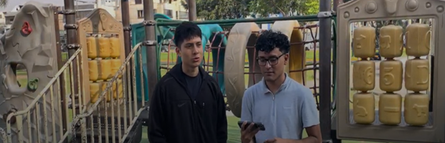
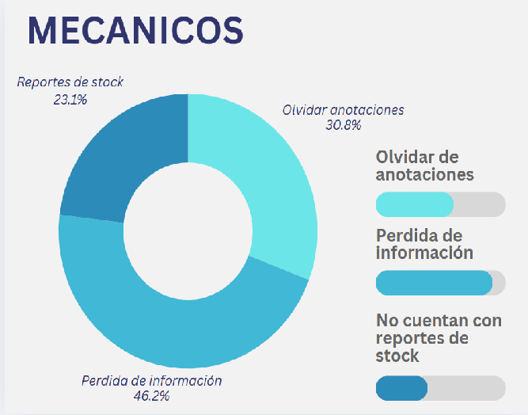
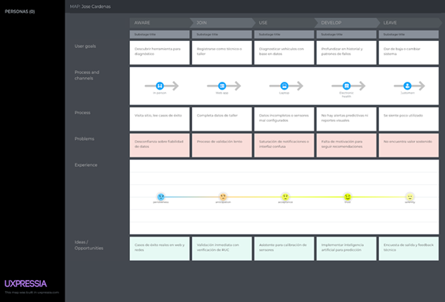

# Universidad Peruana De Ciencias Aplicadas

## Ingeniería de Software

### Informe de Trabajo Final

### Desarrollo de Aplicaciones Open Source 

**Sección:** 
4310

**Profesor:**  
Ivan Robles Fernández

**Integrantes:**

    <ul>
        <li>Victor Andres Cruz Ibarra - U202311053</li>
        <li>Rafael Andres Vivanco Salazar - U202311064</li>
        <li>Ricardo Fernando Cardenas Minaya - U202310004</li>
        <li>Jarod Jack Cespedes Pillco - U202318588</li>
        <li>Ronald Joel Peralta Chipa -U202224619</li>
    </ul>

**2025 - 1**

---

# **Registro de Versiones del Informe**

| Versión | Fecha      | Autor                          | Descripción de modificación      |
|---------|------------|--------------------------------|----------------------------------|
| TB1     | 26/01/2025 | Ronald Joel Peralta Chipa - Victor Andres Cruz Ibarra - Ricardo Fernando Cardenas Minaya - Rafael Andres Vivanco Salazar - Jarod Jack Cespedes Pillco   | Capitulo 1, Capitulo 2, Capitulo 3, Capitulo 4, Capitulo 5 |
| TB2     |            |                                |                                  |
| TB3     |            |                                |                                  |

# **Project Report Collaboration Insights**

Enlace de la organización para el reporte del proyecto: https://github.com/orgs/project-OpenSource-4310/repositories

**TB1**

Para el desarrollo del informe correspondiente a la entrega TB1, se estableció la implementación de secciones de la siguiente manera para cada integrante del equipo:

|Integrante|Tareas Asignadas|
|-|-|
|Victor Andres Cruz Ibarra|Style Guidelines, Information Architecture, Landing Page UI Design, Web Applications UI/UI Design, Web Applications Prototyping|
|Rafael Andres Vivanco Salazar| Startup Profile, Solution Profile, Domain-Driven Software Architecture, Software Object-Oriented Design y Database Design|
|Ricardo Fernando Cardenas Minaya |Competidores, Análisis competitivo, To-Be Scneario Mapping, User Stories, Impact Mapping y Product Backlog|
|Jarod Jack Cespedes Pillco | Source Code Management, Source Style Guide, Software Deployment Configuration|
|Ronald Joel Peralta Chipa|Análisis de entrevistas, NeedFinding, User personas, User Task Matrix, User Journey Mapping, Empathy Mapping, As-is Scenario Mapping.|

# **Contenido**

### Tabla de contenidos

- [**Registro de Versiones del Informe**](#registro-de-versiones-del-informe)
- [**Project Report Collaboration Insights**](#project-report-collaboration-insights)
- [**Contenido**](#contenido)
  - [Tabla de contenidos](#tabla-de-contenidos)
- [**Student Outcome**](#student-outcome)
- [ **Capítulo I: Introducción** ](#-capítulo-i-introducción-)
  - [**1.1. Startup Profile**](#11-startup-profile)
    - [**1.1.1. Descripción de la Startup**](#111-descripción-de-la-startup)
    - [**1.1.2. Perfiles de integrantes del equipo**](#112-perfiles-de-integrantes-del-equipo)
  - [**1.2. Solution Profile**](#12-solution-profile)
    - [**1.2.1 Antecedentes y problemática**](#121-antecedentes-y-problemática)
     - [**1.2.2 Lean UX Process**](#122-lean-ux-process)
    - [**1.2.2.1. Lean UX Problem Statements**](#1221-lean-ux-problem-statements)
    - [**1.2.2.2. Lean UX Assumptions**](#1222-lean-ux-assumptions)
    - [**1.2.2.3. Lean UX Hypothesis Statements**](#1223-lean-ux-hypothesis-statements)
    - [**1.2.2.4. Lean UX Canvas**](#1224-lean-ux-canvas)
  - [**1.3. Segmentos objetivo**](#13-segmentos-objetivo)
- [ **Capítulo II: Requirements Elicitation \& Analysis**](#-capítulo-ii-requirements-elicitation--analysis)
  - [**2.1. Competidores**](#21-competidores)
    - [**2.1.1. Análisis competitivo**](#211-análisis-competitivo)
    - [**2.1.2. Estrategias y tácticas frente a competidores**](#212-estrategias-y-tácticas-frente-a-competidores)
  - [**2.2. Entrevistas**](#22-entrevistas)
    - [**2.2.1. Diseño de entrevistas**](#221-diseño-de-entrevistas)
    - [**2.2.2. Registro de entrevistas**](#222-registro-de-entrevistas)
    - [**2.2.3. Análisis de entrevistas**](#223-análisis-de-entrevistas)
  - [**2.3. Needfinding**](#23-needfinding)
    - [**2.3.1. User Personas**](#231-user-personas)
    - [**2.3.2. User Task Matrix**](#232-user-task-matrix)
    - [**2.3.3. User Journey Mapping**](#233-user-journey-mapping)
    - [**2.3.4. Empathy Mapping**](#234-empathy-mapping)
    - [**2.3.5. As-is Scenario Mapping**](#235-as-is-scenario-mapping)
  - [**2.4. Ubiquitous Language**](#24-ubiquitous-language)
- [ **Capítulo III: Requirements Specification**](#-capítulo-iii-requirements-specification)
  - [**3.1. To-Be Scenario Mapping**](#31-to-be-scenario-mapping)
  - [**3.2. User Stories**](#32-user-stories)
  - [**3.3. Impact Mapping**](#33-impact-mapping)
  - [**3.4. Product Backlog**](#34-product-backlog)
- [**Capítulo IV: Product Design**](#capítulo-iv-product-design)
  - [**4.1. Style Guidelines**](#41-style-guidelines)
    - [**4.1.1. General Style Guidelines**](#411-general-style-guidelines)
    - [**4.1.2. Web Style Guidelines**](#412-web-style-guidelines)
  - [**4.2. Information Architecture**](#42-information-architecture)
    - [**4.2.1. Organization Systems**](#421-organization-systems)
    - [**4.2.2. Labeling Systems**](#422-labeling-systems)
    - [**4.2.3. SEO Tags and Meta Tags**](#423-seo-tags-and-meta-tags)
    - [**4.2.4. Searching Systems**](#424-searching-systems)
    - [**4.2.5. Navigation Systems**](#425-navigation-systems)
  - [**4.3. Landing Page UI Design**](#43-landing-page-ui-design)
    - [**4.3.1. Landing Page Wireframe**](#431-landing-page-wireframe)
    - [**4.3.2. Landing Page Mock-up**](#432-landing-page-mock-up)
  - [**4.4. Web Applications UX/UI Design**](#44-web-applications-uxui-design)
    - [**4.4.1. Web Applications Wireframes**](#441-web-applications-wireframes)
    - [**4.4.2. Web Applications Wireflow Diagrams**](#442-web-applications-wireflow-diagrams)
    - [**4.4.3. Web Applications Mock-ups**](#443-web-applications-mock-ups)
    - [**4.4.4. Web Applications User Flow Diagrams**](#444-web-applications-user-flow-diagrams)
  - [**4.5. Web Applications Prototyping**](#45-web-applications-prototyping)
  - [**4.6. Domain-Driven Software Architecture**](#46-domain-driven-software-architecture)
    - [**4.6.1. Software Architecture Context Diagram**](#461-software-architecture-context-diagram)
    - [**4.6.2. Software Architecture Container Diagrams**](#462-software-architecture-container-diagrams)
    - [**4.6.3. Software Architecture Components Diagrams**](#463-software-architecture-components-diagrams)
  - [**4.7. Software Object-Oriented Design**](#47-software-object-oriented-design)
    - [**4.7.1. Class Diagrams**](#471-class-diagrams)
    - [**4.7.2. Class Dictionary**](#472-class-dictionary)
  - [**4.8. Database Design**](#48-database-design)
    - [**4.8.1. Database Diagram**](#481-database-diagram)
- [**Capítulo V: Product Implementation, Validation & Deployment**](#capítulo-v-product-implementation-validation--deployment)
  - [**5.1. Software Configuration Management**](#51-software-configuration-management)
    - [**5.1.1. Software Development Environment Configuration**](#511-software-development-environment-configuration)
    - [**5.1.2. Source Code Management**](#512-source-code-management)
    - [**5.1.3. Source Code Style Guide & Conventions**](#513-source-code-style-guide--conventions)
    - [**5.1.4. Software Deployment Configuration**](#514-software-deployment-configuration)
  - [**5.2. Landing Page, Services & Applications Implementation**](#52-landing-page-services--applications-implementation)
    - [**5.2.1. Sprint 1**](#521-sprint-1)
      - [**5.2.1.1. Sprint Planning 1**](#5211-sprint-planning-1)
      - [**5.2.1.2. Aspect Leaders and Collaborators**](#5212-aspect-leaders-and-collaborators)
      - [**5.2.1.3. Sprint Backlog 1**](#5213-sprint-backlog-1)
      - [**5.2.1.4. Development Evidence for Sprint Review**](#5214-development-evidence-for-sprint-review)
      - [**5.2.1.5. Execution Evidence for Sprint Review**](#5215-execution-evidence-for-sprint-review)
      - [**5.2.1.6. Services Documentation Evidence for Sprint Review**](#5216-services-documentation-evidence-for-sprint-review)
      - [**5.2.1.7. Software Deployment Evidence for Sprint Review**](#5217-software-deployment-evidence-for-sprint-review)
      - [**5.2.1.8. Team Collaboration Insights during Sprint**](#5218-team-collaboration-insights-during-sprint)
    - [**5.2.2. Sprint 2**](#522-sprint-2)
      - [**5.2.2.1. Sprint Planning 2**](#5221-sprint-planning-2)
      - [**5.2.2.2. Aspect Leaders and Collaborators**](#5222-aspect-leaders-and-collaborators)
      - [**5.2.2.3. Sprint Backlog 2**](#5223-sprint-backlog-2)
      - [**5.2.2.4. Development Evidence for Sprint Review**](#5224-development-evidence-for-sprint-review)
      - [**5.2.2.5. Execution Evidence for Sprint Review**](#5225-execution-evidence-for-sprint-review)
      - [**5.2.2.6. Services Documentation Evidence for Sprint Review**](#5226-services-documentation-evidence-for-sprint-review)
      - [**5.2.2.7. Software Deployment Evidence for Sprint Review**](#5227-software-deployment-evidence-for-sprint-review)
      - [**5.2.2.8. Team Collaboration Insights during Sprint**](#5228-team-collaboration-insights-during-sprint)
  - [**5.3. Validation Interviews**](#53-validation-interviews)
    - [**5.3.1. Diseño de Entrevistas**](#531-diseño-de-entrevistas)
    - [**5.3.2. Registro de Entrevistas**](#532-registro-de-entrevistas)
    - [**5.3.3. Evaluaciones según heurísticas**](#533-evaluaciones-según-heurísticas)

[Conclusiones](#conclusiones)

[Bibliografía](#bibliografía)

[Anexos](#anexos)

# **Student Outcome**

El curso contribuye al cumplimiento del Student Outcome ABET:   
**ABET – EAC - Student Outcome 3** 
**Criterio:** Capacidad de comunicarse efectivamente con un rango de audiencias. 
En el siguiente cuadro se describe las acciones realizadas y enunciados de conclusiones por parte del grupo, que permiten sustentar el haber alcanzado el logro del ABET – EAC - Student Outcome 3.

 

<table style="border-collapse:collapse;border-spacing:0" class="tg"><thead><tr><th style="border-color:black;border-style:solid;border-width:1px;font-family:Arial, sans-serif;font-size:14px;font-weight:normal;overflow:hidden;padding:10px 5px;text-align:left;vertical-align:top;word-break:normal">Criterio específico</th><th style="border-color:black;border-style:solid;border-width:1px;font-family:Arial, sans-serif;font-size:14px;font-weight:normal;overflow:hidden;padding:10px 5px;text-align:left;vertical-align:top;word-break:normal">Acciones realizadas</th><th style="border-color:black;border-style:solid;border-width:1px;font-family:Arial, sans-serif;font-size:14px;font-weight:normal;overflow:hidden;padding:10px 5px;text-align:left;vertical-align:top;word-break:normal">Conclusiones</th></tr></thead>
<tbody>
<tr><td style="border-color:black;border-style:solid;border-width:1px;font-family:Arial, sans-serif;font-size:14px;overflow:hidden;padding:10px 5px;text-align:left;vertical-align:top;word-break:normal">Comunica oralmente con efectividad a diferentes rangos de audiencia </td>
<td style="border-color:black;border-style:solid;border-width:1px;font-family:Arial, sans-serif;font-size:14px;overflow:hidden;padding:10px 5px;text-align:left;vertical-align:top;word-break:normal">Andres Cruz:   TB1: Me aseguré de comunicarme de manera clara y respetuosa con mi equipo, transmitiendo mis ideas con asertividad y cumpliendo los compromisos adquiridos.    Rafael Vivanco:   TB1: Durante las reuniones grupales, me centré en expresar mis ideas y propuestas con claridad, adaptando mi comunicación al contexto para facilitar la comprensión de todos.    Fernando Cardenas:   TB1: Participé activamente en las tareas asignadas, aplicando mis conocimientos y habilidades para alcanzar los objetivos del equipo en tiempo y forma.   Jack Cespedes:   TB1: Me mantuve comprometido con el equipo, colaborando en cada etapa del proceso y asegurándome de aportar soluciones para alcanzar los objetivos de manera eficiente.    Joel Peralta   TB1: Me involucré en un diálogo abierto y constante con el equipo, lo que facilitó la distribución de tareas y la obtención de buenos resultados. Además, procuré mantener siempre una actitud colaborativa y proactiva para fortalecer la dinámica grupal.  
<td style="border-color:black;border-style:solid;border-width:1px;font-family:Arial, sans-serif;font-size:14px;overflow:hidden;padding:10px 5px;text-align:left;vertical-align:top;word-break:normal">TB1: A lo largo del proyecto, todos los integrantes del equipo lograron expresar sus ideas de manera oral con claridad y adecuación al contexto. Esto permitió que tanto compañeros como docentes comprendieran nuestras propuestas con facilidad. Gracias a esta capacidad de adaptación en la comunicación, pudimos distribuir tareas de forma eficiente, resolver inquietudes al instante y mantener una dinámica de colaboración efectiva en todo momento.  </td>
</tr>
<tr><td style="border-color:black;border-style:solid;border-width:1px;font-family:Arial, sans-serif;font-size:14px;overflow:hidden;padding:10px 5px;text-align:left;vertical-align:top;word-break:normal">Comunica por escrito con efectividad a diferentes rangos de audiencia.</td>
<td style="border-color:black;border-style:solid;border-width:1px;font-family:Arial, sans-serif;font-size:14px;overflow:hidden;padding:10px 5px;text-align:left;vertical-align:top;word-break:normal">Andres Cruz:   TB1: Aporté en diferentes etapas del trabajo, garantizando que la información fuera clara, precisa y organizada, lo que permitió una mejor comprensión y aplicación en el desarrollo del proyecto.    Rafael Vivanco:   TB1: Contribuí en diversos aspectos del trabajo, garantizando que la información fuera precisa, coherente y comprensible tanto para compañeros como para docentes.   Fernando Cardenas:   TB1: Participé activamente en las tareas asignadas, aplicando mis conocimientos y habilidades para cumplir con los objetivos del equipo de manera efectiva y dentro de los plazos establecidos.   Jack Cespedes:   TB1:Cumplí con todas las actividades asignadas y considero que tuve un buen desempeño. Sin embargo, reconozco que debo mejorar en la gestión de mi tiempo para optimizar mis resultados en futuros proyectos.   Joel Peralta:   TB1: Me involucré en la ejecución de las tareas grupales, aportando ideas y soluciones que contribuyeron al desarrollo del proyecto. También procuré mantener una comunicación fluida con mis compañeros para garantizar una coordinación eficiente  </td>
<td style="border-color:black;border-style:solid;border-width:1px;font-family:Arial, sans-serif;font-size:14px;overflow:hidden;padding:10px 5px;text-align:left;vertical-align:top;word-break:normal">TB1: La eficacia del trabajo en equipo también se evidenció en nuestra habilidad para transmitir información de manera escrita. La documentación desarrollada, que abarcó informes, descripciones técnicas y contenido para la landing page, fue precisa, estructurada y accesible. Esto contribuyó a la validación del proyecto y garantizó que el producto final reflejara con claridad su propósito y funcionalidad.  </td>
</tr>
</tbody></table>
  

#  **Capítulo I: Introducción** 

## **1.1. Startup Profile**

### **1.1.1. Descripción de la Startup**
Autonexo es un software especializado en la gestión integral del mantenimiento vehicular, diseñado para resolver los principales problemas que enfrentan técnicos (mecánicos) o personas al administrar sus flotas. Su objetivo es optimizar la organización, el seguimiento histórico, la gestión de repuestos y el cálculo de presupuesto, todo dentro de un sistema centralizado y fácil de usar.

La plataforma permite registrar vehículos, usuarios y repuestos, así como ejecutar y organizar mantenimientos. Además, ofrece herramientas para el control de inventario, cálculo de presupuesto, acceso al historial de mantenimiento para realizar los cambios necesarios en el vehículo. Según un estudio realizado por Innocar en colaboración con la empresa mexicana Roshfrans, solo el 23.5% de los talleres mecánicos en América Latina utilizan software especializado para gestionar sus operaciones y aspectos administrativos. Este bajo nivel de adopción tecnológica resalta la necesidad de soluciones digitales que optimicen la eficiencia operativa en la gestión de flotas vehiculares.

Autonexo también contempla la integración de tecnologías opcionales como IoT para  un monitoreo en tiempo real, lo que potencia la eficiencia operativa y la estandarización de procesos en el área de mantenimiento vehicular.
  
A continuación, exponemos un preliminar de, cuadro comparativo de nuestros competidores que será detallado más adelante en el segundo capítulo.
|  **Nombre**    | **Perfil (Overview)** |
|----------------|-----------------------|
| **AutoNexo**   | Autonexo es un software especializado en la gestión del mantenimiento vehicular, diseñado para resolver los principales problemas que enfrentan técnicos (mecánicos) o personas al administrar sus flotas. |
| **Fleetio**    | Fleetio es una de las plataformas más robustas y reconocidas en la gestión de flotas. Su enfoque se centra en brindar a las empresas una solución para controlar todos los aspectos del mantenimiento vehicular. |
| **Drivvo**     | Drivvo es una aplicación orientada tanto a particulares como a pequeñas empresas, enfocada en la administración del mantenimiento, gastos y consumo de vehículos. |
| **Whip Around**| Whip Around es una plataforma para inspecciones y mantenimiento vehicular en flotas comerciales. |

### **1.1.2. Perfiles de integrantes del equipo**

|  | **Ronald Peralta \- u202224619**   Mi nombre es Ronald Joel Peralta Chipa. Soy una persona comprometida con el orden, con un estilo de liderazgo democrático y una gran capacidad para escuchar y comprender. Disfruto crecer en equipo y siempre estoy dispuesto a aprender de los demás. En mi faceta como desarrollador, tengo un especial interés en los lenguajes C# y JavaScript. |
| :---: | ----- |
|  | **Jarod Céspedes \- u202318588**   Mi nombre es Jarod Jack Céspedes Pillco, actualmente estoy cursando el quinto ciclo de la carrera Ingeniería de Software. Considero que soy atento, creativo y colaborador, siempre intentando apoyar a mi equipo en lo más que puedo. Además, tengo conocimientos en varios lenguajes de programación como C++, C#, Python y Java. |
|  | **Ricardo Cardenas \- u202310004**   Mi nombre es Ricardo Cardenas, tengo 19 años y estoy en el 5to ciclo de Ingeniería de Software en la UPC. Soy apasionado, creativo y dedicado en lo que hago. Estoy comprometido a dar lo mejor de mí para lograr resultados sobresalientes y contribuir de manera significativa al equipo. |
|  | **Victor Cruz \- u202311053**   Mi nombre es Victor Cruz, tengo 19 años y estoy cursando mi 5to ciclo de la carrera de Ingeniería de Software en la UPC. Soy una persona entusiasta, creativa y comprometida con cada actividad que realizo. Estoy decidido a dar lo mejor de mi en este proyecto para lograr resultados de calidad. |
| | **Rafael Vivanco \- u202311064**   Mi nombre es Rafael Vivanco, tengo 19 años y actualmente curso el 5to ciclo de la carrera de Ingeniería de Software en la UPC. Me considero una persona responsable con facilidad para adaptarme a distintos entornos y manejar varias tareas a la vez. Siempre doy lo mejor de mí en cada proyecto, aportando dedicación, esfuerzo y actitud positiva. |

## **1.2. Solution Profile**
### **1.2.1. Antecedentes y problemática**
### Who (¿Quién?)
Afecta principalmente a mecánicos encargados del mantenimiento y dueños de flotas (empresas o particulares).
### What (¿Qué?)
Los responsables del mantenimiento vehicular y dueños de vehículos enfrentan dificultades para organizar, planificar y dar seguimiento a los mantenimientos. También hay fallas en el control de inventario de repuestos, registros históricos desorganizados, y una falta de estandarización en los procesos. Esto genera pérdidas económicas, mantenimientos tardíos y decisiones poco informadas.
### Where (¿Dónde?)
Esta problemática se presenta en talleres mecánicos, empresas con flotas de vehículos (logística, transporte, servicios), y en general en cualquier entorno como el hogar donde se requiera un control sistemático del mantenimiento vehicular.
### When (¿Cuándo?)
Es un problema constante, pero se intensifica a medida que aumenta el número de vehículos  cuando se acercan fechas críticas de mantenimiento y no se tiene un control claro.
### Why (¿Por qué?)
Esto se debe a la falta de un sistema centralizado y especializado. Muchos utilizan métodos manuales (hojas de Excel, cuadernos) o herramientas genéricas  no adaptadas a las necesidades específicas del mantenimiento vehicular. Además, hay una escasa integración tecnológica (como IoT) que permita un monitoreo en tiempo real del estado de los vehículos.
### How (¿Cómo?)
A través del desarrollo de un software llamado Autonexo que permitirá reducir costos operativos, ahorrar tiempo y dinero perdido por vehículos fuera de servicio, mejorar el servicio al cliente y la eficiencia operativa a través de datos históricos confiables en una plataforma centralizada.
### How Much (¿Cuánto?)
Se estima que hasta el 65% de las empresas con flotas pequeñas o medianas no tienen un sistema especializado para el mantenimiento vehicular.  Las empresas pueden perder hasta un 20% más en costos de mantenimiento por no contar con una gestión eficiente. Es por esto que con Autonexo se espera una mejora de entre 30% a 50% en la eficiencia operativa, reducción de hasta un 25% en gastos por mantenimientos correctivos y una mejora del 40% en la trazabilidad y control del historial vehicular.
 
### **1.2.2. Lean UX Process**

#### **1.2.2.1. Lean UX Problem Statements**
Nuestra startup proporciona una plataforma especializada en la gestión integral del mantenimiento vehicular. Está dirigida específicamente a propietarios de vehículos y técnicos mecánicos que requieren una herramienta digital eficiente para organizar mantenimientos, controlar repuestos, calcular presupuestos y llevar un historial técnico actualizado. Nuestra solución centraliza todas estas funciones dentro de una plataforma intuitiva y accesible desde la web, optimizando el proceso de control vehicular.
Hemos identificado un factor crítico que afecta tanto a personas como a empresas: la desorganización en el mantenimiento de vehículos, lo que genera sobrecostos, fallas mecánicas evitables y pérdida de tiempo en tareas repetitivas o improvisadas.
Ante este problema, surge la pregunta: ¿Cómo podemos ayudar a los usuarios a gestionar de forma eficiente sus vehículos para reducir imprevistos, optimizar costos y asegurar un mantenimiento constante sin complicaciones?
 
#### **1.2.2.2. Lean UX Assumptions**
### Users:
Propietarios de vehículos particulares preocupados por el buen estado de sus autos.
Mecánicos que desean llevar un control digital de sus mantenimientos y repuestos.
### User Outcomes:
**1. ¿Quién es el usuario?** Nuestros usuarios serán dueños de vehículos y mecánicos. Los propietarios de vehículos buscan una solución para organizar y hacer un seguimiento eficiente de los mantenimientos de sus vehículos mientras que los mecánicos necesitan gestionar múltiples vehículos, repuestos, presupuestos y registros de mantenimientos para optimizar su operación.
 
**2. ¿Dónde encaja nuestro producto en su trabajo o vida?** AutoNexo se convierte en una herramienta diaria de consulta y planificación, tanto para usuarios que desean mantener su vehículo en buen estado como para técnicos que necesitan gestionar varios vehículos con eficiencia.
 
**3. ¿Qué problemas tiene nuestro producto y cómo se puede resolver?** Uno de los problemas principales es la adopción de la tecnología, ya que algunos usuarios pueden no estar familiarizados con el uso de plataformas digitales. Para resolver esto, debemos ofrecer una interfaz intuitiva y fácil de navegar, con un proceso de integración simple y tutoriales para que los nuevos usuarios puedan configurar rápidamente sus vehículos y 
mantenimientos. 
 
**4. ¿Cuándo y cómo es usado nuestro producto?** Será usado cada vez que los usuarios necesiten gestionar el mantenimiento de sus vehículos. El uso se realiza a través de una plataforma web accesible desde cualquier dispositivo, brindando flexibilidad en el momento de acceder a la información.
 
**5. ¿Qué características son importantes?** Algunas características importantes son:
Registro integral de vehículos, usuarios y repuestos
* Calendario de mantenimientos programados
* Control de inventario de repuestos
* Cálculo de presupuesto de reparaciones y mantenimientos
* Historial detallado de mantenimientos por vehículo
* Plataforma intuitiva y accesible desde web
* Servicio de mensajería entre usuario y mecánico 
**6. ¿Cómo debe verse nuestro producto y cómo debe comportarse?** Nuestro producto debe tener un diseño limpio y moderno. La interfaz debe ser clara y accesible, con menús fáciles de navegar y funciones bien definidas, sin sobrecargar al usuario con información innecesaria. En cuanto al comportamiento, la plataforma debe contar con tiempos de carga cortos y sin interrupciones. Las notificaciones y recordatorios deben ser automáticos, proporcionando una experiencia fluida y de confianza al usuario.
  
### Business Outcomes:
**1. Creo que mis clientes necesitan** una plataforma que les permita gestionar de forma eficiente el mantenimiento de sus vehículos, llevar control de repuestos, calcular presupuestos y acceder a un historial detallado de intervenciones.
 
**2. Estas necesidades se pueden resolver** mediante una solución digital centralizada, accesible desde la web, que automatice procesos, reduzca la improvisación y brinde herramientas de seguimiento y planificación de mantenimiento vehicular
 
**3. Mis clientes iniciales serán** propietarios de vehículos particulares y mecánicos que buscan mayor organización y eficiencia en el manejo de mantenimientos.
 
**4. El valor #1 que un cliente quiere de mi servicio** es poder llevar un control integral y ordenado del mantenimiento de sus vehículos en un solo lugar, sin depender de registros manuales o desorganizados.
 
**5. El cliente también puede obtener estos beneficios adicionales:** 
* Ahorro de tiempo y costos por mantenimientos tardíos o improvisados.
* Recordatorios automáticos y seguimiento personalizado.
* Control eficiente del inventario de repuestos.
* Generación de presupuestos claros y detallados.

**6. Voy a adquirir la mayoría de mis clientes a través de** marketing digital dirigido, contenido educativo sobre mantenimiento vehicular, y programas de referidos. 
 
**7. Haré dinero a través de** planes de suscripción mensual o anual para acceso premium, cobros por funcionalidades avanzadas, y alianzas comerciales con proveedores del sector automotriz.
 
**8. Mi competencia principal en el mercado serán** aplicaciones como Drivvo o Fleetio y softwares de gestión vehicular generalistas.
 
**9. Los venceremos debido a nuestro apoyo** enfocado especialmente en el contexto local, con una interfaz amigable, enfoque específico en propietarios individuales y técnicos, y funcionalidades relevantes como historial 
  detallado y gestión de repuestos.
 
**10. Mi mayor riesgo de producto es** que los usuarios no adopten la plataforma por considerar que sus métodos actuales (manuales o informales) ya les funcionan o por falta de conocimiento digital.
Resolveremos esto a través de capacitación básica, demostraciones gratuitas, versión gratuita con funcionalidades clave y testimonios de clientes satisfechos.
 
**11. ¿Qué otras suposiciones tenemos?** 
 
**Suposición 1:** Los mecánicos y dueños de vehículos están dispuestos a cambiar sus métodos actuales por una solución digital.
 
**Suposición 2:** Los usuarios consideran útil llevar un historial detallado y control digital del mantenimiento.
 
**Suposición 3:** El modelo de suscripción es viable para este segmento de usuarios.
 
**Suposición 4:** Los usuarios valorarán funciones adicionales como notificaciones, presupuestos y control de inventario.
 
**¿Eso, si se prueba que es falso, causará que nuestro negocio / proyecto no funcione?** 
Si los usuarios no consideran que el cambio a una solución digital aporta suficiente valor o si no están dispuestos a pagar por ello, el modelo de negocio no será sostenible ni escalable.

#### **1.2.2.3. Lean UX Hypothesis Statements**
**1. Creemos que** al ofrecer una plataforma centralizada para registrar vehículos, repuestos y mantenimientos, ayudaremos a los usuarios a organizar mejor sus procesos y reducir errores o pérdidas de información.
 
**Sabremos que** hemos tenido éxito cuando al menos el 70% de los usuarios registre y mantenga actualizado su historial de vehículos y mantenimientos en el primer mes.
 
**2. Creemos que** al integrar herramientas de control de inventario y cálculo automático de presupuestos, facilitaremos la gestión operativa y financiera tanto a mecánicos como a dueños de vehículos.
 
**Sabremos que** hemos tenido éxito cuando el 60% de los usuarios utilicen estas funciones para planificar o ejecutar mantenimientos dentro de la plataforma.
 
**3. Creemos que** al diseñar una interfaz web intuitiva y accesible, incentivaremos el uso constante de Autonexo incluso por usuarios sin experiencia técnica.
 
**Sabremos que** hemos tenido éxito cuando al menos el 75% de los usuarios activos utilicen la plataforma semanalmente para gestionar sus vehículos.
 
**4. Creemos que** al permitir el acceso al historial completo de mantenimiento, aumentaremos la confianza de los usuarios en sus decisiones de reparación o venta de vehículos.
 
**Sabremos que** hemos tenido éxito cuando el 50% de los usuarios consulten el historial como parte del proceso de evaluación del estado del vehículo.
 
#### **1.2.2.4. Lean UX Canvas**
|  | | |
|-------------|--------------|--------------|
| **Business Problem** Autonexo es una plataforma que combina la eficiencia de un sistema digital con la gestión integral del mantenimiento vehicular. Su objetivo es ayudar a mecánicos y dueños de flotas a organizar, controlar y optimizar todas las actividades relacionadas con el mantenimiento de vehículos desde una sola herramienta. Ante la falta de seguimiento histórico, la desorganización en el manejo de repuestos, y la dificultad para presupuestar y programar mantenimientos, muchos usuarios recurren a métodos manuales o herramientas poco integradas que generan errores, pérdidas económicas y tiempos de inactividad. Además, enfrentan una experiencia fragmentada al usar múltiples sistemas para registrar vehículos, calcular costos o acceder a información técnica. | **Features** - Registro integral de vehículos, usuarios y repuestos  - Calendario de mantenimientos programados  - Control de inventario de repuestos  - Cálculo de presupuesto de reparaciones y mantenimientos  - Historial detallado de mantenimientos por vehículo  - Plataforma intuitiva y accesible desde web  - Servicio de mensajería entre usuario y mecánico | **Business Outcomes** - Reducir mantenimientos olvidados o tardíos mediante recordatorios y seguimiento digital  - Fidelizar a los usuarios con historial completo y recomendaciones personalizadas  - Posicionar a Autonexo como líder en Perú  - Mejorar la productividad de mecánicos y talleres reduciendo errores y tiempos de espera |
| **Customers** Autonexo está dirigido a dueños de vehículos que buscan controlar sus mantenimientos de forma práctica y a técnicos o talleres que desean optimizar su gestión operativa. Ambos valoran soluciones digitales que les permitan organizar historiales, prevenir fallas, reducir costos y tomar decisiones informadas. | **Customer Benefits** - Confianza y transparencia en reparaciones  - Mejora en la toma de decisiones  - Disminución de costos operativos  - Mejora de la reputación profesional (mecánicos)  - Acceso a estadísticas y reportes | **Hypothesis** - Plataforma centralizada reducirá errores y mejorará la organización. Éxito: 70% mantiene historial en el primer mes.  - Inventario y presupuestos facilitarán la gestión. Éxito: 60% los usa para planificar o ejecutar mantenimientos.  - Interfaz intuitiva incentivará el uso. Éxito: 75% usa la plataforma semanalmente. |
| **¿Qué debemos aprender primero?** Debemos entender cómo los técnicos y conductores actualmente organizan sus mantenimientos, qué herramientas usan, qué problemas enfrentan al llevar control manual, y si realmente valoran una solución integral que incluya presupuestos, inventario, entre otras cosas. | **¿Cuál es el menor esfuerzo para validar?** - Desarrollar versión básica para registrar vehículos, usuarios, repuestos y mantenimientos  - Implementar funciones esenciales: historial y presupuesto simple  - Diseñar una interfaz web sencilla e intuitiva  - Aplicar encuestas a un grupo reducido de mecánicos y dueños de vehículos para validar si la solución resuelve sus principales problemas operativos |  |
 

## **1.3. Segmentos objetivo**
Con el propósito de llegar de manera efectiva a posibles clientes, Autonexo ha definido dos segmentos principales como público objetivo.
 
   **Segmento objetivo \#1: Dueños de flota o conductores**
    Personas que poseen uno o más vehículos personales y desean gestionar de forma eficiente el mantenimiento, control de gastos y estado general de su unidad, evitando olvidos o problemas mecánicos por falta de     seguimiento.
 
   Aspectos demográficos:
* Sexo: Masculino y femenino  
* Rango de edad: 25–50 años  
* Nivel socioeconómico: Clases B y C (media-alta y media)  
  Aspectos geográficos:  
* Nacionalidad: Perú  
* Zona geográfica: Urbana (principalmente Lima Metropolitana y otras ciudades con alta concentración vehicular)  
  Aspectos psicográficos:  
* Intereses: Cuidado del vehículo, control financiero, tecnología práctica, seguridad vial, soluciones digitales simples.  
* Estilo de vida: Conducen regularmente, valoran la comodidad y buscan evitar gastos imprevistos o pérdidas de tiempo por fallas mecánicas.  
* Actitudes: Son conscientes de la importancia del mantenimiento preventivo y están abiertos a herramientas digitales que les faciliten llevar un control ordenado, práctico y accesible desde su celular o computadora. 
    **Segmento objetivo \#2: Mecánicos**  
    Profesionales que trabajan de manera independiente o en talleres y desean gestionar mejor sus servicios, controlar inventarios, ofrecer presupuestos precisos y acceder a historiales de mantenimiento para brindar un     mejor servicio a sus clientes.
     
  Aspectos demográficos:  
* Sexo: Masculino (en su mayoría)  
* Rango de edad: 25–50 años  
* Nivel socioeconómico: Clases C y D (media y media-baja)  
  Aspectos geográficos:  
* Nacionalidad: Perú  
* Zona geográfica: Urbana (distritos con concentración de talleres y servicios automotrices)  
  Aspectos psicográficos:  
* Intereses: Reparación automotriz, optimización de tiempo, herramientas digitales accesibles, atención al cliente.  
* Estilo de vida: Profesionales prácticos, con un enfoque técnico, acostumbrados al trabajo manual, pero abiertos a soluciones tecnológicas si son simples y funcionales.  
* Actitudes: Desean mejorar la calidad de su servicio y organización interna. Valoran las plataformas que les permitan brindar un servicio más profesional sin complicaciones adicionales.
#  **Capítulo II: Requirements Elicitation & Analysis** 

## **2.1. Competidores**
Dentro del mercado enfocado en la gestión y mantenimiento de vehículos, existe una amplia gama de plataformas que buscan mejorar la eficiencia, organización y control tanto para usuarios individuales como para empresas. A continuación, se presentan algunos de los principales competidores identificados para Autonexo.

**Fleetio**

Fleetio es una de las plataformas más robustas y reconocidas en la gestión de flotas. Su enfoque se centra en brindar a las empresas una solución integral para controlar todos los aspectos del mantenimiento vehicular, desde el seguimiento de servicios preventivos y correctivos hasta la gestión de combustible, repuestos y órdenes de trabajo. Además, proporciona reportes sobre costos, rendimiento y tiempo de inactividad. Fleetio también destaca por su escalabilidad y capacidad de integración con dispositivos telemáticos.

**Drivvo**

Drivvo es una aplicación orientada tanto a particulares como a pequeñas empresas, enfocada en la administración del mantenimiento, gastos y consumo de vehículos. Su propuesta de valor radica en ofrecer una plataforma sencilla para registrar y monitorear servicios como cambios de aceite, reparaciones, abastecimiento de combustible y más. Drivvo permite establecer recordatorios por tiempo o kilometraje, ayudando a prevenir olvidos en tareas de mantenimiento esenciales. Su interfaz amigable y su enfoque en la eficiencia personal hacen de esta app una opción accesible para los conductores.

**Whip Around**

Whip Around es una solución digital para inspecciones y mantenimiento vehicular en flotas comerciales. Su enfoque está en simplificar el proceso de revisión diaria de vehículos a través de formularios digitales personalizables, lo que ayuda a detectar problemas mecánicos antes de que se conviertan en fallas graves. Además, permite generar órdenes de reparación automáticamente y realizar un seguimiento de cada unidad de la flota. La plataforma también proporciona indicadores clave sobre el estado y rendimiento de los vehículos. Whip Around es especialmente útil para empresas que priorizan la seguridad operativa y el cumplimiento normativo.

### **2.1.1. Análisis competitivo**
| Características | AutoNexo | Fleetio | Drivvo | Whip Around |
|---------------|-----------|---------|---------|-------------|
| **Logo** |  |  |  |  |
| **Overview** | Autonexo es un software especializado en la gestión del mantenimiento vehicular, diseñado para resolver los principales problemas que enfrentan técnicos (mecánicos) o personas al administrar sus flotas | Fleetio es una de las plataformas más robustas y reconocidas en la gestión de flotas. Su enfoque se centra en brindar a las una solución para controlar todos los aspectos del mantenimiento vehicular | Drivvo es una aplicación orientada tanto a particulares como a pequeñas empresas, enfocada en la administración del mantenimiento, gastos y consumo de vehículos | Whip Around es una plataforma para inspecciones y mantenimiento vehicular en flotas comerciales |
| **Ventaja Competitiva** | Ofrece una plataforma integral que digitaliza y automatiza el proceso de mantenimiento vehicular, conectando de forma eficiente a conductores/flotas con talleres mecánicos | Optimiza el rendimiento y reduce los costos operativos de la flota mediante una gestión centralizada, automatizada y basada en datos | Facilita el control financiero y el de vehículos personales o comerciales con una app accesible y fácil de usar | Aumenta la seguridad operativa, minimiza riesgos y mejora el cumplimiento legal mediante inspecciones digitales eficientes |
| **Mercado Objetivo** | Dueños de flotas o conductores y mecánicos | Técnicos de mantenimiento y administradores de operaciones | Conductores, dueños de pequeños negocios de transportes | Gerentes de flota, supervisores de operaciones y conductores |
| **Estrategias de Marketing** | Campañas en redes sociales, programas de usuarios recurrentes y eventos | Blog técnico y educativo, guías sobre mantenimiento de flotas, análisis de costos y gestión de activos | Contenido visual y educativo sobre cómo ahorrar dinero en el uso del auto, mantenimiento y consumo | Campañas dirigidas a gerentes de flotas y operaciones |
| **Producto & Servicios** | Registro y gestión de vehículos, registro y control de inventario de repuestos, programación y seguimiento de mantenimientos | Gestión integral de flotas, registro y control con GPS y reportes analíticos avanzados | Registro de gastos, alertas por mantenimiento, control de historial del vehículo | Inspecciones digitales pre y post viaje, generación automática de órdenes de reparación |
| **Precios & Costos** | Servicio de suscripción, costos según plan, accesible | Servicios por suscripción, costos según flota y módulos | Gratuito con funciones básicas, y suscripción "premium" | Planes accesibles, con precios escalables para flotas grandes |
| **Canales de Distribución** | Web y app móvil | Web y app móvil | App móvil | Web y app móvil |
| **Fortalezas** | Solución especializada y completa para el mantenimiento vehicular | Escalable para pequeñas, medianas y grandes empresas | Fuerte presencia en mercados emergentes | Especialización en inspecciones vehiculares con cumplimiento normativo |
| **Oportunidades** | Digitalización creciente del sector automotriz | Posible expansión con IA para predicción de fallas | Expansión con funcionalidades para pequeñas flotas | Integración con más plataformas de gestión de flotas |
| **Debilidades** | Requiere tiempo para educación del usuario en sectores no digitalizados | Costos más elevados en planes avanzados | No ofrece soporte web | Limitación en la gestión completa de flotas |
| **Amenazas** | Fallas en la experiencia de usuario pueden afectar la percepción inicial | Competidores con soluciones más económicas | Usuarios migran a plataformas más completas | Cambios en normativas que reduzcan la necesidad de inspecciones formales |

### **2.1.2. Estrategias y tácticas frente a competidores**
- **Fortaleza utilizada** : Gestión integral y digital del mantenimiento vehicular, incluyendo diagnóstico, historial, repuestos e interacción con talleres.
- **Oportunidad aprovechada**:  Creciente necesidad de transparencia, trazabilidad y control en el mantenimiento de vehículos, especialmente para flotas y talleres que aún trabajan con procesos manuales.
- **Estrategia**: Desarrollar un ecosistema digital que centralice todos los aspectos del mantenimiento, optimizando la comunicación entre conductores y talleres, y facilitando la toma de decisiones mediante datos históricos y notificaciones inteligentes.
- **Táctica**: Implementar APIs RESTful para conectar todos los módulos, desplegar alertas automáticas sobre mantenimientos pendientes o diagnósticos

## **2.2. Entrevistas**
### **2.2.1. Diseño de entrevistas**
En esta sección se plantea una estrategia colaborativa con el equipo para detectar los aspectos comunes a partir de las respuestas proporcionadas por cada entrevistado en cada pregunta. Esto permite realizar un análisis más preciso y confiable, facilitando el desarrollo de nuestra aplicación basándonos en los datos recopilados.

**Segmento 1: Dueños de flotas.**
1. ¿Cómo realiza actualmente el seguimiento del mantenimiento de su flota de vehículos?
2. ¿Con qué frecuencia enfrenta mantenimientos inesperados o fallas imprevistas?
3. ¿Qué información considera imprescindible tener disponible al momento de tomar decisiones sobre reparaciones o servicios?
4. ¿Tiene alguna forma de visualizar el historial de mantenimiento de cada vehículo? ¿Cómo lo gestiona?
5. ¿Ha tenido problemas con talleres o técnicos, como retrasos, falta de transparencia o tareas mal ejecutadas?
6. ¿Qué tan fácil le resulta coordinar el trabajo entre el área técnica y los talleres externos?
7. ¿Suele usar indicadores como MTBF (tiempo medio entre fallas) o el costo por vehículo? ¿Cómo los calcula o supervisa?
8. ¿Le sería útil contar con alertas automáticas para próximos mantenimientos o vencimientos de componentes clave?
9. ¿Qué tan importante considera que sea la estandarización de las tareas de mantenimiento mediante listas o protocolos definidos?
10. Si pudiera implementar una herramienta que le permita controlar su flota desde una app o panel web, ¿qué funcionalidades consideraría indispensables?

**Segmento 2: Mecánicos**
1. ¿Cómo recibe actualmente las solicitudes de reparación o mantenimiento de los clientes?
2. ¿Tiene algún sistema para organizar las reparaciones que tiene pendiente? ¿Cómo lo gestiona?
3. ¿Lleva un control del tiempo que invierte por reparación? ¿Cómo lo hace?
4. ¿Anota o guarda un registro de los repuestos utilizados en cada reparación? ¿Dónde lo hace?
5. ¿Con qué frecuencia se encuentra con la falta de alguna pieza o herramienta al momento de realizar un trabajo?
6. ¿Ha utilizado alguna vez un checklist o guía paso a paso para una reparación? ¿Le resultó útil?
7. ¿Considera útil que un sistema le indique qué pasos debe seguir y qué materiales necesita antes de comenzar una reparación?
8. ¿Cómo guarda evidencia del trabajo que realiza? (Fotos, notas, videos...) ¿Quién se las pide?
9. ¿Tiene acceso al historial de reparaciones de los vehículos que atiende? ¿Le sería útil poder consultarlo?
10. ¿Qué herramienta digital (app o software) usa actualmente para su trabajo, si es que usa alguna? ¿Qué le gusta o no le gusta de ella?

### **2.2.2. Registro de entrevistas**
**Segmento 1: Dueños de flotas**

**Entrevistado 1**

- **Nombre y Apellido:** Santiago Gómez Iglesias  
- **Edad:** 25  
- **Fecha y lugar:** Lima, Perú  
- **Url:** [Entrevista completa](https://drive.google.com/file/d/13RAjOWoxGp70JdgJCuNyMmnqTYAEUzY/view?usp=sharing)  
- **Duración:** 11:44 minutos
- **Resumen:** El entrevistado habla de como gestiona el mantenimiento y las revisiones técnicas usando su teléfono mobil y un bloc de notas. También nos relata de una mala experiencia con un mecánico que no cumplió con resolver el problema de su vehículo a tiempo. Además, menciona que le gustaría tener una aplicación que le facilite el buscar lugares confiables para obtener repuestos para sus vehículos.

**Entrevistado 2**

- **Nombre y Apellido:** Jean Chipa  
- **Edad:** 25  
- **Fecha y lugar:** Lima, Perú  
- **Url:** [Entrevista completa](https://drive.google.com/file/d/1W4ka95-DvcHUAsc0Jk4nzsRC8l_r72Qx/view?usp=sharing)  
- **Duración:** 6:28 minutos
- **Resumen:** De acuerdo con la entrevista, el usuario gestiona el mantenimiento y las revisiones técnicas a través de una hoja de Excel y un cuaderno de apuntes. Sin embargo, menciona que, en ocasiones, este método se vuelve engorroso cuando hay variaciones, ya que, a medida que realiza más registros, la información pierde claridad. Además, existe la posibilidad de extraviar el cuaderno de apuntes o olvidar registrar ciertos datos. Le resulta alentador saber que puede implementar un sistema que optimice estos procesos de manera rápida y segura. 

**Entrevistado 3**

- **Nombre y Apellido:** Bruno Ontón  
- **Edad:** 24  
- **Fecha y lugar:** Lima, Perú  
- **Url:** [Entrevista completa](https://drive.google.com/file/d/14hpxkvlqUsKjHRF6oJVH3KVf7upqzTEZ/view?usp=drive_link )  
- **Duración:** 4:27 minutos
- **Resumen:** El entrevistado comenta que realiza el seguimiento de sus vehículos de forma manual, utilizando hojas de cálculo y recordatorios en el calendario. No cuenta con un sistema automatizado para registrar reparaciones, calcular indicadores como el MTBF o los costos por vehículo. Aunque lleva un control básico, reconoce que este método no es eficiente y que suele enfrentar pequeños imprevistos. Destaca que disponer de una herramienta que emita alertas automáticas, centralice el historial de cada unidad y genere reportes de mantenimiento sería de gran utilidad. 
 

**Segmento 2: Mecánicos**

**Entrevistado 1**

- **Nombre y Apellido:** Alvaro Espinoza  
- **Edad:** 25  
- **Fecha y lugar:** Lima, Perú  
- **Url:** [Entrevista completa](https://drive.google.com/file/d/1AiEnalDJ3kyt6R3ahbYz2tfpWNI8hX7G/view?usp=drive_linkk )  
- **Duración:** 11:10 minutos
- **Resumen:** El entrevistado menciona que toda la gestión de su mecánica la realiza de manera manual en un bloc de notas. No utiliza ningún software para administrar la cantidad de reparaciones, el stock de productos o los registros de clientes. Sin embargo, reconoce que contar con un sistema que le ayude en estos aspectos sería de gran utilidad, ya que le permitiría optimizar su trabajo de manera más eficiente

**Entrevistado 2**

- **Nombre y Apellido:** Vicente Vicencio  
- **Edad:** 24  
- **Fecha y lugar:** Lima, Perú  
- **Url:** [Entrevista completa](https://drive.google.com/file/d/1jJUJM2CxZaIUD-mVPSILqKvR_Qjnm9dG/view?usp=sharing)  
- **Duración:** 4:07 minutos
- **Resumen:** Vicente Vicencio, técnico independiente, gestiona sus reparaciones de manera informal, recibiendo solicitudes por llamadas o WhatsApp y organizando su trabajo en una libreta. No lleva un control preciso del tiempo invertido ni de los repuestos utilizados, lo que a veces le causa inconvenientes. También enfrenta problemas por la falta de piezas y herramientas durante las reparaciones. Aunque usa el bloc de notas del celular y Excel de forma básica, considera que un sistema digital optimizado le ayudaría a organizarse mejor, evitar olvidos y acceder a un historial de reparaciones para mejorar su eficiencia.

**Entrevistado 3**

- **Nombre y Apellido:** Jair Gutierrez  
- **Edad:** 26  
- **Fecha y lugar:** Lima, Perú  
- **Url:** [Entrevista completa](https://drive.google.com/file/d/1s3h2tNtl4xgaC68Lv3HhIh98MvHGtYEA/view?usp=sharing)  
- **Duración:** 3:02 minutos
- **Resumen:** Jair Gutierrez, mecánico de taller, organiza su trabajo en una libreta y recibe solicitudes por el jefe de taller, llamadas o redes sociales. No lleva un registro preciso del tiempo ni de los repuestos, lo que a veces le genera problemas. Frecuentemente enfrenta la falta de piezas o herramientas, lo que retrasa su trabajo. Considera que un sistema digital le ayudaría a mejorar su organización, evitar olvidos y acceder a historiales de reparaciones para mayor eficiencia

### **2.2.3. Análisis de entrevistas**
Se plantea una estrategia colaborativa con el equipo para identificar los aspectos comunes según las respuestas de cada entrevistado. Esto permite realizar un análisis más preciso y confiable, facilitando el desarrollo de la aplicación a partir de la información recopilada.

**Segmento 1 dueños de flotas, puntos en común:**
1. ¿Cómo gestionan actualmente el mantenimiento de sus vehículos?

- Ambos entrevistados utilizan métodos manuales como hojas de Excel, cuadernos o calendarios. Si bien esto les permite llevar un control básico, reconocen que con el tiempo se vuelve desordenado o poco claro.
2. ¿Qué problemas enfrentan con su método actual?

- Tienen dificultades cuando hay variaciones en los registros, olvidos en las anotaciones o pérdida de información. Además, no cuentan con reportes o indicadores técnicos que ayuden en la toma de decisiones.

3. ¿Utilizan indicadores de mantenimiento como MTBF o costos por vehículo?

- No, actualmente no hacen uso de indicadores avanzados. El control que llevan es básico y no permite calcular estos valores importantes para evaluar el rendimiento o eficiencia de cada unidad.

4.  ¿Estarían interesados en usar un sistema automatizado?

- Sí. Ambos ven con buenos ojos la implementación de una herramienta digital que emita alertas, centralice datos y mejore la organización y eficiencia del mantenimiento.

**Segmento 2 mecánicos, puntos en comun:**
1. ¿Cómo gestionan las reparaciones y el trabajo diario?

- Los tres entrevistados organizan su trabajo manualmente, ya sea con una libreta, bloc de notas, o Excel de forma muy básica. Reciben pedidos por WhatsApp, llamadas o redes sociales.

2. ¿Llevan un control preciso del tiempo y de los repuestos utilizados?

- No. Ninguno lleva un registro detallado del tiempo invertido en cada trabajo ni del uso de repuestos, lo cual les genera problemas de organización y control.

3. ¿Qué tipo de inconvenientes enfrentan por la falta de herramientas o piezas?

- La falta de piezas o herramientas durante una reparación es un problema frecuente que retrasa su trabajo y afecta la eficiencia del servicio que ofrecen.

4.  ¿Consideran útil implementar un sistema digital para organizar su trabajo?

- Sí. Todos coinciden en que un sistema digital podría ayudarles a mejorar su organización, evitar olvidos y acceder rápidamente a información histórica sobre sus trabajos.

**Análisis general por segmento**
- **Segmento 1: Dueños de flotas:** Este segmento presenta una necesidad clara de transformación digital. Aunque han intentado organizarse mediante herramientas básicas como Excel, enfrentan dificultades a medida que la flota crece. La falta de automatización, reportes técnicos y control de mantenimiento los expone a errores y pérdidas de información. Están dispuestos a adoptar una solución digital si les brinda facilidad, seguridad y eficiencia.

- **Segmento 2: Mecánicos** Los mecánicos operan con una gestión altamente informal. La mayoría no utiliza herramientas digitales más allá de aplicaciones básicas. Enfrentan problemas de logística, control y planificación debido a la falta de registros precisos. Ven con buenos ojos un sistema que les facilite el día a día, especialmente en el seguimiento de repuestos, tiempos y clientes.

## **2.3. Needfinding**

### **2.3.1. User Personas**
  **Segmento 1: Dueños de flotas:**

**Segmento 2: Mecánicos**

### **2.3.2. User Task Matrix**
| Task Matrix | Conductor | Conductor | Mecánico | Mecánico |
|------------|-----------|------------|----------|------------|
|  | **Frecuencia** | **Importancia** | **Frecuencia** | **Importancia** |
| Verificar el estado general del vehículo | High | medium | rarely | often |
| Recibir alertas de fallos | medium | High | High | High |
| Registrar fallas o anomalías manualmente | rarely | medium | High | High |
| Ver historial de mantenimiento | often | medium | High | High |
| Solicitar revisión o mantenimiento | often | High | rarely | medium |
| Confirmar ruta y destino desde la app | medium | medium | rarely | rarely |
| Ver notificaciones de revisión próxima | medium | medium | High | High |
| Cargar datos de viaje (distancia, tiempo, etc.) | medium | medium | rarely | rarely |
| Evaluar nivel de combustible | High | High | rarely | medium |
| Revisar detalles de última reparación | rarely | rarely | High | High |
| Diagnóstico de motor en app | rarely | often | High | High |
| Acceder a manual de operación desde el sistema | rarely | rarely | often | often |
| Notificar incidente o avería | medium | High | often | often |
| Descargar reportes de uso o fallos | medium | medium | High | High |

En el caso del conductor, las tareas con mayor frecuencia e importancia incluyen la verificación del estado del vehículo, la recepción de alertas de fallos, y el monitoreo de nivel de combustible. Estas actividades están directamente ligadas con su seguridad y desempeño diario, por lo que requieren una interfaz sencilla, clara y con actualizaciones en tiempo real. Además, tareas como solicitar revisiones o recibir notificaciones de mantenimiento también son frecuentes, aunque pueden variar según el uso del vehículo.
Por otro lado, el mecánico se enfoca en tareas más técnicas y profundas, como el diagnóstico del motor, la revisión del historial de mantenimiento, y la inspección de sensores en tiempo real, las cuales son altamente importantes para la detección precisa de fallas. Aunque estas tareas no se realizan tan frecuentemente como las del conductor, su impacto es crítico, lo que hace indispensable un sistema que facilite el acceso rápido a datos históricos, reportes y alertas.
Una tarea compartida como la recepción de alertas de fallos es esencial para ambos perfiles: el conductor actúa como primer receptor y el mecánico como solucionador. Esto muestra cómo el sistema conecta ambos roles en una misma línea operativa.
En resumen, el sistema debe automatizar la recopilación y análisis de datos en tiempo real para liberar al conductor de tareas manuales repetitivas, mientras proporciona al mecánico herramientas de diagnóstico avanzadas y acceso a información detallada. De esta forma, se garantiza tanto una experiencia de usuario eficiente como una gestión técnica optimizada, cumpliendo el objetivo de mantener los vehículos seguros y operativos.

### **2.3.3. User Journey Mapping**
 **Segmento 1: Dueños de flotas:**

**Segmento 2: Mecánicos**

### **2.3.4. Empathy Mapping**
En esta sección, se elaboró un Empathy Map para analizar a nuestros usuarios, comprendiendo completamente el entorno en el que se desenvuelven. Este proceso nos permitirá profundizar en sus necesidades y orientarnos hacia la oferta de servicios que realmente les sean útiles.

**Segmento 1: Dueños de flotas:**

El mapa de empatía revela una fuerte necesidad de seguridad y claridad. Se enfrenta a la incertidumbre cuando su auto presenta fallas, teme ser engañado y siente frustración por la falta de información confiable. Busca soluciones rápidas y confía más en recomendaciones informales que en el servicio técnico. Su mayor ganancia sería contar con un proceso transparente y confiable que reduzca su ansiedad.

**Segmento 2: Mecánicos**

Podemos analizar que, el problema radica en la falta de herramientas para generar confianza. Aunque tiene experiencia, siente que el cliente no lo comprende ni confía en su diagnóstico. Le gustaría comunicar mejor lo que hace y por qué lo hace, pero muchas veces carece de medios claros para hacerlo. Su motivación principal es ser eficiente y brindar un buen servicio, pero necesita apoyo para transmitir esa calidad al cliente.

### **2.3.5. As-is Scenario Mapping**
En esta sección, exploramos las acciones, pensamientos y emociones que los usuarios experimentan al realizar una tarea. A través de este análisis, buscamos identificar oportunidades de mejora y optimizar su experiencia

  **Segmento 1: Dueños de flotas:**

El escenario actual para el conductor está marcado por el estrés desde el primer síntoma del auto hasta la entrega del vehículo. Sus pensamientos giran en torno al miedo al engaño y a cuánto costará la reparación. Aunque al final suele recibir su auto funcional, la experiencia emocional es negativa, mostrando una gran oportunidad para mejorar la percepción y la confianza durante todo el proceso.

**Segmento 2: Mecánicos**

Para este escenario el flujo actual es rápido y enfocado en la resolución técnica, pero deja de lado la experiencia del usuario. Siente que trabaja bien, pero nota que el cliente no siempre lo valora por la falta de explicaciones o visibilidad del proceso. Esto genera un quiebre en la relación cliente-taller que puede solucionarse con herramientas que acompañen su trabajo con comunicación clara y visual.

## **2.4. Ubiquitous Language**
| Término en Inglés / Español | Definición |
|---------------------------|------------|
| Driver (Conductor) | Persona responsable del uso diario de un vehículo y de solicitar mantenimientos cuando sean necesarios. |
| Mechanic (Mecánico) | Profesional encargado de realizar diagnósticos, reparaciones y mantenimientos a los vehículos. |
| Car (Vehículo) | Medio de transporte registrado en el sistema, con características específicas como marca, modelo, año y kilometraje. |
| Maintenance Record (Registro de mantenimiento) | Documento que describe un mantenimiento específico realizado o planificado, incluyendo el tipo de servicio, fecha, costos y piezas utilizadas. |
| Maintenance Request (Solicitud de mantenimiento) | Propuesta enviada desde el mecánico al conductor con los detalles y costos estimados de un mantenimiento sugerido. |
| Inventory (Inventario) | Conjunto de piezas, repuestos o insumos disponibles por parte del mecánico para ser utilizados durante mantenimientos. |
| Item (Ítem) | Elemento individual dentro del inventario, como una pieza específica o un producto consumible (ej: filtro de aceite, pastilla de freno). |
| Maintenance Service (Servicio de mantenimiento) | Conjunto de operaciones y actividades necesarias para llevar a cabo un mantenimiento, que pueden incluir diagnósticos, reemplazo de piezas, y ajustes. |
| Maintenance Log (Historial de mantenimiento) | Lista histórica de todos los mantenimientos aceptados y ejecutados sobre un vehículo determinado. |
| Stock (Existencias) | Cantidad disponible de un ítem en inventario. |
| Assigned Vehicle (Vehículo asignado) | Vehículo que ha sido aceptado por un mecánico para realizar mantenimientos. |

#  **Capítulo III: Requirements Specification** 

## **3.1. To-Be Scenario Mapping**

## **3.2. User Stories**

## **3.3. Impact Mapping**

## **3.4. Product Backlog**

#  **Capítulo IV: Product Design** 

## **4.1. Style Guidelines**

### 4.1.1. General Style Guidelines

### 4.1.2. Web Style Guidelines

## **4.2. Information Architecture**

### **4.2.1. Organization Systems**

### **4.2.2. Labeling Systems**

### **4.2.3. SEO Tags and Meta Tags**

### **4.2.4. Searching Systems**

### **4.2.5. Navigation Systems**

## **4.3. Landing Page UI Design**

### **4.3.1. Landing Page Wireframe**

### **4.3.2. Landing Page Mock-up**

## **4.4. Web Applications UX/UI Design**

### **4.4.1. Web Applications Wireframes**

### **4.4.2. Web Applications Wireflow Diagrams**

### **4.4.3. Web Applications Mock-ups**

### **4.4.4. Web Applications User Flow Diagrams**

## **4.5. Web Applications Prototyping**

## **4.6. Domain-Driven Software Architecture**

### **4.6.1. Software Architecture Context Diagram**

### **4.6.2. Software Architecture Container Diagrams**

### **4.6.3. Software Architecture Components Diagrams**

## **4.7. Software Object-Oriented Design**

### **4.7.1. Class Diagrams**

### **4.7.2. Diccionario de Clases**

## **4.8. Database Design**

### **4.8.1. Database Diagram**

#  **Capítulo V: Product Implementation, Validation & Deployment** 

## **5.1. Software Configuration Management**

### **5.1.1. Software Development Environment Configuration**

### **5.1.2. Source Code Management**

### **5.1.3. Source Code Style Guide & Conventions**

### **5.1.4. Software Deployment Configuration**

#### **5.2.1.2. Aspect Leaders and Collaborators**

#### **5.2.1.3. Sprint Backlog 1**

#### **5.2.1.4. Development Evidence for Sprint Review**

#### **5.2.1.5. Execution Evidence for Sprint Review**

#### **5.2.1.6. Services Documentation Evidence for Sprint Review**

#### **5.2.1.7. Software Deployment Evidence for Sprint Review**

#### **5.2.1.8. Team Collaboration Insights during Sprint**
### **5.2.2. Sprint 2**
#### **5.2.2.1. Sprint Planning 2**
#### **5.2.2.2. Aspect Leaders and Collaborators**
#### **5.2.2.3. Sprint Backlog 2**
#### **5.2.2.4. Development Evidence for Sprint Review**
#### **5.2.2.5. Execution Evidence for Sprint Review**
#### **5.2.2.6. Services Documentation Evidence for Sprint Review**
#### **5.2.2.7. Software Deployment Evidence for Sprint Review**
#### **5.2.2.8. Team Collaboration Insights during Sprint**

## **5.3. Validation Interviews**
### **5.3.1. Diseño de Entrevistas**
### **5.3.2. Registro de Entrevistas**
### **5.3.3. Evaluaciones según heurísticas**

## Conclusiones

## Bibliografía
Innocar & Roshfrans. (2024, junio 8). _Solo el 23.5% de los talleres mecánicos en América Latina utiliza software especializado para gestionar sus operaciones_. La República. https://www.larepublica.co/internet-economy/uso-de-tecnologia-en-talleres-mecanicos-en-colombia-3877209

## Anexos
