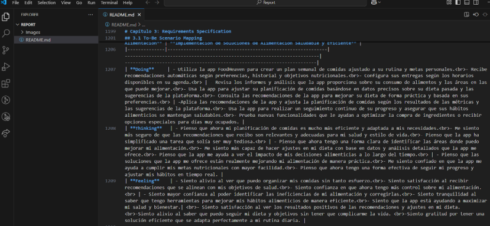
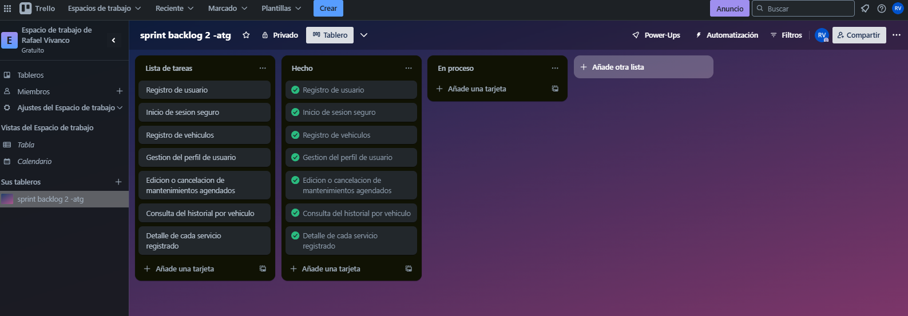
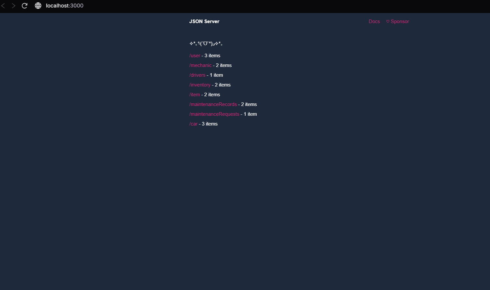

# Universidad Peruana De Ciencias Aplicadas

## Ingeniería de Software

### Informe de Trabajo Final

### Desarrollo de Aplicaciones Open Source 

**Sección:** 
4310

**Profesor:**  
Ivan Robles Fernández

**Integrantes:**

    <ul>
        <li>Victor Andres Cruz Ibarra - U202311053</li>
        <li>Rafael Andres Vivanco Salazar - U202311064</li>
        <li>Ricardo Fernando Cardenas Minaya - U202310004</li>
        <li>Jarod Jack Cespedes Pillco - U202318588</li>
        <li>Ronald Joel Peralta Chipa -U202224619</li>
    </ul>

**2025 - 1**
    

---

# **Registro de Versiones del Informe**

| Versión | Fecha      | Autor                          | Descripción de modificación      |
|---------|------------|--------------------------------|----------------------------------|
| TB1     | 24/04/2025 | Ronald Joel Peralta Chipa - Victor Andres Cruz Ibarra - Ricardo Fernando Cardenas Minaya - Rafael Andres Vivanco Salazar - Jarod Jack Cespedes Pillco   | Capitulo 1, Capitulo 2, Capitulo 3, Capitulo 4, Capitulo 5 |
| TP1     | 13/05/2025 | Ronald Joel Peralta Chipa - Victor Andres Cruz Ibarra - Ricardo Fernando Cardenas Minaya - Rafael Andres Vivanco Salazar - Jarod Jack Cespedes Pillco   | Correción del TB1, Sprint 2 en Capítulo 5|
| TB3     | 19/06/2025 | Ronald Joel Peralta Chipa - Victor Andres Cruz Ibarra - Ricardo Fernando Cardenas Minaya - Rafael Andres Vivanco Salazar   | Correción del TP1, Sprint 3 en Capítulo 5, Actualización de la Landing Page, Video About the Team e Implementación del Back End |

# **Project Report Collaboration Insights**

Enlace de la organización para el reporte del proyecto: https://github.com/orgs/project-OpenSource-4310/repositories

**TB1**

Para el desarrollo del informe correspondiente a la entrega TB1, se estableció la implementación de secciones de la siguiente manera para cada integrante del equipo:

|Integrante|Tareas Asignadas|
|-|-|
|Victor Andres Cruz Ibarra|Style Guidelines, Information Architecture, Landing Page UI Design, Web Applications UI/UI Design, Web Applications Prototyping|
|Rafael Andres Vivanco Salazar| Startup Profile, Solution Profile, Domain-Driven Software Architecture, Software Object-Oriented Design y Database Design|
|Ricardo Fernando Cardenas Minaya |Competidores, Análisis competitivo, To-Be Scneario Mapping, User Stories, Impact Mapping y Product Backlog|
|Jarod Jack Cespedes Pillco | Source Code Management, Source Style Guide, Software Deployment Configuration|
|Ronald Joel Peralta Chipa|Análisis de entrevistas, NeedFinding, User personas, User Task Matrix, User Journey Mapping, Empathy Mapping, As-is Scenario Mapping.|

**TP1**

Para el desarrollo del informe correspondiente a la entrega TP1, se estableció la implementación de secciones de la siguiente manera para cada integrante del equipo:

|Integrante|Tareas Asignadas|
|-|-|
|Victor Andres Cruz Ibarra|Correción del Capítulo 4 e implementación de pantallas del frontend app|
|Rafael Andres Vivanco Salazar|Correción del Capítulo 1 e implementación de pantallas del frontend app|
|Ricardo Fernando Cardenas Minaya |Correción del Capítulo 3 e implementación de pantalla del frontend app|
|Jarod Jack Cespedes Pillco | Correción del Capítulo 5 e implementación de pantallas del frontend app|
|Ronald Joel Peralta Chipa |Correción del Capítulo 2 e implementación de pantallas del frontend app|

**TB3**

Para el desarrollo del informe correspondiente a la entrega TB3, se estableció la implementación de secciones de la siguiente manera para cada integrante del equipo:

|Integrante|Tareas Asignadas|
|-|-|
|Victor Andres Cruz Ibarra|Correción del TB1 en el FrontEnd application|
|Rafael Andres Vivanco Salazar|Correción del TB1 en la Landing Page, Reporte e implementación del Sprint 3 en el capítulo 5|
|Ricardo Fernando Cardenas Minaya |Implementación y documentación del BackEnd |
|Jarod Jack Cespedes Pillco | Registro y análisis de las Entrevistas de validación  |
|Ronald Joel Peralta Chipa | NO REALIZÓ ENTREGA |

# **Contenido**
### Tabla de contenidos

- [**Registro de Versiones del Informe**](#registro-de-versiones-del-informe)
- [**Project Report Collaboration Insights**](#project-report-collaboration-insights)
- [**Contenido**](#contenido)
  - [Tabla de contenidos](#tabla-de-contenidos)
- [**Student Outcome**](#student-outcome)
- [ **Capítulo I: Introducción** ](#-capítulo-i-introducción-)
  - [**1.1. Startup Profile**](#11-startup-profile)
    - [**1.1.1. Descripción de la Startup**](#111-descripción-de-la-startup)
    - [**1.1.2. Perfiles de integrantes del equipo**](#112-perfiles-de-integrantes-del-equipo)
  - [**1.2. Solution Profile**](#12-solution-profile)
    - [**1.2.1 Antecedentes y problemática**](#121-antecedentes-y-problemática)
     - [**1.2.2 Lean UX Process**](#122-lean-ux-process)
    - [**1.2.2.1. Lean UX Problem Statements**](#1221-lean-ux-problem-statements)
    - [**1.2.2.2. Lean UX Assumptions**](#1222-lean-ux-assumptions)
    - [**1.2.2.3. Lean UX Hypothesis Statements**](#1223-lean-ux-hypothesis-statements)
    - [**1.2.2.4. Lean UX Canvas**](#1224-lean-ux-canvas)
  - [**1.3. Segmentos objetivo**](#13-segmentos-objetivo)
- [ **Capítulo II: Requirements Elicitation \& Analysis**](#-capítulo-ii-requirements-elicitation--analysis)
  - [**2.1. Competidores**](#21-competidores)
    - [**2.1.1. Análisis competitivo**](#211-análisis-competitivo)
    - [**2.1.2. Estrategias y tácticas frente a competidores**](#212-estrategias-y-tácticas-frente-a-competidores)
  - [**2.2. Entrevistas**](#22-entrevistas)
    - [**2.2.1. Diseño de entrevistas**](#221-diseño-de-entrevistas)
    - [**2.2.2. Registro de entrevistas**](#222-registro-de-entrevistas)
    - [**2.2.3. Análisis de entrevistas**](#223-análisis-de-entrevistas)
  - [**2.3. Needfinding**](#23-needfinding)
    - [**2.3.1. User Personas**](#231-user-personas)
    - [**2.3.2. User Task Matrix**](#232-user-task-matrix)
    - [**2.3.3. User Journey Mapping**](#233-user-journey-mapping)
    - [**2.3.4. Empathy Mapping**](#234-empathy-mapping)
    - [**2.3.5. As-is Scenario Mapping**](#235-as-is-scenario-mapping)
  - [**2.4. Ubiquitous Language**](#24-ubiquitous-language)
- [ **Capítulo III: Requirements Specification**](#-capítulo-iii-requirements-specification)
  - [**3.1. To-Be Scenario Mapping**](#31-to-be-scenario-mapping)
  - [**3.2. User Stories**](#32-user-stories)
  - [**3.3. Impact Mapping**](#33-impact-mapping)
  - [**3.4. Product Backlog**](#34-product-backlog)
- [**Capítulo IV: Product Design**](#capítulo-iv-product-design)
  - [**4.1. Style Guidelines**](#41-style-guidelines)
    - [**4.1.1. General Style Guidelines**](#411-general-style-guidelines)
    - [**4.1.2. Web Style Guidelines**](#412-web-style-guidelines)
  - [**4.2. Information Architecture**](#42-information-architecture)
    - [**4.2.1. Organization Systems**](#421-organization-systems)
    - [**4.2.2. Labeling Systems**](#422-labeling-systems)
    - [**4.2.3. SEO Tags and Meta Tags**](#423-seo-tags-and-meta-tags)
    - [**4.2.4. Searching Systems**](#424-searching-systems)
    - [**4.2.5. Navigation Systems**](#425-navigation-systems)
  - [**4.3. Landing Page UI Design**](#43-landing-page-ui-design)
    - [**4.3.1. Landing Page Wireframe**](#431-landing-page-wireframe)
    - [**4.3.2. Landing Page Mock-up**](#432-landing-page-mock-up)
  - [**4.4. Web Applications UX/UI Design**](#44-web-applications-uxui-design)
    - [**4.4.1. Web Applications Wireframes**](#441-web-applications-wireframes)
    - [**4.4.2. Web Applications Wireflow Diagrams**](#442-web-applications-wireflow-diagrams)
    - [**4.4.3. Web Applications Mock-ups**](#443-web-applications-mock-ups)
    - [**4.4.4. Web Applications User Flow Diagrams**](#444-web-applications-user-flow-diagrams)
  - [**4.5. Web Applications Prototyping**](#45-web-applications-prototyping)
  - [**4.6. Domain-Driven Software Architecture**](#46-domain-driven-software-architecture)
    - [**4.6.1. Software Architecture Context Diagram**](#461-software-architecture-context-diagram)
    - [**4.6.2. Software Architecture Container Diagrams**](#462-software-architecture-container-diagrams)
    - [**4.6.3. Software Architecture Components Diagrams**](#463-software-architecture-components-diagrams)
  - [**4.7. Software Object-Oriented Design**](#47-software-object-oriented-design)
    - [**4.7.1. Class Diagrams**](#471-class-diagrams)
    - [**4.7.2. Class Dictionary**](#472-class-dictionary)
  - [**4.8. Database Design**](#48-database-design)
    - [**4.8.1. Database Diagram**](#481-database-diagram)
- [**Capítulo V: Product Implementation, Validation & Deployment**](#capítulo-v-product-implementation-validation--deployment)
  - [**5.1. Software Configuration Management**](#51-software-configuration-management)
    - [**5.1.1. Software Development Environment Configuration**](#511-software-development-environment-configuration)
    - [**5.1.2. Source Code Management**](#512-source-code-management)
    - [**5.1.3. Source Code Style Guide & Conventions**](#513-source-code-style-guide--conventions)
    - [**5.1.4. Software Deployment Configuration**](#514-software-deployment-configuration)
  - [**5.2. Landing Page, Services & Applications Implementation**](#52-landing-page-services--applications-implementation)
    - [**5.2.1. Sprint 1**](#521-sprint-1)
      - [**5.2.1.1. Sprint Planning 1**](#5211-sprint-planning-1)
      - [**5.2.1.2. Aspect Leaders and Collaborators**](#5212-aspect-leaders-and-collaborators)
      - [**5.2.1.3. Sprint Backlog 1**](#5213-sprint-backlog-1)
      - [**5.2.1.4. Development Evidence for Sprint Review**](#5214-development-evidence-for-sprint-review)
      - [**5.2.1.5. Execution Evidence for Sprint Review**](#5215-execution-evidence-for-sprint-review)
      - [**5.2.1.6. Services Documentation Evidence for Sprint Review**](#5216-services-documentation-evidence-for-sprint-review)
      - [**5.2.1.7. Software Deployment Evidence for Sprint Review**](#5217-software-deployment-evidence-for-sprint-review)
      - [**5.2.1.8. Team Collaboration Insights during Sprint**](#5218-team-collaboration-insights-during-sprint)
    - [**5.2.2. Sprint 2**](#522-sprint-2)
      - [**5.2.2.1. Sprint Planning 2**](#5221-sprint-planning-2)
      - [**5.2.2.2. Aspect Leaders and Collaborators**](#5222-aspect-leaders-and-collaborators)
      - [**5.2.2.3. Sprint Backlog 2**](#5223-sprint-backlog-2)
      - [**5.2.2.4. Development Evidence for Sprint Review**](#5224-development-evidence-for-sprint-review)
      - [**5.2.2.5. Execution Evidence for Sprint Review**](#5225-execution-evidence-for-sprint-review)
      - [**5.2.2.6. Services Documentation Evidence for Sprint Review**](#5226-services-documentation-evidence-for-sprint-review)
      - [**5.2.2.7. Software Deployment Evidence for Sprint Review**](#5227-software-deployment-evidence-for-sprint-review)
      - [**5.2.2.8. Team Collaboration Insights during Sprint**](#5228-team-collaboration-insights-during-sprint)
    - [**5.2.3. Sprint 3**](#523-sprint-3)
      - [**5.2.3.1. Sprint Planning 3**](#5231-sprint-planning-3)
      - [**5.2.3.2. Aspect Leaders and Collaborators**](#5232-aspect-leaders-and-collaborators)
      - [**5.2.3.3. Sprint Backlog 3**](#5223-sprint-backlog-2)
      - [**5.2.3.4. Development Evidence for Sprint Review**](#5234-development-evidence-for-sprint-review)
      - [**5.2.3.5. Execution Evidence for Sprint Review**](#5235-execution-evidence-for-sprint-review)
      - [**5.2.3.6. Services Documentation Evidence for Sprint Review**](#5236-services-documentation-evidence-for-sprint-review)
      - [**5.2.3.7. Software Deployment Evidence for Sprint Review**](#5237-software-deployment-evidence-for-sprint-review)
      - [**5.2.3.8. Team Collaboration Insights during Sprint**](#5238-team-collaboration-insights-during-sprint)
  - [**5.3. Validation Interviews**](#53-validation-interviews)
    - [**5.3.1. Diseño de Entrevistas**](#531-diseño-de-entrevistas)
    - [**5.3.2. Registro de Entrevistas**](#532-registro-de-entrevistas)
    - [**5.3.3. Evaluaciones según heurísticas**](#533-evaluaciones-según-heurísticas)

[Conclusiones](#conclusiones)

[Bibliografía](#bibliografía)

[Anexos](#anexos)

# **Student Outcome**

El curso contribuye al cumplimiento del Student Outcome ABET:   
**ABET – EAC - Student Outcome 3** 
**Criterio:** Capacidad de comunicarse efectivamente con un rango de audiencias. 
En el siguiente cuadro se describe las acciones realizadas y enunciados de conclusiones por parte del grupo, que permiten sustentar el haber alcanzado el logro del ABET – EAC - Student Outcome 3.

 

<table style="border-collapse:collapse;border-spacing:0" class="tg"><thead><tr><th style="border-color:black;border-style:solid;border-width:1px;font-family:Arial, sans-serif;font-size:14px;font-weight:normal;overflow:hidden;padding:10px 5px;text-align:left;vertical-align:top;word-break:normal">Criterio específico</th><th style="border-color:black;border-style:solid;border-width:1px;font-family:Arial, sans-serif;font-size:14px;font-weight:normal;overflow:hidden;padding:10px 5px;text-align:left;vertical-align:top;word-break:normal">Acciones realizadas</th><th style="border-color:black;border-style:solid;border-width:1px;font-family:Arial, sans-serif;font-size:14px;font-weight:normal;overflow:hidden;padding:10px 5px;text-align:left;vertical-align:top;word-break:normal">Conclusiones</th></tr></thead>
<tbody>
<tr><td style="border-color:black;border-style:solid;border-width:1px;font-family:Arial, sans-serif;font-size:14px;overflow:hidden;padding:10px 5px;text-align:left;vertical-align:top;word-break:normal">Comunica oralmente con efectividad a diferentes rangos de audiencia </td>
<td style="border-color:black;border-style:solid;border-width:1px;font-family:Arial, sans-serif;font-size:14px;overflow:hidden;padding:10px 5px;text-align:left;vertical-align:top;word-break:normal">Andres Cruz:   TB1: Me aseguré de comunicarme de manera clara y respetuosa con mi equipo, transmitiendo mis ideas con asertividad y cumpliendo los compromisos adquiridos.    Rafael Vivanco:   TB1: Durante las reuniones grupales, me centré en expresar mis ideas y propuestas con claridad, adaptando mi comunicación al contexto para facilitar la comprensión de todos.    Fernando Cardenas:   TB1: Participé activamente en las tareas asignadas, aplicando mis conocimientos y habilidades para alcanzar los objetivos del equipo en tiempo y forma.   Jack Cespedes:   TB1: Me mantuve comprometido con el equipo, colaborando en cada etapa del proceso y asegurándome de aportar soluciones para alcanzar los objetivos de manera eficiente.    Joel Peralta   TB1: Me involucré en un diálogo abierto y constante con el equipo, lo que facilitó la distribución de tareas y la obtención de buenos resultados. Además, procuré mantener siempre una actitud colaborativa y proactiva para fortalecer la dinámica grupal.   Andres Cruz:   TB2: En el TB2, aporté al levantamiento de observaciones y al diseño de pantallas, comunicando mis ideas con claridad para mejorar la interfaz y asegurar una experiencia de usuario efectiva.    Rafael Vivanco:   TB2: Durante las reuniones grupales, me centré en expresar mis ideas y propuestas con claridad, adaptando mi comunicación al contexto para facilitar la comprensión de todos.    Fernando Cardenas:   TB2: Contribuí al diseño del frontend y levanté observaciones que mejoraron la calidad visual y funcional del proyecto, reforzando la coordinación mediante una comunicación efectiva.    Joel Peralta   TB2: Participé activamente en la creación de pantallas y en la revisión crítica del diseño, aportando ideas claras que facilitaron mejoras en el producto final.  Jack Céspedes   TB2: Diseñé pantallas y realicé observaciones clave para optimizar la interfaz, manteniendo siempre una comunicación fluida y proactiva con el equipo.  
<td style="border-color:black;border-style:solid;border-width:1px;font-family:Arial, sans-serif;font-size:14px;overflow:hidden;padding:10px 5px;text-align:left;vertical-align:top;word-break:normal">TB1: A lo largo del proyecto, todos los integrantes del equipo lograron expresar sus ideas de manera oral con claridad y adecuación al contexto. Esto permitió que tanto compañeros como docentes comprendieran nuestras propuestas con facilidad. Gracias a esta capacidad de adaptación en la comunicación, pudimos distribuir tareas de forma eficiente, resolver inquietudes al instante y mantener una dinámica de colaboración efectiva en todo momento. 
TB2: A lo largo del desarrollo del TB2, el equipo demostró una comunicación oral efectiva al levantar observaciones y discutir propuestas de mejora para las pantallas del frontend. Cada integrante expresó sus ideas con claridad durante las reuniones, facilitando la toma de decisiones en conjunto y promoviendo la mejora continua del producto. Esta capacidad para dialogar, escuchar activamente y adaptarse al nivel técnico de los interlocutores (docentes, compañeros y usuarios potenciales) fortaleció la cohesión del grupo y permitió avanzar de manera eficiente en los objetivos del proyecto.</td>
</tr>
<tr><td style="border-color:black;border-style:solid;border-width:1px;font-family:Arial, sans-serif;font-size:14px;overflow:hidden;padding:10px 5px;text-align:left;vertical-align:top;word-break:normal">Comunica por escrito con efectividad a diferentes rangos de audiencia.</td>
<td style="border-color:black;border-style:solid;border-width:1px;font-family:Arial, sans-serif;font-size:14px;overflow:hidden;padding:10px 5px;text-align:left;vertical-align:top;word-break:normal">Andres Cruz:   TB1: Aporté en diferentes etapas del trabajo, garantizando que la información fuera clara, precisa y organizada, lo que permitió una mejor comprensión y aplicación en el desarrollo del proyecto.    Rafael Vivanco:   TB1: Contribuí en diversos aspectos del trabajo, garantizando que la información fuera precisa, coherente y comprensible tanto para compañeros como para docentes.   Fernando Cardenas:   TB1: Participé activamente en las tareas asignadas, aplicando mis conocimientos y habilidades para cumplir con los objetivos del equipo de manera efectiva y dentro de los plazos establecidos.   Jack Cespedes:   TB1:Cumplí con todas las actividades asignadas y considero que tuve un buen desempeño. Sin embargo, reconozco que debo mejorar en la gestión de mi tiempo para optimizar mis resultados en futuros proyectos.   Joel Peralta:   TB1: Me involucré en la ejecución de las tareas grupales, aportando ideas y soluciones que contribuyeron al desarrollo del proyecto. También procuré mantener una comunicación fluida con mis compañeros para garantizar una coordinación eficiente   Andres Cruz:   TB2: En el TB2, aporté al levantamiento de observaciones y al diseño de pantallas, comunicando mis ideas con claridad para mejorar la interfaz y asegurar una experiencia de usuario efectiva.    Rafael Vivanco:   TB2: Durante las reuniones grupales, me centré en expresar mis ideas y propuestas con claridad, adaptando mi comunicación al contexto para facilitar la comprensión de todos.    Fernando Cardenas:   TB2: Contribuí al diseño del frontend y levanté observaciones que mejoraron la calidad visual y funcional del proyecto, reforzando la coordinación mediante una comunicación efectiva.    Joel Peralta   TB2: Participé activamente en la creación de pantallas y en la revisión crítica del diseño, aportando ideas claras que facilitaron mejoras en el producto final.  Jack Céspedes   TB2: Diseñé pantallas y realicé observaciones clave para optimizar la interfaz, manteniendo siempre una comunicación fluida y proactiva con el equipo.  </td>
<td style="border-color:black;border-style:solid;border-width:1px;font-family:Arial, sans-serif;font-size:14px;overflow:hidden;padding:10px 5px;text-align:left;vertical-align:top;word-break:normal">TB1: La eficacia del trabajo en equipo también se evidenció en nuestra habilidad para transmitir información de manera escrita. La documentación desarrollada, que abarcó informes, descripciones técnicas y contenido para la landing page, fue precisa, estructurada y accesible. Esto contribuyó a la validación del proyecto y garantizó que el producto final reflejara con claridad su propósito y funcionalidad.   TB2:Durante el TB2, se evidenció una comunicación escrita clara y efectiva en los documentos entregables, reportes de observaciones y en la elaboración de contenidos para el frontend de la app. Cada miembro del equipo contribuyó en la redacción técnica y descriptiva de las funcionalidades implementadas, así como en la documentación de cambios y mejoras. El nivel de precisión, estructura y coherencia en estos escritos permitió que docentes y usuarios comprendieran fácilmente el progreso del proyecto, lo que aportó a su validación y evolución continua.</td>
</tr>
</tbody></table>
  

#  **Capítulo I: Introducción** 

## **1.1. Startup Profile**

### **1.1.1. Descripción de la Startup**

### **1.1.2. Perfiles de integrantes del equipo**

## **1.2. Solution Profile**

### **1.2.1. Antecedentes y problemática**

### **1.2.2. Lean UX Process**

#### **1.2.2.1. Lean UX Problem Statements**

#### **1.2.2.2. Lean UX Assumptions**

#### **1.2.2.3. Lean UX Hypothesis Statements**

#### **1.2.2.4. Lean UX Canvas**

## **1.3. Segmentos objetivo**

#  **Capítulo II: Requirements Elicitation & Analysis** 

## **2.1. Competidores**

### **2.1.1. Análisis competitivo**

### **2.1.2. Estrategias y tácticas frente a competidores**

## **2.2. Entrevistas**

### **2.2.1. Diseño de entrevistas**

### **2.2.2. Registro de entrevistas**

### **2.2.3. Análisis de entrevistas**

## **2.3. Needfinding**

### **2.3.1. User Personas**
  
### **2.3.2. User Task Matrix**

### **2.3.3. User Journey Mapping**

### **2.3.4. Empathy Mapping**

### **2.3.5. As-is Scenario Mapping**

## **2.4. Ubiquitous Language**

#  **Capítulo III: Requirements Specification** 

## **3.1. To-Be Scenario Mapping**

## **3.2. User Stories**

## **3.3. Impact Mapping**

## **3.4. Product Backlog**

#  **Capítulo IV: Product Design** 

## **4.1. Style Guidelines**

### 4.1.1. General Style Guidelines

### 4.1.2. Web Style Guidelines

## **4.2. Information Architecture**

### **4.2.1. Organization Systems**

### **4.2.2. Labeling Systems**

### **4.2.3. SEO Tags and Meta Tags**

### **4.2.4. Searching Systems**

### **4.2.5. Navigation Systems**

## **4.3. Landing Page UI Design**

### **4.3.1. Landing Page Wireframe**

### **4.3.2. Landing Page Mock-up**

## **4.4. Web Applications UX/UI Design**

### **4.4.1. Web Applications Wireframes**

### **4.4.2. Web Applications Wireflow Diagrams**

### **4.4.3. Web Applications Mock-ups**

### **4.4.4. Web Applications User Flow Diagrams**

## **4.5. Web Applications Prototyping**

## **4.6. Domain-Driven Software Architecture**

### **4.6.1. Software Architecture Context Diagram**

### **4.6.2. Software Architecture Container Diagrams**

### **4.6.3. Software Architecture Components Diagrams**

## **4.7. Software Object-Oriented Design**

### **4.7.1. Class Diagrams**

### **4.7.2. Diccionario de Clases**

## **4.8. Database Design**

### **4.8.1. Database Diagram**

#  **Capítulo V: Product Implementation, Validation & Deployment** 

## **5.1. Software Configuration Management**

### **5.1.1. Software Development Environment Configuration**

En esta sección describiremos las herramienas de software que utilizamos para el ciclo de vida del proyecto.   

**Project Management:**   
- Producto: Trello
- Propósito: Seguimiento del progreso de funcionalidades y gestión de tareas
- Ruta: https://trello.com/es

    

**Product UX/UI Design:**
- Producto: Figma
- Propósito: Diseños del Proyecto (Wireframes, Mock-Ups, etc)
- Ruta: https://www.figma.com/es-es/

    

**Software Development:**
- Producto: Visual Studio Code
- Propósito: Desarrollo del Landing Page
- Ruta: https://code.visualstudio.com

    

**Software Documentation:**
- Producto: Visual Studio Code
- Propósito: Para redactar los capítulos en formato Markdown
- Ruta: https://code.visualstudio.com

    

**Software Deployment:**
- Producto: GitHub
- Propósito: Repositorio del Proyecto y gestión de versiones
- Ruta: https://github.com

    

### **5.1.2. Source Code Management**

Nuestro proyecto se mantendrá en línea con las convenciones de flujo de trabajo definidas por el modelo GitFlow para el control de versiones de desarrollo. Teniendo a GitHub como plataforma y sistema de control de versiones.
A continuación, detallaremos la implementación del modelo GitFlow y se proporcionará los URL de los repositorios de GitHub de cada producto del trabajo.

**Repositorios de GitHub:**
- Organización en GitHub
- Landing Page
- Frontend Web Application

**Flujo de Trabajo GitFlow:**
GitFlow es un modelo de flujo de trabajo para administrar y gestionar branches en un proyecto Git, propuesto por Vincent Driessen, diseñado para facilitar el desarrollo colaborativo.

**Estructuras de Branches:**
- **Master Branch:** Es la rama principal de la aplicación, contiene las versiones estables y sin errores listas para ser lanzadas públicamente.
- **Develop Branch:** Es la rama base para el desarrollo activo, aquí se integran todas las funcionalidades nuevas antes de que se considere un lanzamiento.
- **Feature Branch:** Es la rama que se usa para desarrollar nuevas funcionalidades o mejoras específicas del proyecto.
- **Release Branch:** Es la rama que se utiliza para preparar una versión estable del proyecto donde se corrigen bug menores, se actualizan versiones y se ajustan las configuraciones necesarias.
- **Hotfix Branch:** Es la rama donde se resuelven errores críticos encontrados en la aplicación lanzada. Esta rama se crea directamente del main, ya que necesitan una solución urgente sin pasar por el ciclo completo de desarrollo.

**Versionamiento Semántico:**
Aplicaremos el sistema de versionamiento semántico (Semantic Versioning) para dar nombre a los releases de nuestra aplicación.

**Convenciones de Commits:**
Para hacer commits claros y estructurados en nuestro proyecto, utilizaremos la especificación Conventional Commits, inspirada en las Angular Commit Guidelines.

### **5.1.3. Source Code Style Guide & Conventions**

**HTML:** Para conseguir un código ordenado y eficiente, deberemos seguir las siguientes indicaciones:
- Aplicar un uso semántico de etiquetas, tales como: ``<header>``, ``<main>``, ``<section>``, ``<article>``, ``<footer>``, entre otros, en lugar de solo usar ``
``.
- Asegurarse de cerrar todas las etiquetas y verificar que estén correctamente anidadas.
- Colocar los atributos en orden lógico. Es decir, seguir un patrón coherente y predecible al escribir estos atributos dentro de una etiqueta. Por ejemplo: *id*, *class*, *name*, *src*, *alt*, *dato*, *style* y atributos booleanos.
- Evitar usar abreviaturas al usar los atributos class e id. Por ejemplo, envés de ".pcd", usar ".product-card".
- Usar comentarios para describir pedazos de código o simplemente para separar secciones. Ejemplo: ``<!-- -->``

**CSS:** En este lenguaje es recomendable seguir las siguientes indicaciones:
- Organizar los estilos por componentes o secciones del sitio con ayuda de comentarios. Por ejemplo: ``/* Para el encabezado */``, ``/* Para el pie de página */``.
- Usar nombres descriptivos y consistentes para las clases.
- Separar los nombres de las clases e id usando un guión.
- No especificar la unidad de medida cuando se use 0 como valor.

**Gherkin:** Es un lenguaje de especificación estructurado y legible para humanos. Es usado para escribir pruebas de comportamiento (BDD, Behavior Driven Development). Se recomienda usar las palabras clave como Feature, Scenario, Given, When, Then, entre otras, y usar un lenguaje natural claro para que lo escrito sea entendible tanto por los desarrolladores como los stakeholders.

### **5.1.4. Software Deployment Configuration**

**Landing Page Deployment:**
Para desplegar la landing page debemos cumplir con una serie de requisitos. Algunos de ellos son: Contar con una cuenta personal de GitHub, una organización y un repositorio para subir los archivos. Con lo anterior, será posible desplegar la landing page. A continuación se deben seguir los siguientes pasos:

- Crear una carpeta con el nombre de "docs", en él se aloja el Landing Page.
- Verificar que los archivos tengan las nomenclaturas correctas y adecuadas, ya sea "index.html" para el landing page, "style.css" para los estilos y una carpeta llamada "img" para guardar las imágenes que la página usará.
- Subir los archivos al repositorio mediante commits.
- Ir a "Settings", luego a "Pages" y seleccionar el branch donde se localiza el proyecto.
- Seleccionar la carpeta "docs" como la fuente del landing page.
- Esperar a que GitHub termine de hacer las comprobaciones necesarias. Cuando termine todo este proceso, GitHub nos dará un enlace que nos llevará al Landing Page.

## **5.2. Landing Page, Services & Applications Implementation**

### **5.2.1. Sprint 1**

#### **5.2.1.1. Sprint Planning 1**

| Sprint \# | Sprint 1 |
| :---- | :---- |
| Date | 2025 \- 04 \- 17 |
| Time | 13:00 |
| Location | Reunión virtual a través de Discord |
| Prepared by | Victor Andres  |
| Attendees (to planning meeting) | Peralta Chiba, Ronald Joel; Cardenas Minaya, Ricardo Fernando; Ibarra Cruz, Victor Andres; Cespedes Pillco, Jarod Jack y Vivanco Salazar, Ricardo Andres |
| Sprint 1  Review Summary | Se presentó el avance de la landing page y project report dividido en capítulos. |
| Sprint 1 Retrospective Summary | En esta reunión, todos colaboraron en el diseño y la implementación de la landing page y reporte del proyecto para realizar correctamente las bases de la startup. |
| Sprint (n-1) Review Summary | No existe sprint previo |
| Sprint 1 Goal | Implementar el Landing page y organizar el proyecto en una organizaciónd en Github dividido en repositorios para el reporte, landing page, etc |
| Sprint 1 Velocity | 24 story points |
| Sum of Story Points | 24 story points |}

#### **5.2.1.2. Aspect Leaders and Collaborators**

Durante el primer sprint, el equipo **ATG** mostró una impecable unión y organización, lo que permitió cumplir satisfactoriamente el objetivo de desplegar la landing page del proyecto **AutoNexo**. A continuación, se describe el rol desempeñado por cada integrante del equipo.
 
- Victor Andrés Cruz Ibarra (u202311053): Desarrollo del Capítulo 2. Además, Implementación y despliegue de la Landing Page.
- Rafael Andrés Vivanco Salazar (u202311064): Desarrollo del Capítulo 1. Además, Realización de los diagramas C4, Clases y Base de Datos.
- Jarod Jack Céspedes Pillco (u202318588): Desarrollo del Capítulo 3. Además, Documentación de los sprints.
- Ricardo Fernando Cárdenas Minaya (u202310004): Desarrollo del Capítulo 2. Además, Registro de User Stories en el Product Backlog.
- Ronald Joel Peralta Chipa (u202224619): Desarrollo del Capítulo 5. Además, Registro de entrevistas.
 
La ejecución del sprint fue coordinado mediante reuniones virtuales en Discord, con el respaldo de herramientas colaborativas como Google Docs, para redacción conjunta, y GitHub, como repositorio de control de versiones. Esta experiencia colaborativa permitió consolidar un equipo sincronizado, con roles bien definidos y con el establecimiento de una base sólida para los siguientes ciclos de desarrollo.

#### **5.2.1.3. Sprint Backlog 1**

    

Link: https://trello.com/invite/b/680b04bd8f9b8672e4f52732/ATTIcb2cd6271a6b1ae79daa19ca44e24e5657A5F126/product-backlog-autonexo

    <table>
        <table>
    <tr>
        <th colspan="2">Sprint #</th>
        <td colspan="6">Sprint 1</td>
    </tr>
    <tr>
        <th colspan="2">User Story</th>
        <th colspan="6">Work-Item/Task</th>
    </tr>
    <tr>
        <th>User Story ID</th>
        <th>User Story Title</th>
        <th>Work Item ID</th>
        <th>Task Title</th>
        <th>Task Description</th>
        <th>Estimation (Hours)</th>
        <th>Assigned To</th>
        <th>Status</th>
    </tr>
    <!-- US21 - Sección Contáctanos -->
    <tr>
        <td rowspan="2">US21</td>
        <td rowspan="2">Sección Contáctanos</td>
        <td>WU01</td>
        <td>Diseñar la sección Contáctanos</td>
        <td>Crear el diseño visual con campos necesarios (nombre, correo, mensaje)</td>
        <td>2H</td>
        <td>Victor</td>
        <td>Done</td>
    </tr>
    <tr>
        <td>WU02</td>
        <td>Implementar formulario de contacto</td>
        <td>Codificar el formulario y conectar con backend</td>
        <td>3H</td>
        <td>Jarod</td>
        <td>Done</td>
    </tr>
    <!-- US24 - Selección del plan de suscripción -->
    <tr>
        <td rowspan="2">US24</td>
        <td rowspan="2">Selección del plan de suscripción</td>
        <td>WU03</td>
        <td>Diseñar interfaz de selección de plan</td>
        <td>Diseñar botones y disposición visual para los planes</td>
        <td>2H</td>
        <td>Rafael</td>
        <td>Done</td>
    </tr>
    <tr>
        <td>WU04</td>
        <td>Implementar lógica de selección de plan</td>
        <td>Programar la lógica para registrar el plan seleccionado</td>
        <td>3H</td>
        <td>Ronald</td>
        <td>Done</td>
    </tr>
    <!-- US26 - Barra de Navegación -->
    <tr>
        <td rowspan="2">US26</td>
        <td rowspan="2">Barra de Navegación</td>
        <td>WU05</td>
        <td>Diseñar barra de navegación</td>
        <td>Diseño visual accesible con los enlaces principales</td>
        <td>2H</td>
        <td>Victor</td>
        <td>Done</td>
    </tr>
    <tr>
        <td>WU06</td>
        <td>Programar funcionalidad de navegación</td>
        <td>Agregar enlaces funcionales y scroll interno</td>
        <td>3H</td>
        <td>Jarod</td>
        <td>Done</td>
    </tr>
    <!-- US27 - Cambio de plan de suscripción -->
    <tr>
        <td rowspan="2">US27</td>
        <td rowspan="2">Cambio de plan de suscripción</td>
        <td>WU07</td>
        <td>Diseñar interfaz para cambio de plan</td>
        <td>Diseñar botones e indicadores para el cambio de plan</td>
        <td>2H</td>
        <td>Rafael</td>
        <td>Done</td>
    </tr>
    <tr>
        <td>WU08</td>
        <td>Implementar backend para cambio de plan</td>
        <td>Crear lógica para actualizar plan del usuario</td>
        <td>3H</td>
        <td>Ronald</td>
        <td>Done</td>
    </tr>
    <!-- US30 - Compatibilidad con lectores de pantalla -->
    <tr>
        <td rowspan="1">US30</td>
        <td rowspan="1">Compatibilidad con lectores de pantalla</td>
        <td>WU09</td>
        <td>Aplicar etiquetas ARIA y atributos accesibles</td>
        <td>Mejorar el HTML para compatibilidad con tecnologías asistidas</td>
        <td>2H</td>
        <td>Ricardo</td>
        <td>Done</td>
    </tr>
    <!-- US31 - Feedback visual en interacciones -->
    <tr>
        <td rowspan="1">US31</td>
        <td rowspan="1">Feedback visual en interacciones</td>
        <td>WU10</td>
        <td>Agregar animaciones y efectos visuales</td>
        <td>Agregar hover, focus, y transiciones para mejorar la experiencia del usuario</td>
        <td>3H</td>
        <td>Ricardo</td>
        <td>Done</td>
    </tr>
    </table>
      

#### **5.2.1.4. Development Evidence for Sprint Review**

    <table>
        <tr>
            <th>Repository</th>
            <th>Branch</th>
            <th>Commit ID</th>
            <th>Commit Message</th>
            <th>Commit Message Body</th>
            <th>Commit on (Date)</th>
        </tr>
        <tr>
            <td>project-OpenSource-4310</td>
            <td>Main</td>
            <td>834fb12</td>
            <td>Style</td>
            <td>Landing Page Style</td>
            <td>04/24/2025</td>
        </tr>
        <tr>
            <td>project-OpenSource-4310</td>
            <td>Main</td>
            <td>874fee6</td>
            <td>Feat</td>
            <td>Landing Page</td>
            <td>04/24/2025</td>
        </tr>
    </table>

#### **5.2.1.5. Execution Evidence for Sprint Review**

En el primer sprint, logramos desarrollar parcialmente la implementación del despliegue del landing page. Donde se muestra las diferentes divisiones que el usuario podrá visualizar como lo sería la información sobre el startup y nuestro producto. A continuación mostramos algunas evidencias:

- **Sección Home (About Us):** En esta sección, damos al usuario una introducción sobre nosotros y nuestro producto.

    

- **Sección Servicios:** En esta sección, el usuario puede enterarse del funcionamiento de nuestro producto a través de un video informativo y una pequeña guía de cómo registrarse.

    

- **Sección Precios:** En esta sección, ofrecemos al usuario diferentes planes en los que se puede suscribir.

    

- **Sección Testimonios:** En esta sección, el usuario puede ver testimonios de otras personas.

    

#### **5.2.1.6. Services Documentation Evidence for Sprint Review**

*Para este primer sprint no fue contemplada la evidencia de documentación de los servicios.*

#### **5.2.1.7. Software Deployment Evidence for Sprint Review**

Para la entrega del primer sprint, desplegamos el landing page en una versión temprana, la cual tiene unas cuantas funcionalidades sin implementar y bugs que, para las siguientes entregas, estarán completamente resueltas. He aquí la evidencia del despliegue:

    

#### **5.2.1.8. Team Collaboration Insights during Sprint**

Aquí se muestra el insight que nos proporciona Github, en su propio apartado:

    

### **5.2.2. Sprint 2**
#### **5.2.2.1. Sprint Planning 2**
| Sprint \# | Sprint 2 |
| :---- | :---- |
| Date | 2025 \- 05 \- 12 |
| Time | 19:00 |
| Location | Reunión virtual a través de Discord |
| Prepared by | Ricardo Minaya  |
| Attendees (to planning meeting) | Peralta Chiba, Ronald Joel; Cardenas Minaya, Ricardo Fernando; Ibarra Cruz, Victor Andres; Cespedes Pillco, Jarod Jack y Vivanco Salazar, Ricardo Andres |
| Sprint 2  Review Summary | Se presentó el avance del front-end de la aplicación y sus respectivos bounded contexts y diseños. |
| Sprint 2 Retrospective Summary | En esta reunión, todos colaboraron en el diseño y la implementación del frontend, contribuyendo a un desarrollo más ágil y efectivo del proyecto. |
| Sprint (n-1) Review Summary | 24 story points |
| Sprint 2 Goal | Implementar y diseñar cada uno de los Bounded Context |
| Sprint 2 Velocity | 47 story points |
| Sum of Story Points | 71 story points |}
 

#### **5.2.2.2. Aspect Leaders and Collaborators**
Durante el segundo sprint, el equipo ATG mostró una gran organización, lo que permitió cumplir satisfactoriamente el objetivo de diseñar e implementar los bounded context de AutoNexo. A continuación, se describe el rol desempeñado por cada integrante del equipo.
 
- Victor Andrés Cruz Ibarra (u202311053): Correción del Capítulo 4 e implementación de pantallas del frontend app.
- Rafael Andrés Vivanco Salazar (u202311064): Correción del Capítulo 4 e implementación de pantallas del frontend app.
- Jarod Jack Céspedes Pillco (u202318588): Correción del Capítulo 4 e implementación de pantallas del frontend app.
- Ricardo Fernando Cárdenas Minaya (u202310004): Correción del Capítulo 4 e implementación de pantallas del frontend app.
- Ronald Joel Peralta Chipa (u202224619): Correción del Capítulo 4 e implementación de pantallas del frontend app.
 
La ejecución del sprint fue coordinado mediante reuniones virtuales en Discord, con el respaldo de herramientas colaborativas como Google Docs, para redacción conjunta, y GitHub, como repositorio de control de versiones.
 

#### **5.2.2.3. Sprint Backlog 2**

    

Link: [https://trello.com/invite/b/680b04bd8f9b8672e4f52732/ATTIcb2cd6271a6b1ae79daa19ca44e24e5657A5F126/product-backlog-autonexo](https://trello.com/invite/b/682413b3332f981bd0a0c9e8/ATTI96c86c3989bcd4016c076c5586951a20E5A6A6A8/sprint-backlog-2-atg)
 
<table>
    <tr>
        <th colspan="2">Sprint #</th>
        <td colspan="6">Sprint 2</td>
    </tr>
    <tr>
        <th colspan="2">User Story</th>
        <th colspan="6">Work-Item/Task</th>
    </tr>
    <tr>
        <th>User Story ID</th>
        <th>User Story Title</th>
        <th>Work Item ID</th>
        <th>Task Title</th>
        <th>Task Description</th>
        <th>Estimation (Hours)</th>
        <th>Assigned To</th>
        <th>Status</th>
    </tr>
    <!-- US01 - Registro de usuario -->
    <tr>
        <td rowspan="2">US01</td>
        <td rowspan="2">Registro de usuario</td>
        <td>WU11</td>
        <td>Diseñar formulario de registro</td>
        <td>Diseñar campos y estructura visual del registro</td>
        <td>2H</td>
        <td>Victor</td>
        <td>Done</td>
    </tr>
    <tr>
        <td>WU12</td>
        <td>Implementar lógica de registro</td>
        <td>Codificar backend y validaciones para el registro</td>
        <td>3H</td>
        <td>Jarod</td>
        <td>Done</td>
    </tr>
    <!-- US02 - Inicio de sesión seguro -->
    <tr>
        <td rowspan="2">US02</td>
        <td rowspan="2">Inicio de sesión seguro</td>
        <td>WU13</td>
        <td>Diseñar formulario de inicio de sesión</td>
        <td>Diseñar campos para email y contraseña</td>
        <td>1H</td>
        <td>Ricardo</td>
        <td>Done</td>
    </tr>
    <tr>
        <td>WU14</td>
        <td>Programar autenticación segura</td>
        <td>Codificar validaciones y autenticación del usuario</td>
        <td>3H</td>
        <td>Jarod</td>
        <td>Done</td>
    </tr>
    <!-- US03 - Registro de vehículos -->
    <tr>
        <td rowspan="1">US03</td>
        <td rowspan="1">Registro de vehículos</td>
        <td>WU15</td>
        <td>Desarrollar formulario de registro de vehículo</td>
        <td>Diseñar e implementar el formulario con validaciones</td>
        <td>3H</td>
        <td>Rafael</td>
        <td>Done</td>
    </tr>
    <!-- US05 - Gestión del perfil del usuario -->
    <tr>
        <td rowspan="1">US05</td>
        <td rowspan="1">Gestión del perfil del usuario</td>
        <td>WU16</td>
        <td>Diseñar e implementar edición de perfil</td>
        <td>Permitir al usuario actualizar sus datos personales</td>
        <td>3H</td>
        <td>Ronald</td>
        <td>Done</td>
    </tr>
    <!-- US07 - Visualización de vehículos asignados -->
    <tr>
        <td rowspan="1">US07</td>
        <td rowspan="1">Visualización de vehículos asignados</td>
        <td>WU17</td>
        <td>Diseñar e implementar vista de vehículos asignados</td>
        <td>Mostrar al mecánico los vehículos asignados por cliente</td>
        <td>2H</td>
        <td>Ricardo</td>
        <td>Done</td>
    </tr>
    <!-- US08 - Visualización de mantenimientos recomendados -->
    <tr>
        <td rowspan="1">US08</td>
        <td rowspan="1">Mantenimientos recomendados</td>
        <td>WU18</td>
        <td>Implementar vista de recomendaciones</td>
        <td>Mostrar lista de recomendaciones a clientes</td>
        <td>3H</td>
        <td>Ronald</td>
        <td>Done</td>
    </tr>
    <!-- US10 - Restablecer contraseña -->
    <tr>
        <td rowspan="2">US10</td>
        <td rowspan="2">Restablecer contraseña</td>
        <td>WU19</td>
        <td>Diseñar interfaz de recuperación</td>
        <td>Diseñar formulario para solicitud de nueva contraseña</td>
        <td>2H</td>
        <td>Victor</td>
        <td>Done</td>
    </tr>
    <tr>
        <td>WU20</td>
        <td>Implementar lógica de restablecimiento</td>
        <td>Codificar flujo para restablecer contraseña vía email</td>
        <td>3H</td>
        <td>Jarod</td>
        <td>Done</td>
    </tr>
    <!-- US18 - Consulta del historial por vehículo -->
    <tr>
        <td rowspan="1">US18</td>
        <td rowspan="1">Consulta del historial por vehículo</td>
        <td>WU21</td>
        <td>Implementar vista de historial por vehículo</td>
        <td>Mostrar servicios pasados por cada vehículo registrado</td>
        <td>3H</td>
        <td>Ricardo</td>
        <td>Done</td>
    </tr>
    <!-- US19 - Detalle de cada servicio registrado -->
    <tr>
        <td rowspan="1">US19</td>
        <td rowspan="1">Detalle de cada servicio registrado</td>
        <td>WU22</td>
        <td>Desarrollar vista de detalle del servicio</td>
        <td>Mostrar repuestos usados, costos y observaciones</td>
        <td>3H</td>
        <td>Ronald</td>
        <td>Done</td>
    </tr>
    <!-- US22 - Página Page Not Found -->
    <tr>
        <td rowspan="1">US22</td>
        <td rowspan="1">Página Page Not Found</td>
        <td>WU23</td>
        <td>Diseñar e implementar página 404</td>
        <td>Incluir mensaje y botón para volver a Home</td>
        <td>2H</td>
        <td>Rafael</td>
        <td>Done</td>
    </tr>
    <!-- US23 - Language Switcher -->
    <tr>
        <td rowspan="1">US23</td>
        <td rowspan="1">Language Switcher</td>
        <td>WU24</td>
        <td>Implementar botón de cambio de idioma</td>
        <td>Permitir cambiar idioma entre ES y EN</td>
        <td>2H</td>
        <td>Victor</td>
        <td>Done</td>
    </tr>
    <!-- US29 - Botón de retroceso -->
    <tr>
        <td rowspan="1">US29</td>
        <td rowspan="1">Botón de retroceso</td>
        <td>WU25</td>
        <td>Agregar funcionalidad de retroceso</td>
        <td>Permitir navegación hacia la página anterior</td>
        <td>1H</td>
        <td>Jarod</td>
        <td>Done</td>
    </tr>
</table>
 

#### **5.2.2.4. Development Evidence for Sprint Review**
 

| Repository | Branch | Commit ID | Commit Message | Commit Message Body | Commited on (Date) |
| :---- | :---- | :---- | :---- | :---- | :---- |
| project-OpenSource-4310 | develop | 32a8943 | Style | button-classic added in shared/buttons | 05/13/2025 |
| project-OpenSource-4310 | develop | 3e91394 | Feat | ATG AutoNexo Added | 05/12/2025 |
| project-OpenSource-4310 | develop | 43ec90d | Feat | initial commit | 05/07/2025 |
 

#### **5.2.2.5. Execution Evidence for Sprint Review**
A continuacion la fake api ejecutada:
 

    

 

    

#### **5.2.2.6. Services Documentation Evidence for Sprint Review**
En el segundo sprint, logramos desarrollar parcialmente la implementación del despliegue del front end app. Donde se muestra las diferentes pnatallas para el usuario y luego de su registro para el mecánico o conductor.
A continuación evidencias:
 

- **Home view:** El entry point del frontendapp.

    

 

- **Login:** El login page del frontendapp.

    

 

- **Register:** El register page del frontendapp.

    

 

- **Forgot Password:** El forgot password page del frontendapp.

    

 

- **Reparaciones send:** Reparaciones enviadas por parte del mechanic.

    

 

- **Vehicles:** Los vehiculos que posee el mecánico

    

 

#### **5.2.2.7. Software Deployment Evidence for Sprint Review**
A continuación, se presentan capturas de los analíticos de colaboración desde el repositorio oficial, donde se evidencia la participación activa de todos los miembros del equipo.

    

#### **5.2.2.8. Team Collaboration Insights during Sprint**
Aquí se muestra el insight que nos proporciona Github, en su propio apartado:

    

 

    

 

### **5.2.3. Sprint 3**
#### **5.2.3.1. Sprint Planning 3**

| Sprint \# | Sprint 3 |
| :---- | :---- |
| Date | 2025 \- 06 \- 12 |
| Time | 15:00 |
| Location | Reunión virtual a través de Discord |
| Prepared by | Rafael Vivanco  |
| Attendees (to planning meeting) | Peralta Chiba, Ronald Joel; Cardenas Minaya, Ricardo Fernando; Ibarra Cruz, Victor Andres; Cespedes Pillco, Jarod Jack y Vivanco Salazar, Ricardo Andres |
| Sprint 3  Review Summary | Se presentó el avance del back-end de la aplicación, su despliegue e implementación en su respectivo repositorio. |
| Sprint 3 Retrospective Summary | En esta reunión, todos colaboraron en el diseño y la implementación del backend, contribuyendo a un desarrollo significativo para el proyecto. |
| Sprint (n-1) Review Summary | 71 story points |
| Sprint 3 Goal | Implementar, desplegar y documentar el BackEnd |
| Sprint 3 Velocity | 43 story points |
| Sum of Story Points | 114 story points |}

#### **5.2.3.2. Aspect Leaders and Collaborators**
Durante el tercer sprint, el equipo ATG mantuvo una coordinación efectiva que permitió avanzar significativamente en el desarrollo del backend de AutoNexo. Cada integrante asumió un rol clave dentro del equipo, contribuyendo al cumplimiento de los objetivos establecidos.
 
- Victor Andrés Cruz Ibarra (u202311053): Correción del TB1 en el FrontEnd application.
- Rafael Andrés Vivanco Salazar (u202311064): Correción del TB1 en la Landing Page, Reporte e implementación del Sprint 3 en el capítulo 5.
- Jarod Jack Céspedes Pillco (u202318588): Implementación y documentación del BackEnd.
- Ricardo Fernando Cárdenas Minaya (u202310004): Registro y análisis de las Entrevistas de validación.
- Ronald Joel Peralta Chipa (u202224619): Implementación, despliegue y documentación del BackEnd.
 
La ejecución del sprint se gestionó a través de reuniones virtuales en Discord, complementadas con herramientas colaborativas como Google Drive para la documentación compartida y GitHub para el control de versiones y seguimiento del código.

#### **5.2.3.3. Sprint Backlog 3**

    

Link: [https://trello.com/invite/b/684c86d41bcf5ce86f14a34c/ATTI3a60b6b53746be38aa5f9d3beff51e3117EF9693/sprint-backlog-3](https://trello.com/invite/b/684c86d41bcf5ce86f14a34c/ATTI3a60b6b53746be38aa5f9d3beff51e3117EF9693/sprint-backlog-3)

<table>
    <tr>
        <th colspan="2">Sprint #</th>
        <td colspan="6">Sprint 3</td>
    </tr>
    <tr>
        <th colspan="2">User Story</th>
        <th colspan="6">Work-Item/Task</th>
    </tr>
    <tr>
        <th>User Story ID</th>
        <th>User Story Title</th>
        <th>Work Item ID</th>
        <th>Task Title</th>
        <th>Task Description</th>
        <th>Estimation (Hours)</th>
        <th>Assigned To</th>
        <th>Status</th>
    </tr>
    <!-- US04 - Registro de repuestos -->
    <tr>
        <td rowspan="1">US04</td>
        <td rowspan="1">Registro de repuestos</td>
        <td>WU26</td>
        <td>Implementar formulario de registro de repuestos</td>
        <td>Permitir ingresar datos de repuestos al sistema</td>
        <td>3H</td>
        <td>Ricardo</td>
        <td>Done</td>
    </tr>
    <!-- US06 - Edición del perfil desde la app -->
    <tr>
        <td rowspan="1">US06</td>
        <td rowspan="1">Edición del perfil desde la app</td>
        <td>WU27</td>
        <td>Adaptar edición de perfil a versión móvil</td>
        <td>Permitir editar datos personales desde la app</td>
        <td>2H</td>
        <td>Victor</td>
        <td>Done</td>
    </tr>
    <!-- US13 - Sección About the Team -->
    <tr>
        <td rowspan="1">US13</td>
        <td rowspan="1">Sección About the Team</td>
        <td>WU28</td>
        <td>Diseñar e implementar sección About the Team</td>
        <td>Mostrar información del equipo detrás del proyecto</td>
        <td>2H</td>
        <td>Rafael</td>
        <td>Done</td>
    </tr>
    <!-- US14 - Actualización del inventario tras mantenimiento -->
    <tr>
        <td rowspan="1">US14</td>
        <td rowspan="1">Actualización automática del inventario</td>
        <td>WU29</td>
        <td>Programar lógica de actualización de stock</td>
        <td>Reducir automáticamente unidades usadas en mantenimientos</td>
        <td>3H</td>
        <td>Jarod</td>
        <td>Done</td>
    </tr>
    <!-- US11 - Consulta de repuestos disponibles -->
    <tr>
        <td rowspan="1">US11</td>
        <td rowspan="1">Consulta de repuestos disponibles</td>
        <td>WU30</td>
        <td>Desarrollar vista de repuestos disponibles</td>
        <td>Mostrar listado de repuestos en stock</td>
        <td>2H</td>
        <td>Ronald</td>
        <td>Done</td>
    </tr>
    <!-- US09 - Edición o cancelación de mantenimientos -->
    <tr>
        <td rowspan="1">US09</td>
        <td rowspan="1">Edición o cancelación de mantenimientos</td>
        <td>WU31</td>
        <td>Habilitar edición y cancelación de mantenimientos</td>
        <td>Permitir modificar o eliminar mantenimientos agendados</td>
        <td>3H</td>
        <td>Ricardo</td>
        <td>Done</td>
    </tr>
    <!-- US12 - Registro de nuevos ingresos de repuestos -->
    <tr>
        <td rowspan="1">US12</td>
        <td rowspan="1">Registro de nuevos ingresos de repuestos</td>
        <td>WU32</td>
        <td>Crear formulario de ingreso de stock</td>
        <td>Permitir agregar repuestos al inventario</td>
        <td>2H</td>
        <td>Rafael</td>
        <td>Done</td>
    </tr>
    <!-- US17 - Visualización de gastos históricos por vehículo -->
    <tr>
        <td rowspan="1">US17</td>
        <td rowspan="1">Visualización de gastos históricos</td>
        <td>WU33</td>
        <td>Implementar vista de gastos por vehículo</td>
        <td>Mostrar historial de gastos acumulados</td>
        <td>3H</td>
        <td>Ronald</td>
        <td>Done</td>
    </tr>
    <!-- US20 - Exportación o descarga del historial en PDF -->
    <tr>
        <td rowspan="1">US20</td>
        <td rowspan="1">Descarga de historial en PDF</td>
        <td>WU34</td>
        <td>Agregar funcionalidad para exportar historial</td>
        <td>Permitir descargar historial como archivo PDF</td>
        <td>3H</td>
        <td>Victor</td>
        <td>Done</td>
    </tr>
    <!-- US28 - Cancelación o pausa del servicio -->
    <tr>
        <td rowspan="1">US28</td>
        <td rowspan="1">Cancelación o pausa del servicio</td>
        <td>WU35</td>
        <td>Desarrollar opción de cancelar o pausar suscripción</td>
        <td>Permitir al usuario detener temporal o definitivamente el servicio</td>
        <td>2H</td>
        <td>Jarod</td>
        <td>Done</td>
    </tr>
    <!-- TS01 - Registro de usuario vía RESTful API -->
    <tr>
        <td rowspan="1">TS01</td>
        <td rowspan="1">Registro de usuario vía API</td>
        <td>WU36</td>
        <td>Programar endpoint POST para usuarios</td>
        <td>Crear endpoint para registrar usuarios desde el frontend</td>
        <td>3H</td>
        <td>Jarod</td>
        <td>Done</td>
    </tr>
    <!-- TS03 - Registro de vehículos vía RESTful API -->
    <tr>
        <td rowspan="1">TS03</td>
        <td rowspan="1">Registro de vehículos vía API</td>
        <td>WU37</td>
        <td>Programar endpoint POST para vehículos</td>
        <td>Crear API para ingresar vehículos desde el frontend</td>
        <td>3H</td>
        <td>Rafael</td>
        <td>Done</td>
    </tr>
    <!-- TS05 - Creación de mantenimientos mediante RESTful API -->
    <tr>
        <td rowspan="1">TS05</td>
        <td rowspan="1">Creación de mantenimientos vía API</td>
        <td>WU38</td>
        <td>Programar endpoint POST para mantenimientos</td>
        <td>Permitir agendar mantenimientos desde la app vía API</td>
        <td>3H</td>
        <td>Ronald</td>
        <td>Done</td>
    </tr>
</table>

#### **5.2.3.4. Development Evidence for Sprint Review**
#### **5.2.3.5. Execution Evidence for Sprint Review**
#### **5.2.3.6. Services Documentation Evidence for Sprint Review**
#### **5.2.3.7. Software Deployment Evidence for Sprint Review**
#### **5.2.3.8. Team Collaboration Insights during Sprint**

## **5.3. Validation Interviews**
### **5.3.1. Diseño de Entrevistas**
En esta sección se plantea una estrategia colaborativa con el equipo para detectar los aspectos comunes a partir de las respuestas proporcionadas por cada entrevistado en cada pregunta. Esto permite realizar un análisis más preciso y confiable.

**Segmento 1: Dueños de flotas.**
1. ¿Qué información esperaba encontrar en la landing page antes de probar la aplicación? ¿Cumplió con sus expectativas?
2. ¿Ha utilizado alguna vez una aplicación web para gestionar sus vehiculos? ¿Qué le gustó y qué no le gustó de esa experiencia?
3. Al probar nuestra aplicación, ¿qué funcionalidad le resultó más útil y cuál cree que podría mejorarse?
4. ¿Cómo calificaría la facilidad de uso de la interfaz? ¿Hubo algún proceso que le resultó confuso o poco intuitivo?
5. ¿Qué tipo de reportes o datos le gustaría que la aplicación le proporcionara para tomar mejores decisiones?
6. Si pudiera agregar una función nueva a la aplicación, ¿cuál sería y por qué?
7. ¿Recomendaría nuestra aplicación a otros conductores? ¿Qué destacaría de ella?

**Segmento 2: Mecánicos**
1. ¿Qué información buscaba en la landing page antes de registrarse en la aplicación? ¿Le resultó fácil encontrarla?
2. ¿Ha usado antes otras aplicaciones o software para gestionar reparaciones? ¿Qué ventajas y desventajas encontró?
3. Al usar nuestra aplicación, ¿qué le pareció más útil de las funcionalidades de historial de vehiculos, gestion de repuestos, entre otras?
4. ¿Cómo evalúa la facilidad de registro y acceso a las órdenes de trabajo en la aplicación? ¿Hubo algo que le dificultó el proceso?
5. ¿Le gustaría que la aplicación le sugiriera pasos específicos para ciertas reparaciones basadas en el modelo del vehículo?
6. Si pudiera mejorar una función de la aplicación, ¿cuál sería y por qué?
7. ¿Qué tan probable es que recomiende esta aplicación a otros talleres o mecánicos? ¿Por qué?

### **5.3.2. Registro de Entrevistas**
### **5.3.3. Evaluaciones según heurísticas**

## Conclusiones

**TB1:** 
 
Desarrollar *Autonexo* como parte de nuestro trabajo en equipo nos permitió comprender de forma práctica cómo se aplica la ingeniería de software en contextos reales, especialmente dentro del desarrollo de soluciones para startups tecnológicas. Esta experiencia no solo fortaleció nuestros conocimientos técnicos en modelado, diseño orientado al dominio y arquitectura de sistemas, sino que también nos permitió entender la importancia de una buena comunicación entre miembros del equipo y con los usuarios finales.
Aprendimos a identificar necesidades del negocio, transformarlas en requerimientos funcionales y traducirlas en componentes de software robustos y escalables. Además, reforzamos habilidades clave en metodologías ágiles, análisis de sistemas, pensamiento crítico, y sobre todo, en cómo construir productos que realmente aporten valor. Este proyecto nos acercó a la realidad de nuestra carrera y nos motivó a seguir perfeccionando nuestras competencias como futuros ingenieros de software.
 

**TP1:**
 
Durante el TP1, profundizamos en la construcción de Autonexo mediante el diseño e implementación del frontend de la aplicación, lo que nos permitió aplicar conocimientos técnicos en experiencia de usuario, componentes visuales y validación de interfaces. Esta etapa fue clave para fortalecer nuestra capacidad de traducir requerimientos en soluciones tangibles y funcionales. A través del levantamiento de observaciones y la mejora continua del diseño, aprendimos a iterar con base en retroalimentación efectiva, manteniendo siempre una comunicación clara y documentada entre los miembros del equipo. Asimismo, consolidamos nuestras habilidades en trabajo colaborativo, priorización de tareas y control de versiones, pilares esenciales en el desarrollo ágil de software. TP1 nos dio una visión más completa del proceso de desarrollo y reforzó nuestro compromiso con la creación de productos tecnológicos que respondan a necesidades reales del entorno.
 

**TB3:**
 
Durante el TB3, dimos un paso significativo en el desarrollo de Autonexo al enfocarnos en la implementación del Back End, utilizando Java como lenguaje principal. Esta fase fue fundamental para afianzar nuestra comprensión sobre la arquitectura de software, la lógica de negocio y la comunicación entre capas dentro de una aplicación escalable. Nos permitió aplicar principios de diseño limpio, organización modular del código, y conexión con bases de datos, consolidando así una estructura sólida que servirá como soporte para las funcionalidades de la plataforma. Además, corregimos observaciones del TP1, actualizamos la landing page para reflejar mejor la propuesta del proyecto, y preparamos el video “About the Team”. Sin embargo, el desarrollo del backend fue el componente más relevante, ya que nos permitió consolidar nuestros conocimientos técnicos en diseño de APIs, organización de código y buenas prácticas en el desarrollo de software del lado servidor.
 

## Bibliografía

## Anexos
