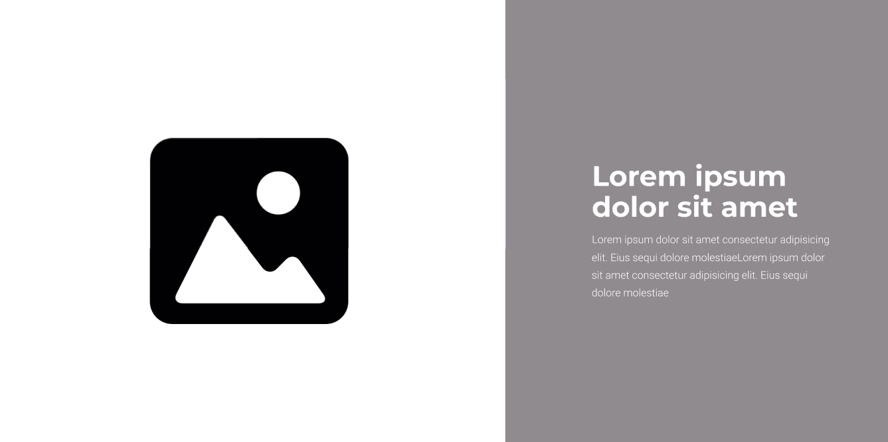

# Universidad Peruana De Ciencias Aplicadas

## Ingeniería de Software

### Informe de Trabajo Final

### Desarrollo de Aplicaciones Open Source 

**Sección:** 
4310

**Profesor:**  
Ivan Robles Fernández

**Integrantes:**

    <ul>
        <li>Victor Andres Cruz Ibarra - U202311053</li>
        <li>Rafael Andres Vivanco Salazar - U202311064</li>
        <li>Ricardo Fernando Cardenas Minaya - U202310004</li>
        <li>Jarod Jack Cespedes Pillco - U202318588</li>
        <li>Ronald Joel Peralta Chipa -U202224619</li>
    </ul>

**2025 - 1**

---

# **Registro de Versiones del Informe**

| Versión | Fecha      | Autor                          | Descripción de modificación      |
|---------|------------|--------------------------------|----------------------------------|
| TB1     | 26/01/2025 | Ronald Joel Peralta Chipa - Victor Andres Cruz Ibarra - Ricardo Fernando Cardenas Minaya - Rafael Andres Vivanco Salazar - Jarod Jack Cespedes Pillco   | Capitulo 1, Capitulo 2, Capitulo 3, Capitulo 4, Capitulo 5 |
| TB2     |            |                                |                                  |
| TB3     |            |                                |                                  |

# **Project Report Collaboration Insights**

Enlace de la organización para el reporte del proyecto: https://github.com/orgs/project-OpenSource-4310/repositories

**TB1**

Para el desarrollo del informe correspondiente a la entrega TB1, se estableció la implementación de secciones de la siguiente manera para cada integrante del equipo:

|Integrante|Tareas Asignadas|
|-|-|
|Victor Andres Cruz Ibarra|Style Guidelines, Information Architecture, Landing Page UI Design, Web Applications UI/UI Design, Web Applications Prototyping|
|Rafael Andres Vivanco Salazar| Startup Profile, Solution Profile, Domain-Driven Software Architecture, Software Object-Oriented Design y Database Design|
|Ricardo Fernando Cardenas Minaya |Competidores, Análisis competitivo, To-Be Scneario Mapping, User Stories, Impact Mapping y Product Backlog|
|Jarod Jack Cespedes Pillco | Source Code Management, Source Style Guide, Software Deployment Configuration|
|Ronald Joel Peralta Chipa|Análisis de entrevistas, NeedFinding, User personas, User Task Matrix, User Journey Mapping, Empathy Mapping, As-is Scenario Mapping.|

# **Contenido**

### Tabla de contenidos

- [**Registro de Versiones del Informe**](#registro-de-versiones-del-informe)
- [**Project Report Collaboration Insights**](#project-report-collaboration-insights)
- [**Contenido**](#contenido)
  - [Tabla de contenidos](#tabla-de-contenidos)
- [**Student Outcome**](#student-outcome)
- [ **Capítulo I: Introducción** ](#-capítulo-i-introducción-)
  - [**1.1. Startup Profile**](#11-startup-profile)
    - [**1.1.1. Descripción de la Startup**](#111-descripción-de-la-startup)
    - [**1.1.2. Perfiles de integrantes del equipo**](#112-perfiles-de-integrantes-del-equipo)
  - [**1.2. Solution Profile**](#12-solution-profile)
    - [**1.2.1 Antecedentes y problemática**](#121-antecedentes-y-problemática)
     - [**1.2.2 Lean UX Process**](#122-lean-ux-process)
    - [**1.2.2.1. Lean UX Problem Statements**](#1221-lean-ux-problem-statements)
    - [**1.2.2.2. Lean UX Assumptions**](#1222-lean-ux-assumptions)
    - [**1.2.2.3. Lean UX Hypothesis Statements**](#1223-lean-ux-hypothesis-statements)
    - [**1.2.2.4. Lean UX Canvas**](#1224-lean-ux-canvas)
  - [**1.3. Segmentos objetivo**](#13-segmentos-objetivo)
- [ **Capítulo II: Requirements Elicitation \& Analysis**](#-capítulo-ii-requirements-elicitation--analysis)
  - [**2.1. Competidores**](#21-competidores)
    - [**2.1.1. Análisis competitivo**](#211-análisis-competitivo)
    - [**2.1.2. Estrategias y tácticas frente a competidores**](#212-estrategias-y-tácticas-frente-a-competidores)
  - [**2.2. Entrevistas**](#22-entrevistas)
    - [**2.2.1. Diseño de entrevistas**](#221-diseño-de-entrevistas)
    - [**2.2.2. Registro de entrevistas**](#222-registro-de-entrevistas)
    - [**2.2.3. Análisis de entrevistas**](#223-análisis-de-entrevistas)
  - [**2.3. Needfinding**](#23-needfinding)
    - [**2.3.1. User Personas**](#231-user-personas)
    - [**2.3.2. User Task Matrix**](#232-user-task-matrix)
    - [**2.3.3. User Journey Mapping**](#233-user-journey-mapping)
    - [**2.3.4. Empathy Mapping**](#234-empathy-mapping)
    - [**2.3.5. As-is Scenario Mapping**](#235-as-is-scenario-mapping)
  - [**2.4. Ubiquitous Language**](#24-ubiquitous-language)
- [ **Capítulo III: Requirements Specification**](#-capítulo-iii-requirements-specification)
  - [**3.1. To-Be Scenario Mapping**](#31-to-be-scenario-mapping)
  - [**3.2. User Stories**](#32-user-stories)
  - [**3.3. Impact Mapping**](#33-impact-mapping)
  - [**3.4. Product Backlog**](#34-product-backlog)
- [**Capítulo IV: Product Design**](#capítulo-iv-product-design)
  - [**4.1. Style Guidelines**](#41-style-guidelines)
    - [**4.1.1. General Style Guidelines**](#411-general-style-guidelines)
    - [**4.1.2. Web Style Guidelines**](#412-web-style-guidelines)
  - [**4.2. Information Architecture**](#42-information-architecture)
    - [**4.2.1. Organization Systems**](#421-organization-systems)
    - [**4.2.2. Labeling Systems**](#422-labeling-systems)
    - [**4.2.3. SEO Tags and Meta Tags**](#423-seo-tags-and-meta-tags)
    - [**4.2.4. Searching Systems**](#424-searching-systems)
    - [**4.2.5. Navigation Systems**](#425-navigation-systems)
  - [**4.3. Landing Page UI Design**](#43-landing-page-ui-design)
    - [**4.3.1. Landing Page Wireframe**](#431-landing-page-wireframe)
    - [**4.3.2. Landing Page Mock-up**](#432-landing-page-mock-up)
  - [**4.4. Web Applications UX/UI Design**](#44-web-applications-uxui-design)
    - [**4.4.1. Web Applications Wireframes**](#441-web-applications-wireframes)
    - [**4.4.2. Web Applications Wireflow Diagrams**](#442-web-applications-wireflow-diagrams)
    - [**4.4.3. Web Applications Mock-ups**](#443-web-applications-mock-ups)
    - [**4.4.4. Web Applications User Flow Diagrams**](#444-web-applications-user-flow-diagrams)
  - [**4.5. Web Applications Prototyping**](#45-web-applications-prototyping)
  - [**4.6. Domain-Driven Software Architecture**](#46-domain-driven-software-architecture)
    - [**4.6.1. Software Architecture Context Diagram**](#461-software-architecture-context-diagram)
    - [**4.6.2. Software Architecture Container Diagrams**](#462-software-architecture-container-diagrams)
    - [**4.6.3. Software Architecture Components Diagrams**](#463-software-architecture-components-diagrams)
  - [**4.7. Software Object-Oriented Design**](#47-software-object-oriented-design)
    - [**4.7.1. Class Diagrams**](#471-class-diagrams)
    - [**4.7.2. Class Dictionary**](#472-class-dictionary)
  - [**4.8. Database Design**](#48-database-design)
    - [**4.8.1. Database Diagram**](#481-database-diagram)
- [**Capítulo V: Product Implementation, Validation & Deployment**](#capítulo-v-product-implementation-validation--deployment)
  - [**5.1. Software Configuration Management**](#51-software-configuration-management)
    - [**5.1.1. Software Development Environment Configuration**](#511-software-development-environment-configuration)
    - [**5.1.2. Source Code Management**](#512-source-code-management)
    - [**5.1.3. Source Code Style Guide & Conventions**](#513-source-code-style-guide--conventions)
    - [**5.1.4. Software Deployment Configuration**](#514-software-deployment-configuration)
  - [**5.2. Landing Page, Services & Applications Implementation**](#52-landing-page-services--applications-implementation)
    - [**5.2.1. Sprint 1**](#521-sprint-1)
      - [**5.2.1.1. Sprint Planning 1**](#5211-sprint-planning-1)
      - [**5.2.1.2. Aspect Leaders and Collaborators**](#5212-aspect-leaders-and-collaborators)
      - [**5.2.1.3. Sprint Backlog 1**](#5213-sprint-backlog-1)
      - [**5.2.1.4. Development Evidence for Sprint Review**](#5214-development-evidence-for-sprint-review)
      - [**5.2.1.5. Execution Evidence for Sprint Review**](#5215-execution-evidence-for-sprint-review)
      - [**5.2.1.6. Services Documentation Evidence for Sprint Review**](#5216-services-documentation-evidence-for-sprint-review)
      - [**5.2.1.7. Software Deployment Evidence for Sprint Review**](#5217-software-deployment-evidence-for-sprint-review)
      - [**5.2.1.8. Team Collaboration Insights during Sprint**](#5218-team-collaboration-insights-during-sprint)
    - [**5.2.2. Sprint 2**](#522-sprint-2)
      - [**5.2.2.1. Sprint Planning 2**](#5221-sprint-planning-2)
      - [**5.2.2.2. Aspect Leaders and Collaborators**](#5222-aspect-leaders-and-collaborators)
      - [**5.2.2.3. Sprint Backlog 2**](#5223-sprint-backlog-2)
      - [**5.2.2.4. Development Evidence for Sprint Review**](#5224-development-evidence-for-sprint-review)
      - [**5.2.2.5. Execution Evidence for Sprint Review**](#5225-execution-evidence-for-sprint-review)
      - [**5.2.2.6. Services Documentation Evidence for Sprint Review**](#5226-services-documentation-evidence-for-sprint-review)
      - [**5.2.2.7. Software Deployment Evidence for Sprint Review**](#5227-software-deployment-evidence-for-sprint-review)
      - [**5.2.2.8. Team Collaboration Insights during Sprint**](#5228-team-collaboration-insights-during-sprint)
  - [**5.3. Validation Interviews**](#53-validation-interviews)
    - [**5.3.1. Diseño de Entrevistas**](#531-diseño-de-entrevistas)
    - [**5.3.2. Registro de Entrevistas**](#532-registro-de-entrevistas)
    - [**5.3.3. Evaluaciones según heurísticas**](#533-evaluaciones-según-heurísticas)

[Conclusiones](#conclusiones)

[Bibliografía](#bibliografía)

[Anexos](#anexos)

# **Student Outcome**

El curso contribuye al cumplimiento del Student Outcome ABET:   
**ABET – EAC - Student Outcome 3** 
**Criterio:** Capacidad de comunicarse efectivamente con un rango de audiencias. 
En el siguiente cuadro se describe las acciones realizadas y enunciados de conclusiones por parte del grupo, que permiten sustentar el haber alcanzado el logro del ABET – EAC - Student Outcome 3.

 

<table style="border-collapse:collapse;border-spacing:0" class="tg"><thead><tr><th style="border-color:black;border-style:solid;border-width:1px;font-family:Arial, sans-serif;font-size:14px;font-weight:normal;overflow:hidden;padding:10px 5px;text-align:left;vertical-align:top;word-break:normal">Criterio específico</th><th style="border-color:black;border-style:solid;border-width:1px;font-family:Arial, sans-serif;font-size:14px;font-weight:normal;overflow:hidden;padding:10px 5px;text-align:left;vertical-align:top;word-break:normal">Acciones realizadas</th><th style="border-color:black;border-style:solid;border-width:1px;font-family:Arial, sans-serif;font-size:14px;font-weight:normal;overflow:hidden;padding:10px 5px;text-align:left;vertical-align:top;word-break:normal">Conclusiones</th></tr></thead>
<tbody>
<tr><td style="border-color:black;border-style:solid;border-width:1px;font-family:Arial, sans-serif;font-size:14px;overflow:hidden;padding:10px 5px;text-align:left;vertical-align:top;word-break:normal">Comunica oralmente con efectividad a diferentes rangos de audiencia </td>
<td style="border-color:black;border-style:solid;border-width:1px;font-family:Arial, sans-serif;font-size:14px;overflow:hidden;padding:10px 5px;text-align:left;vertical-align:top;word-break:normal">Andres Cruz:   TB1: Me aseguré de comunicarme de manera clara y respetuosa con mi equipo, transmitiendo mis ideas con asertividad y cumpliendo los compromisos adquiridos.    Rafael Vivanco:   TB1: Durante las reuniones grupales, me centré en expresar mis ideas y propuestas con claridad, adaptando mi comunicación al contexto para facilitar la comprensión de todos.    Fernando Cardenas:   TB1: Participé activamente en las tareas asignadas, aplicando mis conocimientos y habilidades para alcanzar los objetivos del equipo en tiempo y forma.   Jack Cespedes:   TB1: Me mantuve comprometido con el equipo, colaborando en cada etapa del proceso y asegurándome de aportar soluciones para alcanzar los objetivos de manera eficiente.    Joel Peralta   TB1: Me involucré en un diálogo abierto y constante con el equipo, lo que facilitó la distribución de tareas y la obtención de buenos resultados. Además, procuré mantener siempre una actitud colaborativa y proactiva para fortalecer la dinámica grupal.  
<td style="border-color:black;border-style:solid;border-width:1px;font-family:Arial, sans-serif;font-size:14px;overflow:hidden;padding:10px 5px;text-align:left;vertical-align:top;word-break:normal">TB1: A lo largo del proyecto, todos los integrantes del equipo lograron expresar sus ideas de manera oral con claridad y adecuación al contexto. Esto permitió que tanto compañeros como docentes comprendieran nuestras propuestas con facilidad. Gracias a esta capacidad de adaptación en la comunicación, pudimos distribuir tareas de forma eficiente, resolver inquietudes al instante y mantener una dinámica de colaboración efectiva en todo momento.  </td>
</tr>
<tr><td style="border-color:black;border-style:solid;border-width:1px;font-family:Arial, sans-serif;font-size:14px;overflow:hidden;padding:10px 5px;text-align:left;vertical-align:top;word-break:normal">Comunica por escrito con efectividad a diferentes rangos de audiencia.</td>
<td style="border-color:black;border-style:solid;border-width:1px;font-family:Arial, sans-serif;font-size:14px;overflow:hidden;padding:10px 5px;text-align:left;vertical-align:top;word-break:normal">Andres Cruz:   TB1: Aporté en diferentes etapas del trabajo, garantizando que la información fuera clara, precisa y organizada, lo que permitió una mejor comprensión y aplicación en el desarrollo del proyecto.    Rafael Vivanco:   TB1: Contribuí en diversos aspectos del trabajo, garantizando que la información fuera precisa, coherente y comprensible tanto para compañeros como para docentes.   Fernando Cardenas:   TB1: Participé activamente en las tareas asignadas, aplicando mis conocimientos y habilidades para cumplir con los objetivos del equipo de manera efectiva y dentro de los plazos establecidos.   Jack Cespedes:   TB1:Cumplí con todas las actividades asignadas y considero que tuve un buen desempeño. Sin embargo, reconozco que debo mejorar en la gestión de mi tiempo para optimizar mis resultados en futuros proyectos.   Joel Peralta:   TB1: Me involucré en la ejecución de las tareas grupales, aportando ideas y soluciones que contribuyeron al desarrollo del proyecto. También procuré mantener una comunicación fluida con mis compañeros para garantizar una coordinación eficiente  </td>
<td style="border-color:black;border-style:solid;border-width:1px;font-family:Arial, sans-serif;font-size:14px;overflow:hidden;padding:10px 5px;text-align:left;vertical-align:top;word-break:normal">TB1: La eficacia del trabajo en equipo también se evidenció en nuestra habilidad para transmitir información de manera escrita. La documentación desarrollada, que abarcó informes, descripciones técnicas y contenido para la landing page, fue precisa, estructurada y accesible. Esto contribuyó a la validación del proyecto y garantizó que el producto final reflejara con claridad su propósito y funcionalidad.  </td>
</tr>
</tbody></table>
  

#  **Capítulo I: Introducción** 

## **1.1. Startup Profile**

### **1.1.1. Descripción de la Startup**

### **1.1.2. Perfiles de integrantes del equipo**

## **1.2. Solution Profile**

### **1.2.1. Antecedentes y problemática**

### **1.2.2. Lean UX Process**

#### **1.2.2.1. Lean UX Problem Statements**

#### **1.2.2.2. Lean UX Assumptions**

#### **1.2.2.3. Lean UX Hypothesis Statements**

#### **1.2.2.4. Lean UX Canvas**

## **1.3. Segmentos objetivo**

#  **Capítulo II: Requirements Elicitation & Analysis** 

## **2.1. Competidores**

### **2.1.1. Análisis competitivo**

### **2.1.2. Estrategias y tácticas frente a competidores**

## **2.2. Entrevistas**

### **2.2.1. Diseño de entrevistas**

### **2.2.2. Registro de entrevistas**

### **2.2.3. Análisis de entrevistas**

## **2.3. Needfinding**

### **2.3.1. User Personas**
  
### **2.3.2. User Task Matrix**

### **2.3.3. User Journey Mapping**

### **2.3.4. Empathy Mapping**

### **2.3.5. As-is Scenario Mapping**

## **2.4. Ubiquitous Language**

#  **Capítulo III: Requirements Specification** 

## **3.1. To-Be Scenario Mapping**

## **3.2. User Stories**

## **3.3. Impact Mapping**

## **3.4. Product Backlog**

#  **Capítulo IV: Product Design** 

## **4.1. Style Guidelines**

Una **Style Guideline**  es un conjunto de normas y recomendaciones que definen cómo se debe redactar, diseñar o estructurar contenido, ya sea en documentos, sitios web, software u otros productos creativos. A continuación, se detallan los lineamientos específicos aplicados en la organización y diseño del presente proyecto.

**Branding**  
**Brand Overview:**

La startup, presentada con el nombre de “ATG”, se especializa en ofrecer una solución tecnológica integral para optimizar el proceso de mantenimiento vehicular en el Perú. A través de su plataforma digital, permite a los usuarios registrar sus vehículos, seleccionar técnicos de confianza y gestionar todo el flujo de trabajo, desde la solicitud hasta la ejecución del servicio.

La plataforma segmenta el proceso en distintas etapas: registro del vehículo, selección del mecánico, generación de diagnósticos técnicos con costos e inventario, validación del cliente, ejecución de la reparación mediante una checklist guiada y almacenamiento del informe final en el historial del vehículo. Además, el sistema analiza tanto datos históricos como información en tiempo real para brindar trazabilidad, facilitar la toma de decisiones y aumentar la eficiencia operativa de técnicos y dueños de flotas.

Así, se mejora el control del mantenimiento, se reducen costos innecesarios y se optimiza la comunicación entre los actores clave del proceso, digitalizando por completo una tarea que tradicionalmente ha sido manual y desorganizada.

**Misión:** Digitalizar la gestión del mantenimiento vehicular, conectando a técnicos y clientes mediante flujos inteligentes que aseguren organización, eficiencia y trazabilidad en cada servicio realizado.

**Visión:** Ser la plataforma líder en gestión de mantenimientos vehiculares en el Perú, ofreciendo una experiencia integral, intuitiva y confiable para empresas, técnicos y usuarios particulares.

**Brand Name:** 

El nombre de la propuesta de solución es AutoNexo. El concepto nace de la fusión entre los términos “Auto” (vehículo) y “Nexo” (conexión, enlace), reflejando la misión principal de la plataforma: ser el punto de conexión entre clientes y técnicos, y entre cada fase del proceso de mantenimiento vehicular.

Este nombre no solo representa la naturaleza del servicio, sino también el valor que aporta al rubro automotriz: centralizar, automatizar y conectar todos los elementos involucrados en la gestión técnica de una flota o vehículo individual. En ese sentido, AutoNexo se posiciona como una herramienta moderna, confiable y enfocada en transformar digitalmente el sector de mantenimiento vehicular en el país.

### 4.1.1. General Style Guidelines

Figma:[https://www.figma.com/design/D1mRJqb7kyr4DyR8rcyMXF/AutoNexo-Style-Guidelines?node-id=5118-975\&t=unmpfvn41gldCkVV-1](https://www.figma.com/design/D1mRJqb7kyr4DyR8rcyMXF/AutoNexo-Style-Guidelines?node-id=5118-975&t=unmpfvn41gldCkVV-1)

**Colores:** 

La identidad visual de AutoNexo se apoya en una paleta cromática moderna, contrastante y funcional, pensada para reforzar la experiencia en entornos digitales técnicos. Cada color cumple una función específica dentro de la interfaz, garantizando legibilidad, accesibilidad y consistencia visual.

* **\#**080210 – Violeta o Púrpura Azulado Oscuro  
   Usado como fondo principal, barra de navegación, íconos y textos en fondos fucsia o blancos.

* \#DD22EB – Magenta Brillante / Fucsia  
   Color predominante en títulos sobre fondo blanco, botones activos, elementos principales y enlaces. También aplicado a logotipos e íconos destacados.

* \#F3BAFF – Lila Pastel / Lavanda Claro  
   Utilizado como fondo de inputs, checks activos o botones en estado de hover sobre fondos claros.

* \#540065 – Morado Oscuro Profundo  
   Aplicado en estados hover de enlaces sobre fondo blanco y elementos secundarios destacados.

Esta paleta permite comunicar tecnología, innovación y profesionalismo, facilitando además una interfaz atractiva y funcional en ambientes operativos.

**Tipografia:** 

La tipografía cumple un papel fundamental en la estructura visual de AutoNexo, ya que permite establecer jerarquías claras entre los distintos niveles de contenido y facilita la navegación del usuario a lo largo de la interfaz. Para este proyecto, se han seleccionado dos tipografías que combinan solidez y legibilidad: Montserrat Bold, utilizada en títulos para transmitir fuerza y profesionalismo, y Roboto, en estilos Bold y Light, empleada en cuerpos de texto y descripciones para asegurar una lectura fluida y moderna.

La jerarquía tipográfica está organizada en cuatro niveles principales dentro del sistema web, definidos por los siguientes tamaños:

* **TITLE 1**  
   *Font:* Montserrat  
   *Tamaño:* 42px / 50px – Bold (700)  
   *Uso:* Títulos principales de formularios y cajas de texto.

* **Button-text**  
   *Font:* Montserrat  
   *Tamaño:* 18px / 21px – Medium (500)  
   *Uso:* Texto de botones interactivos.

* **body-text**  
   *Font:* Roboto  
   *Tamaño:* 16px / 19px – Light (300)  
   *Uso:* Texto de párrafos y entradas (inputs).

* **body-title**  
   *Font:* Roboto  
   *Tamaño:* 32px / 37px – Medium (500)  
   *Uso:* Subtítulos o encabezados antes de bloques de texto.

* **body-title-italic**  
   *Font:* Roboto  
   *Tamaño:* 32px / 37px – Medium (500), *cursiva*  
   *Uso:* Preguntas o instrucciones para el usuario.

* **placeholder**  
   *Font:* Roboto  
   *Tamaño:* 14px / 16.5px – Light (300) o 11px / 13px – Semibold (600)  
   *Uso:* Texto dentro de campos input como guía de usuario.

**Iconografía:** 

La iconografía en AutoNexo ha sido diseñada para ser intuitiva, reconocible y coherente con el flujo de trabajo de técnicos y administradores. Se emplean íconos funcionales que representan acciones y secciones clave, como perfil, historial, solicitud, inventario, reparación y configuración, así como acciones específicas como agregar, editar, aceptar, denegar, entrar, salir y volver atrás (go back). También se incluyen íconos ilustrativos como carro, imagen y ubicación, que refuerzan visualmente el contexto de cada vista. Esta iconografía contribuye a una navegación más fluida y a una rápida comprensión de las funciones, optimizando la experiencia del usuario en entornos operativos.

**Grid System:**

**Espaciado:**

**Campos de Texto:**

**Selectores:**

**Botones:**

**Elementos Grandes:**

**Tarjetas:**

### 4.1.2. Web Style Guidelines

**Tarjetas**

Se emplean tarjetas visuales para representar elementos clave como solicitudes activas, vehículos asignados, reparaciones enviadas e historial técnico. Estas tarjetas incluyen **títulos, subtítulos, botones funcionales e íconos representativos**, organizados verticalmente para una interacción cómoda con el pulgar. En cada una se destacan datos como el cliente, el vehículo y la acción pendiente, asegurando una vista rápida del estado del proceso.

**Imágenes**

Las imágenes dentro de la aplicación cumplen un rol funcional: se utilizan para mostrar el modelo del vehículo en reparación, representar repuestos o ilustrar íconos de sección. Estas imágenes son simples, claras y colocadas en áreas donde mejoran la comprensión inmediata, sin saturar la interfaz. No se emplean fondos visuales pesados, manteniendo un enfoque sobrio que favorece la legibilidad, especialmente en contextos de trabajo como talleres.

**Botones**

Los botones en la app móvil siguen las normas visuales definidas en la guía general. Se ubican estratégicamente en la parte inferior de cada pantalla para permitir una interacción fluida con una sola mano. Su coloración utiliza el fucsia vibrante \#DD22EB para destacar acciones principales como "Agregar", "Guardar" o "Comenzar reparación". Para acciones de confirmación o eliminación, se aplica un estilo distintivo que utiliza mayor contraste, como tonos oscuros o rojos, reforzando su función crítica.

**Listas y registros**

En lugar de tablas convencionales, se utilizan listas verticales que muestran ítems como repuestos a emplear, reparaciones anteriores o pasos de una checklist. Cada elemento cuenta con un orden visual jerárquico: nombre del proceso, tipo de reparación, detalles y estado. Estas listas pueden contener divisiones por fecha o tipo, y permiten al técnico llevar un seguimiento claro incluso desde un entorno móvil.

**Pantallas Emergentes (Pop-ups)**

Las pantallas emergentes son utilizadas para confirmar acciones sensibles como aceptar o rechazar solicitudes, registrar reparaciones o modificar datos importantes. Se oscurece el fondo para enfocar la atención del usuario y se emplean colores vivos y contrastantes para reforzar la importancia de la decisión antes de continuar el flujo de trabajo. Esto mejora la claridad y reduce el margen de error en tareas críticas.

**Navegación Móvil**

AutoNexo presenta una barra de navegación inferior con íconos circulares altamente visibles, optimizados para el trabajo diario del técnico. Esta barra permite cambiar rápidamente entre módulos: solicitudes, historial, inventario, tareas pendientes, etc. Esta disposición mejora la usabilidad con el pulgar y reduce la necesidad de desplazamientos excesivos, ideal para entornos de campo o talleres.

## **4.2. Information Architecture**

Dado que AutoNexo es una plataforma orientada a optimizar el proceso de gestión y ejecución de mantenimientos vehiculares, resulta fundamental que el usuario se mantenga en todo momento consciente del flujo que está realizando y del punto exacto donde se encuentra dentro de la aplicación. La arquitectura de la información ha sido diseñada para facilitar esa comprensión de forma clara y secuencial.

Cada pantalla responde a una fase específica del proceso, iniciando desde la visualización general de los vehículos asignados, pasando por el registro o revisión de reparaciones, hasta llegar a la ejecución técnica y cierre del mantenimiento. El usuario (técnico o administrador) avanza dentro del sistema siguiendo un flujo progresivo, donde cada unidad representa un vehículo y sus intervenciones a lo largo del tiempo.

Además, a través de la vista de “Panel Técnico” o “Panel de Vehículos”, se proporciona una perspectiva centralizada de las funcionalidades clave como solicitudes activas, historial, inventario disponible y checklist en curso. Esto permite distinguir claramente entre las tareas operativas (registro y ejecución) y las tareas de control y análisis, otorgando un equilibrio entre acción inmediata y seguimiento estratégico del mantenimiento.

Esta estructura garantiza una experiencia de usuario organizada, lógica y enfocada en reducir el esfuerzo cognitivo, lo cual es clave en contextos técnicos donde la eficiencia y la precisión son fundamentales.

### **4.2.1. Organization Systems**

La organización visual del contenido en AutoNexo se ha estructurado en función de las tareas clave que realizan tanto los técnicos como los administradores de flotas. Para lograr una navegación clara y funcional, se implementan distintos tipos de organización: jerárquica, secuencial, matricial y por audiencia, dependiendo del tipo de pantalla y el rol del usuario.

En las pantallas de log-in y de perfil de usuario, se aplica una organización jerárquica. Los títulos como nombres de usuario, cargo y empresa tienen un mayor peso visual que los datos específicos, destacando la identidad del usuario antes de permitir la edición. Las acciones secundarias, como modificar datos o cerrar sesión, están visualmente diferenciadas con botones en colores suaves que no compiten con la información principal.

Las vistas relacionadas con el flujo de trabajo técnico como la gestión de reparaciones, se organizan de forma secuencial, guiando al mecánico a través de un proceso paso a paso: desde la recepción de una solicitud, pasando por la creación de una reparación sugerida, hasta la ejecución y cierre con checklist. Esta secuencia permite mantener un orden lógico de intervención técnica, reduciendo errores y aumentando la trazabilidad.

Para los administradores, el sistema ofrece una vista tipo matricial, especialmente en el panel de control. Esta pantalla agrupa visualmente tarjetas que representan vehículos, estadísticas de mantenimiento, historial técnico y gestión de repuestos. Cada tarjeta está diferenciada por color y función, permitiendo una rápida exploración y acceso a los módulos más utilizados por parte del personal administrativo.

En pantallas como Inventario disponible o Reparaciones enviadas, la organización se basa en listas por categoría y visualización vertical, priorizando claridad y rapidez de lectura. Los elementos se presentan acompañados de imágenes y etiquetas que facilitan la identificación inmediata.

Además, se implementa una categorización por audiencia al momento de ingresar a la aplicación. Por ejemplo, los técnicos inician su jornada en la pantalla de solicitudes activas o vehículos asignados, enfocándose en la acción inmediata. En cambio, los administradores acceden directamente al panel general, donde pueden supervisar el estado global de la flota y coordinar tareas.

### **4.2.2. Labeling Systems**

En AutoNexo, el sistema de etiquetado cumple una función clave para facilitar la comprensión del contenido en cada vista y asegurar una navegación eficiente. Los encabezados están presentes en todas las pantallas, especialmente en aquellas que no forman parte directa del flujo de reparación, como el historial técnico, el inventario disponible o el perfil del usuario. Estos encabezados resumen de forma clara y directa la función principal de la pantalla, permitiendo al usuario identificar de inmediato dónde se encuentra y qué puede hacer.

En el panel principal, las tarjetas informativas como “Vehículos asignados”, “Solicitudes recibidas”, “Reparaciones pendientes” o “Inventario disponible” están acompañadas de etiquetas textuales claras y representativas, que indican con precisión el contenido al que se accederá. Estas etiquetas están reforzadas con íconos visuales consistentes que mejoran la usabilidad, especialmente en contextos de uso rápido como talleres o ambientes móviles.

Dentro de la barra de navegación lateral (desktop) o inferior (mobile), se incluyen labels visibles en todo momento para las vistas más importantes como Inicio, Historial, Reparaciones, Inventario y Perfil, facilitando el desplazamiento entre módulos sin necesidad de exploración innecesaria.

El etiquetado de campos dentro de formularios y procesos técnicos como “Agregar reparación” o “Seleccionar inventario a emplear” también sigue una lógica coherente y específica para el rubro automotriz, con terminología técnica comprensible tanto para mecánicos como para administradores de flotas.

### **4.2.3. SEO Tags and Meta Tags**

Las metaetiquetas son elementos fundamentales para definir metadatos dentro de un sitio web. Aunque no son visibles para los usuarios, sí son interpretadas por navegadores y rastreadores web, permitiendo una mejor organización, interpretación y posicionamiento del contenido en los motores de búsqueda. Su implementación en AutoNexo facilita tanto la correcta visualización del sitio como el mantenimiento de su estructura HTML, aportando además al posicionamiento SEO de la plataforma.

A continuación, se detallan las principales metaetiquetas utilizadas en el proyecto:

**Título**

Esta etiqueta es una de las más relevantes, ya que define el título que se mostrará en los resultados de los buscadores (SERP). Es clave para captar la atención del usuario.

`<title>Gestiona el mantenimiento de tu flota con AutoNexo</title>`

**Codificación de caracteres**

Permite que los caracteres especiales se visualicen correctamente en todos los navegadores.

`<meta charset="utf-8">`

**Descripción**

Brinda un resumen del contenido principal del sitio web, ayudando a los motores de búsqueda a entender su propósito.

`<meta name="description" content="AutoNexo es una plataforma web para la gestión integral del mantenimiento vehicular. Permite registrar vehículos, asignar técnicos, planificar reparaciones y mantener trazabilidad de todo el proceso.">`

**Palabras clave (Keywords)**

Incluye términos relacionados con el contenido del sitio, ayudando al posicionamiento en búsquedas relevantes.

`<meta name="keywords" content="mantenimiento, vehículos, flotas, reparaciones, técnico, gestión, autos, plataforma, AutoNexo">`

**Autor y Derechos de autor**

Define el autor del proyecto y los derechos sobre el contenido publicado.

`<meta name="author" content="AutoNexo Team">`

`<meta name="copyright" content="Copyright AutoNexo 2025">`

### **4.2.4. Searching Systems**

En AutoNexo, los usuarios administradores pueden buscar y filtrar información clave de forma rápida y eficiente. Esto es fundamental para gestionar grandes volúmenes de datos generados por los registros de vehículos, mantenimientos y técnicos.

Se pueden realizar búsquedas por placa, fecha de registro, tipo de mantenimiento o estado del proceso. En el historial, los filtros incluyen tipo de reparación, fecha, técnico responsable y repuestos utilizados.

También es posible buscar técnicos por nombre, especialidad o cantidad de intervenciones, facilitando la organización del equipo. Estas funcionalidades permiten acceder fácilmente a la información necesaria para tomar decisiones rápidas y efectivas.

### **4.2.5. Navigation Systems**

Los sistemas de navegación principales de la Landing Page de Autonexo son los menús de navegación superior e inferior. El sistema de labeling permite a los usuarios desplazarse directamente a las secciones que desean visualizar dentro de la página. En caso de no utilizar estos enlaces, el usuario podrá ver la página de manera descendente. En la aplicación, los usuarios seguirán el proceso de mantenimiento vehicular con secciones enumeradas, visibles arriba de los registros de cada fase del proceso. Los usuarios podrán saltar de una fase a otra o seguir un camino secuencial según el orden de los mantenimientos programados. Los botones en la plataforma representan la apertura, confirmación o finalización de un registro de mantenimiento, permitiendo que los usuarios continúen el proceso en una nueva pantalla de forma intuitiva.

## **4.3. Landing Page UI Design**

Link del Figma: [https://www.figma.com/design/D1mRJqb7kyr4DyR8rcyMXF/AutoNexo-Style-Guidelines?node-id=24-32\&t=CXkvwD2BlgThW7RS-1](https://www.figma.com/design/D1mRJqb7kyr4DyR8rcyMXF/AutoNexo-Style-Guidelines?node-id=24-32&t=CXkvwD2BlgThW7RS-1)

### **4.3.1. Landing Page Wireframe**

**Landing page para Desktop Web Browser**

### **4.3.2. Landing Page Mock-up**

**Landing page para Desktop Web Browser**  

## **4.4. Web Applications UX/UI Design**

### **4.4.1. Web Applications Wireframes**

User:

Mechanic:

Driver:

### **4.4.2. Web Applications Wireflow Diagrams**

### **4.4.3. Web Applications Mock-ups**

User:

Mecánico:

Driver:

### **4.4.4. Web Applications User Flow Diagrams**

Link LucidChart: [https://lucid.app/lucidchart/37e9a14d-a46b-448d-9841-196d02438668/edit?viewport\_loc=-4077%2C-434%2C14613%2C6821%2C0\_0\&invitationId=inv\_547ed1f4-8d1e-41f6-a112-bc3205b6c1c8](https://lucid.app/lucidchart/37e9a14d-a46b-448d-9841-196d02438668/edit?viewport_loc=-4077%2C-434%2C14613%2C6821%2C0_0&invitationId=inv_547ed1f4-8d1e-41f6-a112-bc3205b6c1c8)

**USUARIO:MECANICO**

USUARIO: CONDUCTOR  

## **4.5. Web Applications Prototyping**

Link Video Prototipo: [https://upcedupe-my.sharepoint.com/:v:/g/personal/u202311053_upc_edu_pe/Ebh9UlP-IMJIixrQrg9GU2gBmLwOPERJO4AvsirWd7Fstw?e=EO7fVz&nav=eyJyZWZlcnJhbEluZm8iOnsicmVmZXJyYWxBcHAiOiJTdHJlYW1XZWJBcHAiLCJyZWZlcnJhbFZpZXciOiJTaGFyZURpYWxvZy1MaW5rIiwicmVmZXJyYWxBcHBQbGF0Zm9ybSI6IldlYiIsInJlZmVycmFsTW9kZSI6InZpZXcifX0%3D](https://upcedupe-my.sharepoint.com/:v:/g/personal/u202311053_upc_edu_pe/Ebh9UlP-IMJIixrQrg9GU2gBmLwOPERJO4AvsirWd7Fstw?e=EO7fVz&nav=eyJyZWZlcnJhbEluZm8iOnsicmVmZXJyYWxBcHAiOiJTdHJlYW1XZWJBcHAiLCJyZWZlcnJhbFZpZXciOiJTaGFyZURpYWxvZy1MaW5rIiwicmVmZXJyYWxBcHBQbGF0Zm9ybSI6IldlYiIsInJlZmVycmFsTW9kZSI6InZpZXcifX0%3D)

## **4.6. Domain-Driven Software Architecture**

Autonexo adopta los principios del Domain Driven Design (DDD) como una estrategia clave para desarrollar un software que realmente entienda y resuelva los problemas del mantenimiento vehicular. El objetivo principal es lograr un entendimiento compartido del dominio entre los desarrolladores y los expertos en mantenimiento (técnicos, mecánicos, administradores de flotas).

Gracias a la perspectiva que brinda DDD, es posible fortalecer la colaboración interdisciplinaria, permitiendo que las decisiones técnicas estén alineadas con las necesidades reales del usuario. En Autonexo, el lenguaje ubicu**o** es parte fundamental del proceso: todos los participantes del proyecto comparten una terminología clara, coherente y contextualizada, lo cual evita ambigüedades y mejora la comunicación.

### **4.6.1. Software Architecture Context Diagram**

### **4.6.2. Software Architecture Container Diagrams**

### **4.6.3. Software Architecture Components Diagrams**

## **4.7. Software Object-Oriented Design**

### **4.7.1. Class Diagrams**

Lo hemos realizado en el software de LucidChart: [https://lucid.app/lucidchart/8cc8249e-65e6-47ef-a7ac-43d18a3e7683/edit?viewport\_loc=-542%2C-345%2C3967%2C1443%2C0\_0\&invitationId=inv\_eca9a654-aa1b-4ef6-b9eb-ed29b8f2660e](https://lucid.app/lucidchart/8cc8249e-65e6-47ef-a7ac-43d18a3e7683/edit?viewport_loc=-542%2C-345%2C3967%2C1443%2C0_0&invitationId=inv_eca9a654-aa1b-4ef6-b9eb-ed29b8f2660e)

### **4.7.2. Diccionario de Clases**

**Class User**

Guarda los atributos y métodos comunes para todo usuario (login, register, name, lastName, phoneNumber) y los métodos login, register para que puedan acceder a la aplicación., también es padre de Driver y Mechanic.

**Class Driver**

Es un tipo de usuario con funcionalidades propias (send request, approve or reject maintenance) y atributos como id driver y lista de carros. Es hija de user y mantiene una relación de asociación con este. 

***Relaciones:*** Driver tiene muchos Car, Driver tiene un solo MaintenanceRequest.

**Class Mechanic**

Es un tipo de usuario con funcionalidades propias (agregar mantenimiento, adjuntar mantenimiento, subir mantenimiento, ver carros para arreglar, agregar inventario, agregar items al inventario y asignar inventario e items para el mantenimiento). Tiene atributos como id mechanic, inventario y lista de carros para arreglar. Es hija de user y mantiene una relación de asociación con este. 

***Relaciones***: Mechanic tiene uno o más inventarios, Mechanic puede tener muchos MaintenanceRecord, Mechanic puede tener muchos MaintenanceRequest.

**Class Car:**

Guarda los datos propios de un auto como la marca, placa, año, modelo y un arreglo de mantenimientos realizados (list\<maintenanceRecord\>). Y los métodos que puede usar son: agregar Mantenimiento y mostrar todos los mantenimientos.

***Relaciones***: Car puede tener muchos MaintenanceRecord.

**Class Car Builder:**

Encapsula la lógica de construcción personalizada de un Car mediante el método Build().

**Service Class Car:**

Encapsula la lógica de negocio específica de Car, proporciona métodos para crear un car con todos sus parámetros,  encontrar un car mediante carId y obtener una lista con todos los car asociados a un driverId.

**Class MaintenanceRequest**

* Es la petición que le hace el Driver a Mechanic, en esta le envía el objeto auto (con todos los datos que la clase auto tiene), deja un comentario e indica a qué Mechanic se lo está enviando mediante mechanicId. La clase tiene los atributos recordId que luego obtendrá un valor una vez el mechanic responda y status que varía entre un enum de (PROGRESO, APROBADO, RECHAZADO)  
* Una vez el Mechanic recibe el request, este responde adjuntando un maintenanceRecord mediante el método attachMaintenanceRecord() y modifica el status mediante updateStatus()

**Class MaintenanceRecord**

Es la clase mantenimiento que crea el Mechanic para adjuntarlo al maintenanceRecord(), guarda toda la información de un mantenimiento de acuerdo a las especificaciones del carro y descripción del problema en el request. La clase MaintenanceRecord tiene los atributos: maitenanceDate, descripcion, totalCost, status, además de una lista con todos los repuestos utilizados para ese mantenimiento 

(list\<item\>). Esta clase puede realizar a través de sus métodos: calculateTotalCost() (calcula precio final del mantenimiento), assignInventory(list\<item\>) (asigna que repuestos se necesitan en ese mantenimiento).

***Relaciones***: MaintenanceRecord puede tener asignado ninguno o muchos Items.

**Service Class Maintenance**

Encapsula la lógica de negocio específica del maintenance o mantenimiento, proporciona métodos para crear un manteinanceRecord con todos sus parámetros, lista de items asignados, idMechanic y idCar. Un método para asignar inventario al mantenimiento con el objeto manteinanceRecord y la lista de items. Y un método para añadirlo al carLog. 

**Class Inventory**

Es el conjunto de Items (repuestos) que posee el Mechanic, tiene como atributo un inventoryId, nombre del inventario, mechanicId y una lista de items. Permite mostrar todos los items mediante getAllItems, agregar, eliminar y obtener un ítem en específico mediante getItem(idItem)

***Relaciones:*** Inventory tiene uno o más items

**Class Inventory Builder:**

Encapsula la lógica de construcción personalizada de un Inventory mediante el método Build(), además de permitir agregar o eliminar un item.

**Class Inventory Service:**

Encapsula la lógica de negocio específica del inventario, proporciona métodos para crear un ítem con todos sus parámetros,  cambiar el stock de cierto ítem y asignar ítems a los mantenimientos.

**Class Item**

Tiene todos los atributos que un repuesto debe tener (name, info, unitPrice, stock), así como el inventario al que pertenece permite mostrar el stock de ese item en el inventario mediante getStock().

## **4.8. Database Design**

### **4.8.1. Database Diagram**

Lo hemos realizado en el software LucidChart:[https://lucid.app/lucidchart/958d1937-30a6-4a7f-a668-5f8f3ce9a7ee/edit?viewport\_loc=-4769%2C-54%2C3624%2C1530%2C0\_0\&invitationId=inv\_eb407874-6533-4622-8f5a-b521552274b2](https://lucid.app/lucidchart/958d1937-30a6-4a7f-a668-5f8f3ce9a7ee/edit?viewport_loc=-4769%2C-54%2C3624%2C1530%2C0_0&invitationId=inv_eb407874-6533-4622-8f5a-b521552274b2)

#  **Capítulo V: Product Implementation, Validation & Deployment** 

## **5.1. Software Configuration Management**

### **5.1.1. Software Development Environment Configuration**

### **5.1.2. Source Code Management**

### **5.1.3. Source Code Style Guide & Conventions**

### **5.1.4. Software Deployment Configuration**

#### **5.2.1.2. Aspect Leaders and Collaborators**

#### **5.2.1.3. Sprint Backlog 1**

#### **5.2.1.4. Development Evidence for Sprint Review**

#### **5.2.1.5. Execution Evidence for Sprint Review**

#### **5.2.1.6. Services Documentation Evidence for Sprint Review**

#### **5.2.1.7. Software Deployment Evidence for Sprint Review**

#### **5.2.1.8. Team Collaboration Insights during Sprint**
### **5.2.2. Sprint 2**
#### **5.2.2.1. Sprint Planning 2**
#### **5.2.2.2. Aspect Leaders and Collaborators**
#### **5.2.2.3. Sprint Backlog 2**
#### **5.2.2.4. Development Evidence for Sprint Review**
#### **5.2.2.5. Execution Evidence for Sprint Review**
#### **5.2.2.6. Services Documentation Evidence for Sprint Review**
#### **5.2.2.7. Software Deployment Evidence for Sprint Review**
#### **5.2.2.8. Team Collaboration Insights during Sprint**

## **5.3. Validation Interviews**
### **5.3.1. Diseño de Entrevistas**
### **5.3.2. Registro de Entrevistas**
### **5.3.3. Evaluaciones según heurísticas**

## Conclusiones

## Bibliografía

## Anexos
